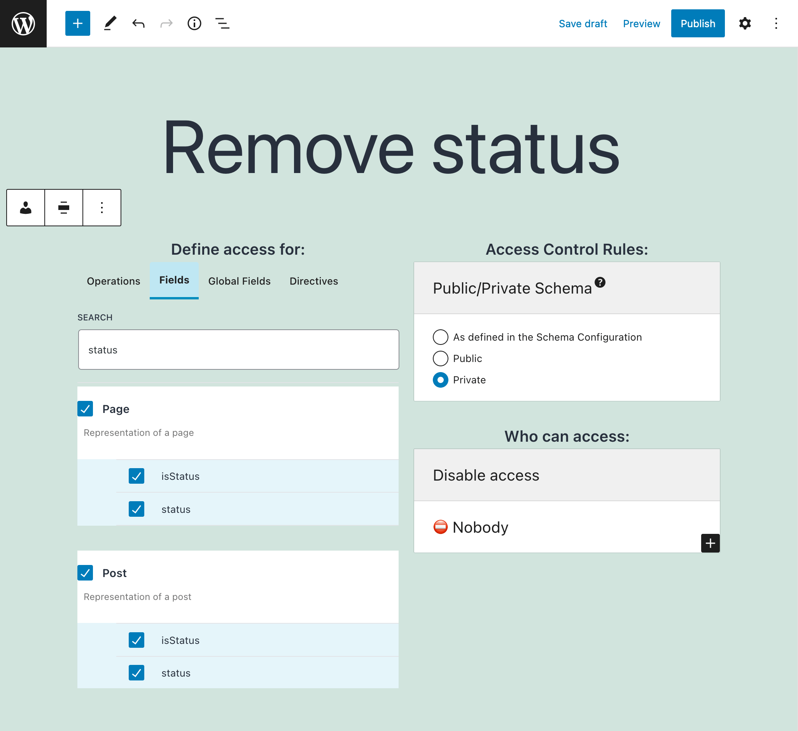

# Access Control Rule: Disable access

Remove fields and directives from the GraphQL schema.

## Description

To remove fields and directives from the GraphQL schema, create an **Access Control** entry containing:

- The private visibility mode
- The "Disable access" rule
- The fields and directives to remove access to

Selecting the operation `"mutation"` will also remove access to all mutations in the schema.
