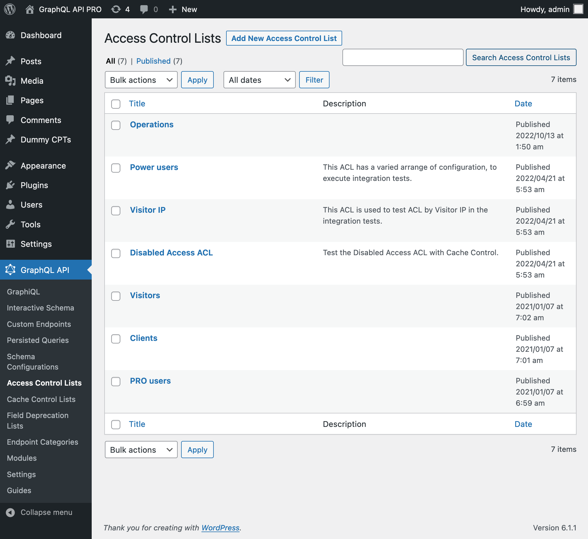
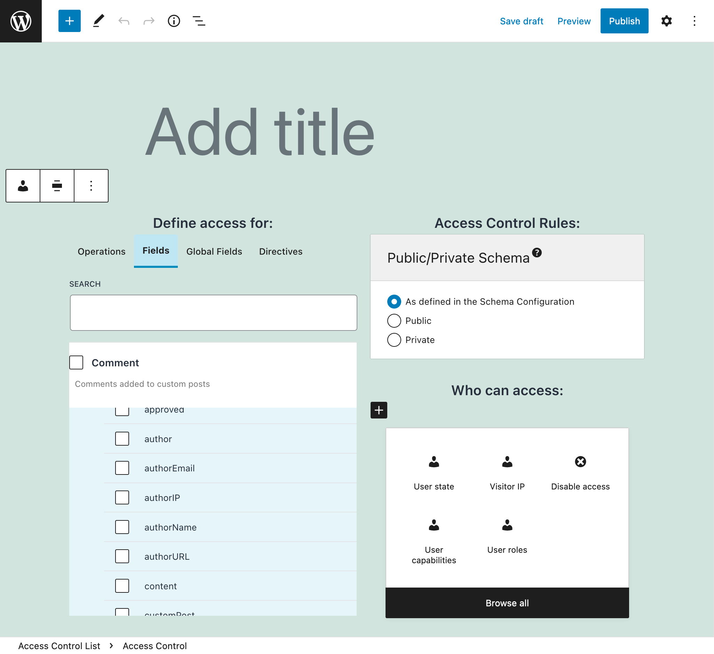
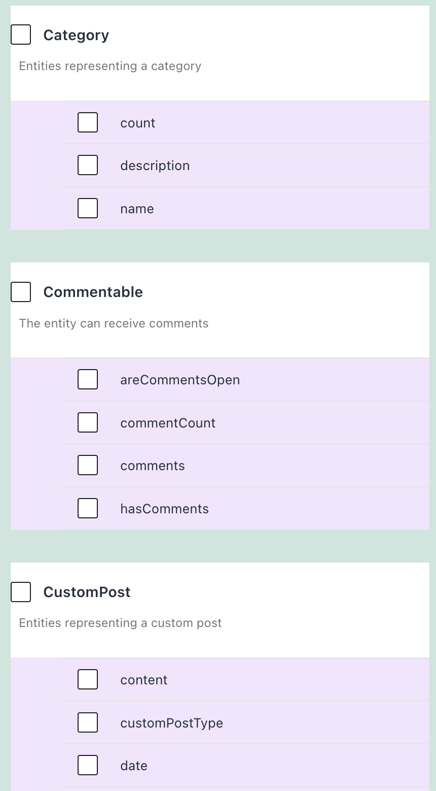

# Access Control

Manage who can access every field and directive in the schema through Access Control Lists.

## Description

Whenever the requested GraphQL query, either executed through a Custom Endpoint or as a Persisted Query, contains one of the selected fields or directives in the selected Access Control List(s), the corresponding list of rules is evaluated. If any rule is not satisfied, access to that field or directive is denied.

If module `Public/Private Schema` is enabled, when access to some field or directive is denied, there are 2 ways for the API to behave:

- **Public mode**: Provide an error message to the user, indicating why access is denied
- **Private mode**: The error message indicates that the field or directive does not exist

If this module is not enabled, the default behavior ir `Public`.

## Access Control rules

The GraphQL API PRO plugin makes available the following access control rules:

- Disable access
- Grant access only if the user is logged-in or out
- Grant access only if the user has some role
- Grant access only if the user has some capability

## Using an Access Control List (ACL)

After creating the ACL (see next section), we can have the Custom Endpoint or Persisted Query use it by editing the corresponding Schema Configuration, and selecting the ACL from the list under block "Access Control Lists".

## Creating an Access Control List

Click on the "Access Control Lists" page in the GraphQL API menu:

Then click on "Add New Access Control List" to go to the editor:

Every Access Control List contains one or many entries, each of them with the following elements:

- The fields to grant or deny access to
- The directives to grant or deny access to
- The list of rules to validate

If module `Public/Private Schema` is enabled, and option `Enable granular control?` in the settings is `on`, there is an additional element:

- Public/Private Schema: behavior when access is denied

Every entry is created by selecting the operations, fields and directives, and configuring the rules:

Validation for fields from an interface is carried on all types implementing the interface.

## Resources

Video showing how access to different fields is granted or not, according to the configuration and the user executing the query: <a href="https://vimeo.com/413503383" target="_blank">vimeo.com/413503383</a>.
