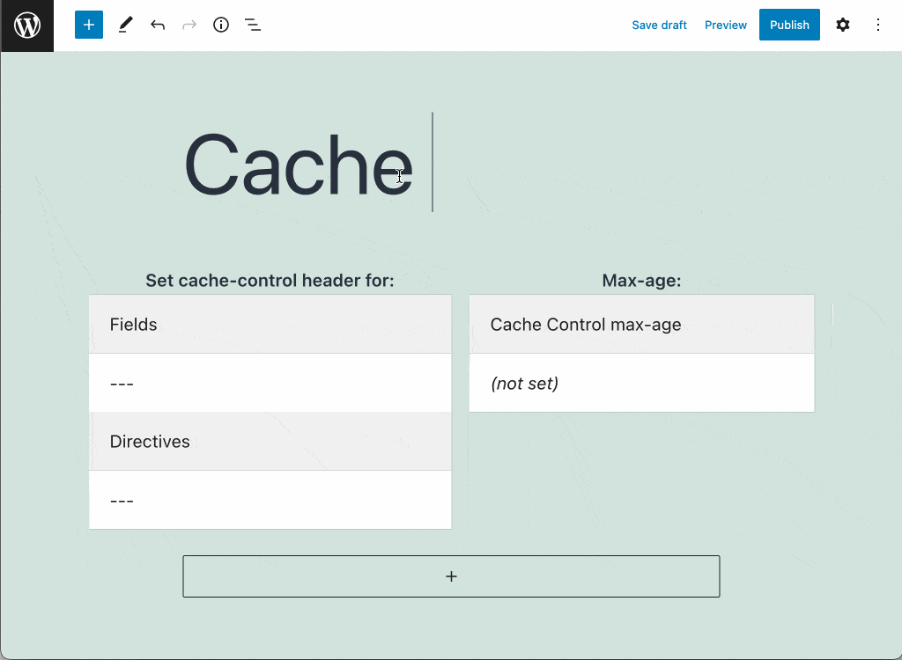
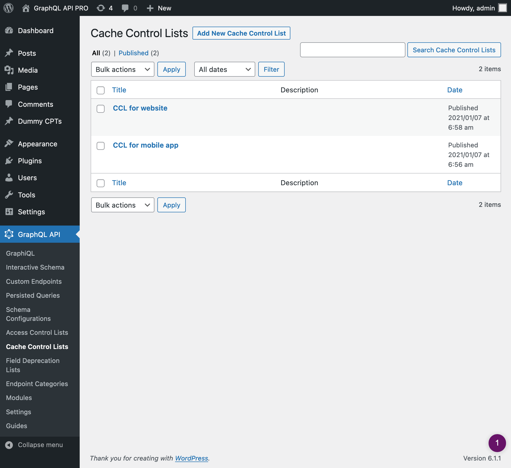

# Cache Control

When queries are executed against the GraphQL server using `GET` (instead of the more traditional `POST` method), the GraphQL response can be cached on the client-side or intermediate stages between the client and the server (such as a CDN), by relying on standard HTTP caching.

This works naturally for persisted queries, and for the single endpoint and custom endpoints it can work by appending param `?query={ GraphQL query }` to the endpoint.

## Description

HTTP caching works by sending a `Cache-Control` header with a `max-age` value in the response, indicating for how long the response must be cached.

The GraphQL API PRO plugin offers Cache Control Lists, where custom `max-age` values are defined for fields and directives. Hence, different queries containing different combinations of fields and directives will produce a different `max-age` value.

The response's `max-age` value is calculated as the lowest value from all the fields and directives in the requested query, or `no-store` if either:

- any mutation is executed
- any field or directive has `max-age` with value `0`
- an Access Control rule must check the user state for any field or directive (in which case, the response is specific to the user, so it cannot be cached)



## Using a Cache Control List (CCL)

After creating the CCL (see next section), we can have the endpoint use it by editing the corresponding Schema Configuration, and selecting the CCL from the list under block "Cache Control Lists".


## Creating a Cache Control List

Click on the "Cache Control Lists" page in the GraphQL API menu:



Then click on "Add New Cache Control List" to go to the editor:


Every Cache Control List contains one or many entries, each of them with the following elements:

- The fields and directives which, if they appear on the GraphQL query, the selected max-age takes effect
- The max-age


Caching for fields from an interface is carried on all types implementing the interface.


Fields which are not given any specific `max-age` will use the default value, defined in the Settings page under tab "Cache Control":


## Executing the endpoint via `GET`

Persisted queries are already suitable to be executed via `GET`, as they store the GraphQL query in the server (i.e. it must not be provided in the body of the request).

For the single endpoint and custom endpoints, though, the query must be provided under param `?query=...` attached to the endpoint URL.

For instance, the following GraphQL query:

```graphql
{
  posts {
    id
    title
    url
    author {
      id
      name
      url
    }
  }
}
```

...can be executed via `GET` against the single endpoint like this:

`https://mysite.com/graphql/?query={ posts { id title url author { id name url } } }`

<!-- ## Resources

Video showing how the response's `Cache-Control` header contains different `max-age` values depending on the Cache Control configuration for the fields in the query: <a href="https://vimeo.com/413503188" target="_blank">vimeo.com/413503188</a>. -->
