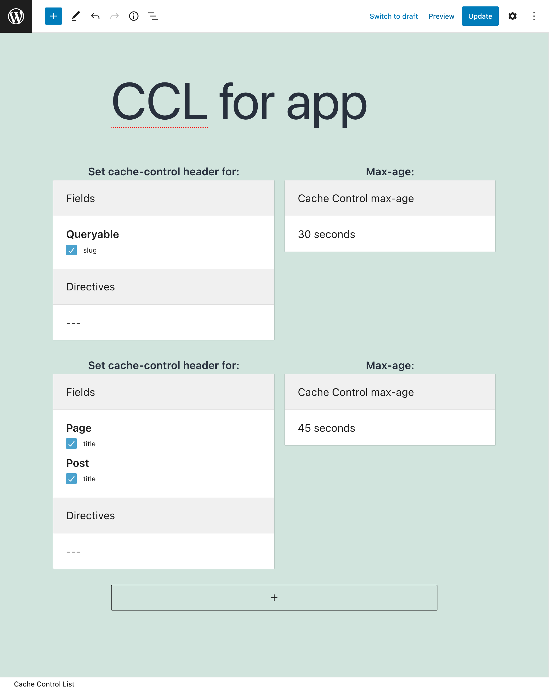

# Cache Control

Because it sends the queries via `POST`, GraphQL is normally not cacheable on the server-side or intermediate stages between the client and the server, such as a CDN.

However, persisted queries can be accessed via `GET`, hence their response can be cached via the `Cache-Control` header.

## Description

The `Cache-Control` header indicates for how long the response is to be cached through its `max-age` value.

The GraphQL API PRO plugin offers Cache Control Lists, where custom `max-age` values are defined for fields and directives. Hence, different queries containing different combinations of fields and directives will produce a different `max-age` value.

The response's `max-age` value is calculated as the lowest value from all the fields and directives in the requested query, or `no-store` if either:

- any field or directive has `max-age` with value `0`
- an Access Control rule must check the user state for any field or directive (in which case, the response is specific to the user, so it cannot be cached)

## Using a Cache Control List (CCL)

After creating the CCL (see next section), we can have the Persisted Query use it by editing the corresponding Schema Configuration, and selecting the CCL from the list under block "Cache Control Lists".

## Creating a Cache Control List

Click on the "Cache Control Lists" page in the GraphQL API menu, and then click on "Add New Cache Control List".

Every Cache Control List contains one or many entries, each of them with the following elements:

- The fields and directives which, if they appear on the GraphQL query, the selected max-age takes effect
- The max-age

## Resources

Video showing how the response's `Cache-Control` header contains different `max-age` values depending on the Cache Control configuration for the fields in the query: <a href="https://vimeo.com/413503188" target="_blank">vimeo.com/413503188</a>.
