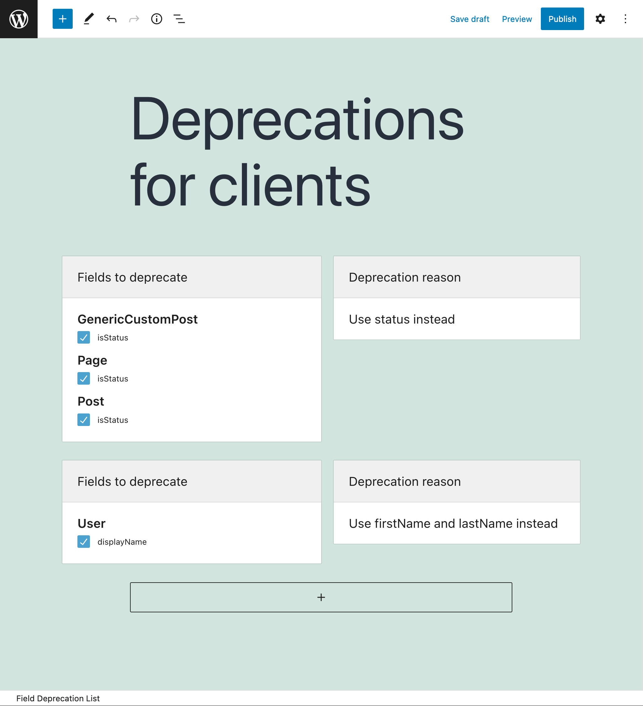

# Field Deprecation

User interface to deprecate fields, and indicate how they must be replaced.

## Description

Fields in GraphQL can be marked as deprecated when they are not deemed necessary by the application anymore.

This module allows us to mark fields as deprecated via a user interface.

## Using a Field Deprecation List

After creating the Field Deprecation List (see next section), we can have the Custom Endpoint and Persisted Query use it by editing the corresponding Schema Configuration, and selecting the item from the list under block "Field Deprecation Lists".

## Creating a Field Deprecation List

Click on the "Field Deprecation Lists" page in the GraphQL API menu:

Then click on "Add New Field Deprecation List" to go to the editor:

Every Field Deprecation List contains one or many entries, each of them with the following elements:

- The fields to deprecate
- The deprecation reason (to be shown in the GraphQL response when the deprecated field is queried)

<!-- ## Resources

Video showing how to deprecate fields: <a href="https://vimeo.com/413503110" target="_blank">vimeo.com/413503110</a>. -->
