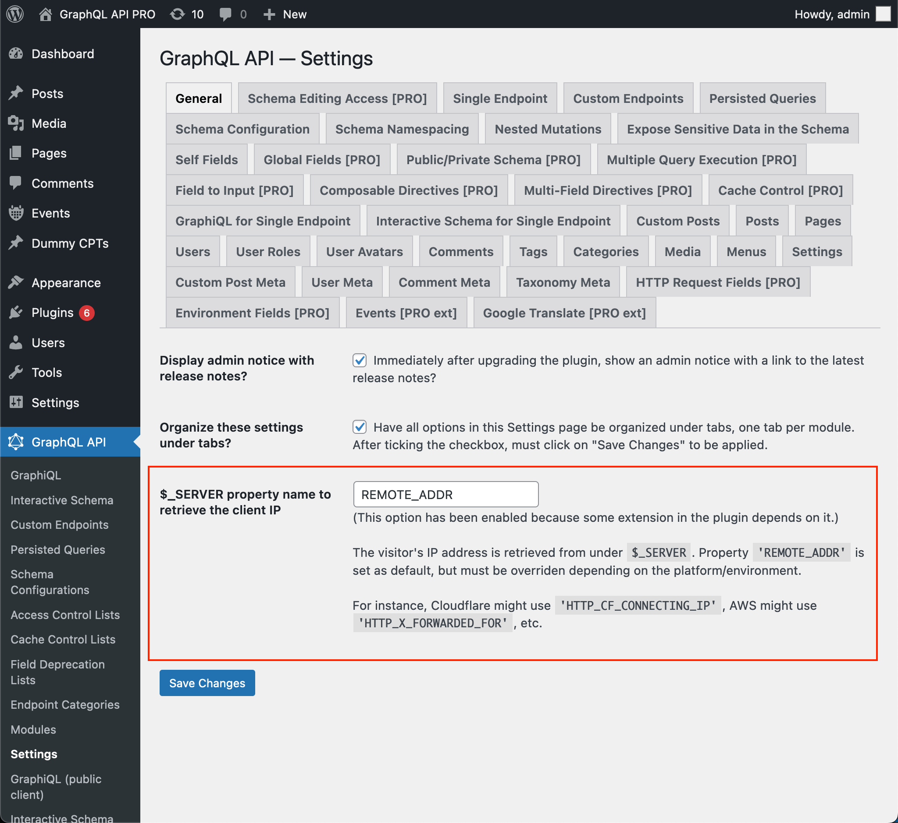

# Function Fields

Manipulate the field output using standard programming language functions (provided via special fields)

## Description

This module adds several fields to the GraphQL schema which expose functionalities commonly found in programming languages (such as PHP).

Function fields are **Global Fields**, hence they are added to every single type in the GraphQL schema: in `QueryRoot`, but also in `Post`, `User`, etc.

Function fields are useful for manipulating the data once it has been retrieved, allowing us to transform a field value in whatever way it is required, and granting us powerful data import/export capabilities.

## Available Function Fields

This is the list of currently-available function fields.

### `_and`

Return an `AND` operation among several boolean properties.

### `_arrayAddItem`

Adds an element to the array.

### `_arraySetItem`

Sets an element on some position of the array.

### `_arrayChunk`

Split an array into chunks.

### `_arrayDiff`

Return an array containing all the elements from the first array which are not present on any of the other arrays.

### `_arrayFill`

Create an array filled with values.

### `_arrayInnerJoinJSONObjectProperties`

Fill the JSON objects inside a target array with properties from a JSON object from a source array, where a certain property is the same for both objects.

### `_arrayItem`

Access the element on the given position in the array.

### `_arrayJoin`

Join all the strings in an array, using a provided separator.

### `_arrayLength`

Number of elements in an array.

### `_arrayMerge`

Merge two or more arrays together.

### `_arrayPad`

Pad an array to the specified length with a value.

### `_arrayRandom`

Randomly select one element from the provided ones.

### `_arrayRemoveFirst`

Remove the first element in the array.

### `_arrayRemoveLast`

Remove the last element in the array.

### `_arrayReverse`

Reverse an array.

### `_arraySearch`

Search in what position is an element placed in the array. If found, it returns its position, otherwise it returns `false`.

### `_arraySlice`

Extract a slice of an array.

### `_arraySplice`

Remove a portion of an array and replace it with something else.

### `_arrayUnique`

Filters out all duplicated elements in the array.

### `_clientIP`

Retrieves the client IP address. If the server is not properly configured (see below), the response is `null`.

#### Configuration

The client's IP address is retrieved from under the `$_SERVER` global variable, normally from under property `'REMOTE_ADDR'`. However, different platforms may require to use a different property name to retrieve this information.

For instance:

- Cloudflare might use `'HTTP_CF_CONNECTING_IP'`
- AWS might use `'HTTP_X_FORWARDED_FOR'`

The property name to use can be configured in the "Plugin Settings > Server IP Configuration" tab on the Settings page:



### `_echo`

Repeat back the input, whatever it is.

### `_equals`

Indicate if the result from a field equals a certain value.

### `_fail`

Create an entry under the response's `errors`.

<!-- ### `_floatDivide`

Divide a number by another number. -->

### `_greaterThan`

Indicate if number1 > number2.

### `_greaterThanOrEquals`

Indicate if number1 >= number2.

### `_if`

If a boolean property is true, execute a field, else, execute another field.

### `_inArray`

Indicate if the array contains the value

### `_intAdd`

Add an integer to another integer number.

### `_intArraySum`

Sum of the integer elements in the array.

### `_isEmpty`

Indicate if a value is empty.

### `_isNull`

Indicate if a value is null.

### `_lowerThan`

Indicate if number1 < number2.

### `_lowerThanOrEquals`

Indicate if number1 <= number2.

### `_not`

Return the opposite value of a boolean property.

### `_notEmpty`

Indicate if the value is not empty.

### `_notEquals`

Are the two values not equal to each other.

### `_notInArray`

Indicate if the array does not contain the value.

### `_notNull`

Indicate if the value is not `null`.

### `_objectAddEntry`

Adds an entry to the object.

### `_objectCombine`

Create a JSON object using the elements from an array as keys, and the elements from another array as values.

### `_objectProperty`

Retrieve a property from a JSON object.

### `_objectRemoveEntry`

Removes an entry from the object.

### `_or`

Return an `OR` operation among several boolean properties.

### `_propertyExistsInJSONObject`

Indicate if a property exists on a JSON object.

### `_propertyIsSetInJSONObject`

Indicate if a property exists and is not `null` on a JSON object.

### `_sprintf`

Replace placeholders inside a string with provided values.

### `_strAppend`

Append a string to another string.

### `_strContains`

Indicates if a string contains another string.

### `_strEndsWith`

Indicates if a string ends with another string.

### `_strLength`

Length of the string

### `_strLowerCase`

Transform a string to lower case.

### `_strPad`

Pad a string to a certain length with another string

### `_strPos`

Position of a substring within the string, or `null` if not found

### `_strRegexReplace`

Execute a regular expression to search and replace a string.

### `_strRepeat`

Repeat a string

### `_strReplace`

Replace a string with another string.

### `_strReverse`

Reverse a string.

### `_strShuffle`

Randomly shuffles a string

### `_strStartsWith`

Indicates if a string starts with another string.

### `_strStripSlashes`

Returns a string with backslashes stripped off. (\\\' becomes \' and so on.) Double backslashes (\\\\) are made into a single backslash (\\).

### `_strSubstr`

Return part of a string

### `_strTitleCase`

Transform a string to title case.

### `_strToTime`

Parse about any English textual datetime description into a Unix timestamp

### `_strTrim`

Strip whitespace (or other characters) from the beginning and end of a string.

### `_strUpperCase`

Transform a string to upper case.

### `_strWordCount`

Number of words in the string

### `_time`

Return the time now.

## Examples

While we have a `Post.hasComments` fields, we may need the opposite value. Instead of creating a new field `Post.notHasComments` (for which we'd need to edit PHP code), we can use the **Field to Input** feature to input the value from `hasComments` into a `not` field, thus calculating the new value always within the GraphQL query:

```graphql
{
  posts {
    id
    hasComments
    notHasComments: _not(value: $__hasComments)
  }
}
```

We can apply function fields multiple times to perform a more complex calculation, such as generating a `summary` field based on the values from other fields:

```graphql
{
  posts {
    id
    content @remove
    shortContent: _strSubstr(string: $__content, offset: 0, length: 150) @remove
    excerpt @remove
    isExcerptEmpty: _isEmpty(value: $__excerpt) @remove
    summary: _if(
      condition: $__isExcerptEmpty
      then: $__content
      else: $__excerpt
    )
  }
}
```

Together with the **Send HTTP Request Fields** module, we can dynamically generate an API endpoint to connect to (based on the data on our site), and then extract some specific field from the returned data:

```graphql
{
  users(
    pagination: { limit: 2 },
    sort: { order: ASC, by: ID }
  ) {
    id
    
    # Dynamically generate endpoint for the user
    endpoint: _arrayJoin(values: [
      "https://newapi.getpop.org/wp-json/wp/v2/users/",
      $__id,
      "?_fields=name,avatar_urls"
    ])
    
    # Retrieve the endpoint data
    endpointData: _requestJSONObjectItem(input: { url: $__endpoint } )

    # Extract specific information
    userAvatar: _objectProperty(
      object: $__endpointData,
      by: {
        path: "avatar_urls.48"
      }
    )
  }
}
```

...producing:

```json
{
  "data": {
    "users": [
      {
        "id": 1,
        "endpoint": "https://newapi.getpop.org/wp-json/wp/v2/users/1?_fields=name,avatar_urls",
        "endpointData": {
          "name": "leo",
          "avatar_urls": {
            "24": "https://secure.gravatar.com/avatar/b28085726ee66e49f08be16ad668efd5?s=24&d=mm&r=g",
            "48": "https://secure.gravatar.com/avatar/b28085726ee66e49f08be16ad668efd5?s=48&d=mm&r=g",
            "96": "https://secure.gravatar.com/avatar/b28085726ee66e49f08be16ad668efd5?s=96&d=mm&r=g"
          },
          "_links": {
            "self": [
              {
                "href": "https://newapi.getpop.org/wp-json/wp/v2/users/1"
              }
            ],
            "collection": [
              {
                "href": "https://newapi.getpop.org/wp-json/wp/v2/users"
              }
            ]
          }
        },
        "userAvatar": "https://secure.gravatar.com/avatar/b28085726ee66e49f08be16ad668efd5?s=48&d=mm&r=g"
      },
      {
        "id": 2,
        "endpoint": "https://newapi.getpop.org/wp-json/wp/v2/users/2?_fields=name,avatar_urls",
        "endpointData": {
          "name": "themedemos",
          "avatar_urls": {
            "24": "https://secure.gravatar.com/avatar/7554514b65216821eeacde0fdcd6c6e6?s=24&d=mm&r=g",
            "48": "https://secure.gravatar.com/avatar/7554514b65216821eeacde0fdcd6c6e6?s=48&d=mm&r=g",
            "96": "https://secure.gravatar.com/avatar/7554514b65216821eeacde0fdcd6c6e6?s=96&d=mm&r=g"
          },
          "_links": {
            "self": [
              {
                "href": "https://newapi.getpop.org/wp-json/wp/v2/users/2"
              }
            ],
            "collection": [
              {
                "href": "https://newapi.getpop.org/wp-json/wp/v2/users"
              }
            ]
          }
        },
        "userAvatar": "https://secure.gravatar.com/avatar/7554514b65216821eeacde0fdcd6c6e6?s=48&d=mm&r=g"
      }
    ]
  }
}
```
