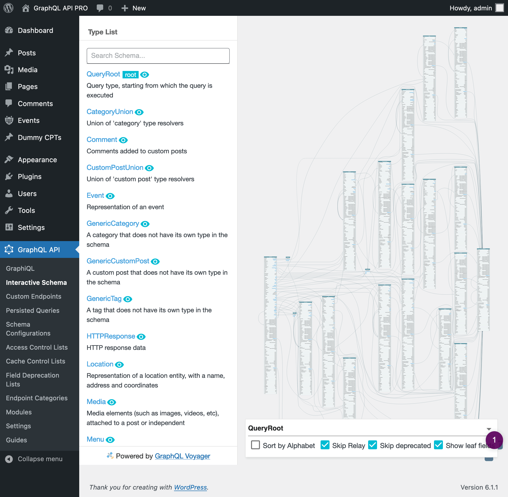
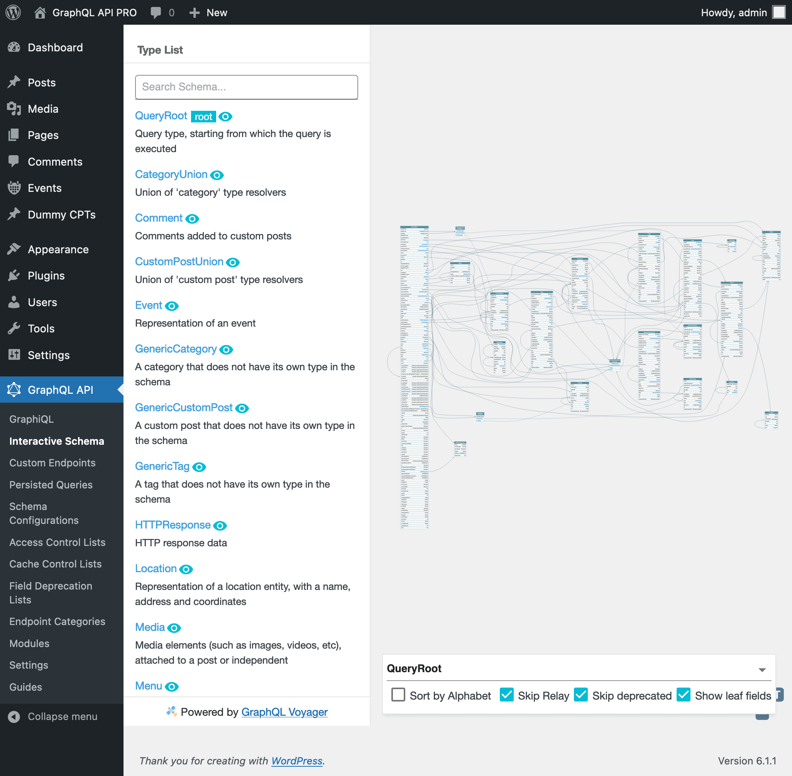

# Global Fields

Global fields are fields that are accessible under every single type in the GraphQL schema (while being defined only once).

## Description

The GraphQL schema exposes types, such as `Post`, `User` and `Comment`, and the fields available for every type, such as `Post.title`, `User.name` and `Comment.responses`. These fields deal with "data", as they retrieve some specific piece of data from an entity.

The GraphQL API PRO, in addition, also offers a different kind of fields: those providing "functionality" instead of data.

These are some examples:

- Those fields from the **HTTP Request Fields** module, which connect to external API endpoints and retrieve data from them:
  - `_request`
  - `_requestJSONObjectItem`
  - `_requestJSONObjectCollection`
  - `_requestGraphQL`
- Those fields from the **Function Fields** module, which expose functionalities commonly found in programming languages (such as PHP):
  - `_not`
  - `_if`
  - `_equals`
  - `_isEmpty`
  - `_echo`
  - `_sprintf`
  - `_arrayItem`
  - `_arrayAddItem`
  - `_arrayUnique`

**Please notice:** By convention, all these fields start with `"_"`. This convention helps differentiate which are data (i.e. "normal") fields, and which are functionality fields, when visualizing the GraphQL schema.

As can be appreciated from these available modules, functionality fields are useful for obtaining data that is stored outside of WordPress, and for manipulating the data once it has been retrieved, allowing us to transform a field value in whatever way it is required, and granting us powerful data import/export capabilities.

Functionality fields belong not to a specific type, such as `Post` or `User`, but to all the types in the schema. That's why these are handled in a distinctive way in the GraphQL API PRO, under the name of "global fields".

## Examples

While we have a `Post.hasComments` fields, we may need the opposite value. Instead of creating a new field `Post.notHasComments` (for which we'd need to edit PHP code), we can use the **Field to Input** feature to input the value from `hasComments` into a `_not` field, thus calculating the new value always within the GraphQL query:

```graphql
{
  posts {
    id
    hasComments
    notHasComments: _not(value: $__hasComments)
  }
}
```

We can apply function fields multiple times to perform a more complex calculation, such as generating a `summary` field based on the values from other fields:

```graphql
{
  posts {
    id
    content @remove
    shortContent: _strSubstr(string: $__content, offset: 0, length: 150) @remove
    excerpt @remove
    isExcerptEmpty: _isEmpty(value: $__excerpt) @remove
    summary: _if(
      condition: $__isExcerptEmpty
      then: $__content
      else: $__excerpt
    )
  }
}
```

## Exposing Global Fields in the Schema

Global fields are added to all types in the GraphQL schema, which renders its visualization unwieldy:



That's why the configuration (see next section) offers to not expose the global fields (when doing introspection), by either:

- Exposing them on the Root type only
- Not exposing them at all

**Please notice:** Global fields will still available under all types from the schema, even when not exposed; in other words, they are simply "hidden from view" when doing introspection. If you desire to actually remove (not just hide) some global field from the schema, this must be done via an Access Control List.

By default, the schema exposes global fields under the Root type only, and it is easier to visualize and browse:



## Configuration

To select the general level of exposure of global fields in the GraphQL schema, go to the "Global Fields" module on the Settings page, and select the desired option:

- Do not expose
- Expose under the Root type only _(this is the default value)_
- Expose under all types


To modify the exposure of global fields on different custom endpoints, select the desired option in block "Global Fields" from the corresponding Schema Configuration:


