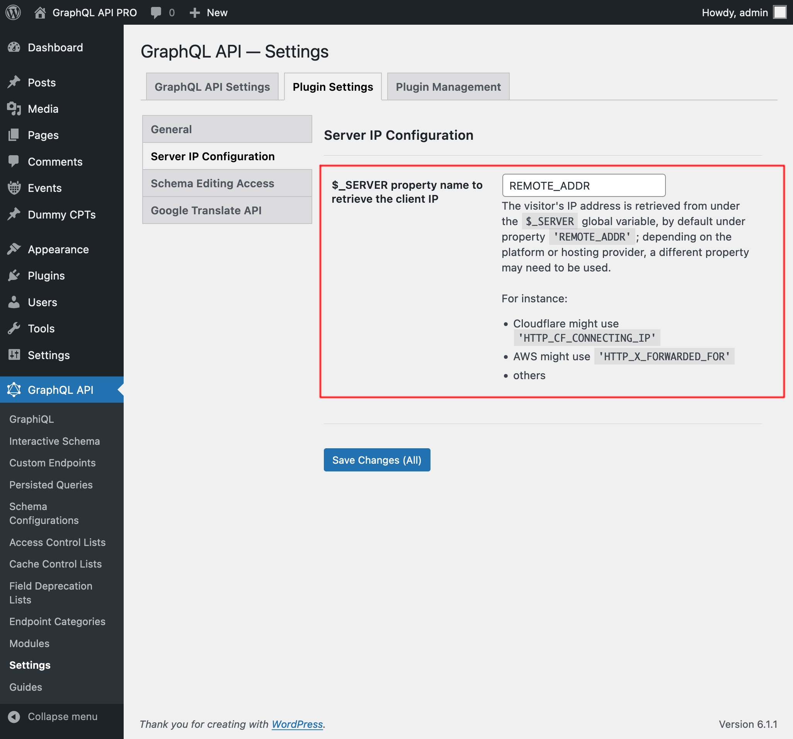

# Inspect HTTP Request Fields

Addition of fields to retrieve the current HTTP request data.

## Description

The following fields to retrive the current HTTP request data are added to the GraphQL schema:

### `_httpRequestBody`

Body of the HTTP request.

### `_httpRequestClientHost`

Client host.

### `_httpRequestClientIP`

Retrieves the client IP address. If the server is not properly configured (see below), the response is `null`.

#### Configuration

The client's IP address is retrieved from under the `$_SERVER` global variable, normally from under property `'REMOTE_ADDR'`. However, different platforms may require to use a different property name to retrieve this information.

For instance:

- Cloudflare might use `'HTTP_CF_CONNECTING_IP'`
- AWS might use `'HTTP_X_FORWARDED_FOR'`

The property name to use can be configured in the "Plugin Settings > Server IP Configuration" tab on the Settings page:

### `_httpRequestCookie`

Request cookie value.

### `_httpRequestCookies`

Request cookies.

### `_httpRequestDomain`

Domain of the requested URL.

### `_httpRequestFullURL`

Requested URL (including the query params).

### `_httpRequestHasCookie`

Does the request contain a certain cookie?.

### `_httpRequestHasHeader`

Does the request contain a certain header?.

### `_httpRequestHasParam`

Does the request contain a certain parameter?.

### `_httpRequestHeader`

Request header value.

### `_httpRequestHeaders`

Request headers.

### `_httpRequestHost`

Host of the requested URL.

### `_httpRequestMethod`

Request method.

### `_httpRequestParam`

Value of a param passed via POST or GET.

### `_httpRequestParams`

Params passed via POST or GET.

### `_httpRequestProtocol`

Request protocol.

### `_httpRequestQuery`

Query params string.

### `_httpRequestReferer`

Request referer.

### `_httpRequestRequestTime`

Timestamp of the start of the request.

### `_httpRequestScheme`

Scheme of the requested URL.

### `_httpRequestServerIP`

Server IP address.

### `_httpRequestURL`

Requested URL (without query params).

### `_httpRequestURLPath`

Asolute path (starting with "/") of the requested URL.

### `_httpRequestUserAgent`

User agent.
