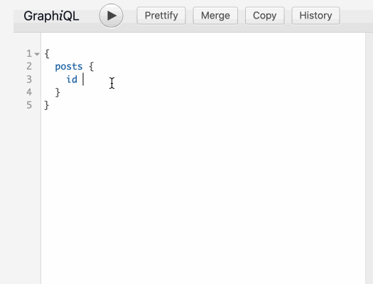
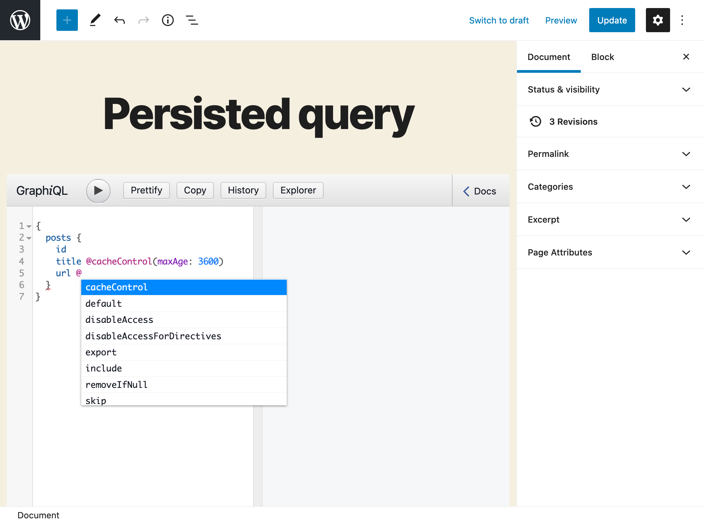

# Low-Level Persisted Query Editing

Have access to directives to apply to the schema, already in the persisted query's editor.

## Description

In GraphQL, directives are functions that enable to modify the result from a field. For instance, a directive `@strUpperCase` will transform the value of the field into uppercase format.

There are 2 types of directives: those that are applied to the schema and are executed always, on every query; and those that are applied to the query, by the user or the application on the client-side.

In the GraphQL API for WordPress, most functionality involved when resolving a query is executed through directives to be applied to the schema. 

For instance, Cache Control works by applying directive `@cacheControl` on the schema. This configuration is by default hidden, and carried out by the plugin through the user interface:

Similarly, these directives provide Access Control for fields (and similar directives provide Access Control for directives):

- `@disableAccess`
- `@validateIsUserLoggedIn`
- `@validateIsUserNotLoggedIn`
- `@validateDoesLoggedInUserHaveAnyRole`.
- `@validateDoesLoggedInUserHaveAnyCapability`

---

This module `Low-Level Persisted Query Editing` makes all directives to be applied to the schema available in the GraphiQL editor when editing persisted queries, allowing to avoid the user interface and add the schema-type directives already in the persisted query.

## How to use

For instance, defining Cache Control can be done directly in the persisted query, by setting directive `@cacheControl` with argument `maxAge` on the field:

