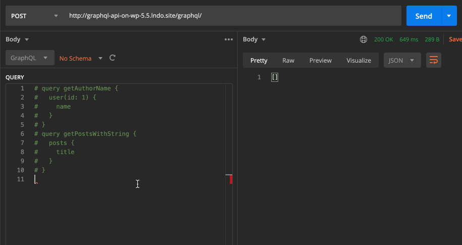

# Multiple Query Execution

Multiple queries are combined together, and executed as a single operation, reusing their state and their data. For instance, if a first query fetches some data, and a second query also accesses the same data, this data is retrieved only once, not twice.

This feature improves performance, for whenever we need to execute an operation against the GraphQL server, then wait for its response, and then use that result to perform another operation. By combining them together, we are avoiding the latency from the extra request(s).

## Description

Multiple query execution combines the multiple queries into a single query, making sure they are executed in the same requested order.



This is different from query batching, in which the GraphQL server also executes multiple queries in a single request, but those queries are merely executed one after the other, independently from each other.

When this feature is enabled, two directives are made available in the GraphQL schema:

- `@depends` operation directive, to have an operation (whether a `query` or `mutation`) indicate what other operations must be executed before
- `@export` field directive, to export some field value from one query, to inject it as an input to some field in another query

<!-- ## When to use

Let's suppose we want to search all posts which mention the name of the logged-in user. Normally, we would need 2 queries to accomplish this:

We first retrieve the user's `name`:

```graphql
query GetLoggedInUserName {
  me {
    name
  }
}
```

...and then, having executed the first query, we can pass the retrieved user's `name` as variable `$search` to perform the search in a second query:

```graphql
query GetPostsContainingString($search: String = "") {
  posts(filter: { search: $search }) {
    id
    title
  }
}
```

The `@export` directive exports the value from a field, and inject this value into a second field through a dynamic variable (whose name is defined under argument `as`), thus combining the 2 queries into 1:

```graphql
query GetLoggedInUserName {
  me {
    name @export(as: "search")
  }
}

query GetPostsContainingString @depends(on: "GetLoggedInUserName") {
  posts(filter: { search: $search }) {
    id
    title
  }
}
``` -->

## `@depends`

When the GraphQL Document contains multiple operations, we must provide URL param `?operationName=` to indicate the server which one to execute.

Starting from this initial operation, the server will collect all operations to execute, which are defined by adding directive `depends(on: [...])`, and execute them in the corresponding order respecting the dependencies.

Directive arg `operations` receives an array of operation names (`[String]`), or we can also provide a single operation name (`String`).

In this query, we pass `?operationName=Four`, and the executed operations (whether `query` or `mutation`) will be `["One", "Two", "Three", "Four"]`:

```graphql
mutation One {
  # Do something ...
}

mutation Two {
  # Do something ...
}

query Three @depends(on: ["One", "Two"]) {
  # Do something ...
}

query Four @depends(on: "Three") {
  # Do something ...
}
```

## `@export`

Directive `@export` exports the value of a field (or set of fields) into a dynamic variable, to be used as input in some field from another query.

For instance, in this query we export the logged-in user's name, and use this value to search for posts containing this string (please notice that variable `$loggedInUserName`, because it is dynamic, does not need be defined in operation `FindPosts`):

```graphql
query GetLoggedInUserName {
  loggedInUser {
    name @export(as: $loggedInUserName)
  }
}

query FindPosts @depends(on: "GetLoggedInUserName") {
  posts(filter: { search: $loggedInUserName }) {
    id
  }
}
```

### Exportable data

`@export` handles these 2 cases:

1. Exporting a single value from a single field
2. Exporting a list of values from a single field

In addition, when the **Multi-Field Directives** feature is enabled, `@export` handles 2 additional cases:

3. Exporting a dictionary of values, containing several fields from the same object
4. Exporting a list of a dictionary of values, with each dictionary containing several fields from the same object

#### 1. Exporting a single value from a single field

`@export` must handle exporting a single value from a single field, such as the user's `name` in this query:

```graphql
query GetLoggedInUserName {
  me {
    name @export(as: "search")
  }
}

query GetPostsContainingString @depends(on: "GetLoggedInUserName") {
  posts(filter: { search: $search }) {
    id
    title
  }
}
```

#### 2. Exporting a list of values from a single field

Fields returning lists should also be exportable. For instance, in the query below, the exported value is the list of names from the logged-in user's friends (hence the type of the `$search` variable went from `String` to `[String]`):

```graphql
query GetLoggedInUserFriendNames {
  me {
    friends {
      name @export(as: "search")
    }
  }
}

query GetPostsContainingLoggedInUserFriendNames @depends(on: "GetLoggedInUserFriendNames") {
  posts(filter: { searchAny: $search }) {
    id
    title
  }
}
```

#### 3. Exporting a dictionary of values, containing several fields from the same object

We may also need to export several properties from a same object. Then, `@export` also allows to export these properties to the same variable, as a dictionary of values.

For instance, the query could export both the `name` and `surname` fields from the user, and have a `searchByAnyProperty` input that receives a dictionary. This is done by appending the `affectAdditionalFieldsUnderPos` directive argument (see the documentation for **Multi-Field Directives**) pointing to the extra field(s):

```graphql
query GetLoggedInUserNameAndSurname {
  me {
    name
    surname
      @export(
        as: "search"
        affectAdditionalFieldsUnderPos: [1]
      )
  }
}

query GetPostsContainingLoggedInUserNameAndSurname @depends(on: "GetLoggedInUserNameAndSurname") {
  posts(filter: { searchByAnyProperty: $search }) {
    id
    title
  }
}
```

#### 4. Exporting a list of a dictionary of values, with each dictionary containing several fields from the same object

Similar to upgrading from a single value to a list of values, we can upgrade from a single dictionary to a list of dictionaries.

For instance, we could export fields `name` and `surname` from the list of the logged-in user's friends:

```graphql
query GetLoggedInUserFriendNamesAndSurnames {
  me {
    friends {
      name
      surname
        @export(
          as: "search"
          affectAdditionalFieldsUnderPos: [1]
        )
    }
  }
}

query GetPostsContainingLoggedInUserFriendNamesAndSurnames @depends(on: "GetLoggedInUserFriendNamesAndSurnames") {
  posts(filter: { searchAnyByAnyProperty: $search }) {
    id
    title
  }
}
```

## Conditional execution of operations

When Multiple Query Execution is enabled, directives `@include` and `@skip` are also available as operation directives, and these can be use to conditionally execute an operation if it satisfies some condition.

For instance, in this query, operation `CheckIfPostExists` exports a dynamic variable `$postExists` and, only if its value is `true`, will mutation `ExecuteOnlyIfPostExists` be executed:

```graphql
query CheckIfPostExists($id: ID!) {
  # Initialize the dynamic variable to `false`
  postExists: _echo(value: false) @export(as: "postExists")

  post(by: { id: $id }) {
    # Found the Post => Set dynamic variable to `true`
    postExists: _echo(value: true) @export(as: "postExists")
  }
}

mutation ExecuteOnlyIfPostExists
  @depends(on: "CheckIfPostExists")
  @include(if: $postExists)
{
  # Do something...
}
```

## Directive execution order

If there are other directives before `@export`, the exported value will reflect the modifications by those previous directives.

For instance, in this query, depending on `@export` taking place before or after `@strUpperCase`, the result will be different:

```graphql
query One {
  id
    # First export "root", only then will be converted to "ROOT"
    @export(as: "id")
    @strUpperCase

  again: id
    # First convert to "ROOT" and then export this value
    @strUpperCase
    @export(as: "again")
}

query Two @depends(on: "One") {
  mirrorID: _echo(value: $id)
  mirrorAgain: _echo(value: $again)
}
```

Producing:

```json
{
  "data": {
    "id": "ROOT",
    "again": "ROOT",
    "mirrorID": "root",
    "mirrorAgain": "ROOT"
  }
}
```

## Multi-Field Directives

When the **Multi-Field Directives** feature is enabled and we export the value of multiple fields into a dictionary, use `@deferredExport` instead of `@export` to guarantee that all directives from each involved field have been executed before exporting the field's value.

For instance, in this query, the first field has directive `@strUpperCase` applied to it, and the second has `@strTitleCase`. When executing `@deferredExport`, the exported value will have these directives applied:

```graphql
query One {
  id @strUpperCase # Will be exported as "ROOT"
  again: id @strTitleCase # Will be exported as "Root"
    @deferredExport(as: "props", affectAdditionalFieldsUnderPos: [1])
}

query Two @depends(on: "One") {
  mirrorProps: _echo(value: $props)
}
```

Producing:

```json
{
  "data": {
    "id": "ROOT",
    "again": "Root",
    "mirrorProps": {
      "id": "ROOT",
      "again": "Root"
    }
  }
}
```

## Execution in Persisted Queries

When a GraphQL query contains multiple operations in a Persisted Query, we must invoke the corresponding endpoint passing URL param `?operationName=...` with the name of the first operation to execute.

For instance, to execute operation `GetPostsContainingString` in a Persisted Query with endpoint `/graphql-query/posts-with-user-name/`, we must invoke: `https://www.mysite.com/graphql-query/posts-with-user-name/?operationName=GetPostsContainingString`.

## Examples

Import content from an external API endpoint:

```graphql
query FetchDataFromExternalEndpoint
{
  _requestJSONObjectItem(input: { url: "https://site.com/wp-json/wp/posts/1" } )
    @export(as: "externalData")
    @remove
}

query ManipulateDataIntoInput @depends(on: "FetchDataFromExternalEndpoint")
{
  title: _objectProperty(
    object: $externalData,
    by: {
      path: "title.rendered"
    }
  ) @export(as: "postTitle")

  excerpt: _objectProperty(
    object: $externalData,
    by: {
      key: "excerpt"
    }
  ) @export(as: "postExcerpt")
}

mutation CreatePost @depends(on: "ManipulateDataIntoInput")
{
  createPost(input: {
    title: $postTitle
    excerpt: $postExcerpt
  }) {
    id
  }
}
```

## GraphQL spec

This functionality is currently not part of the GraphQL spec, but it has been requested:

- <a href="https://github.com/graphql/graphql-spec/issues/375" target="_blank">Issue #375 - [RFC] Executing multiple operations in a query</a>
- <a href="https://github.com/graphql/graphql-spec/issues/377" target="_blank">Issue #377 - [RFC] exporting variables between queries</a>
