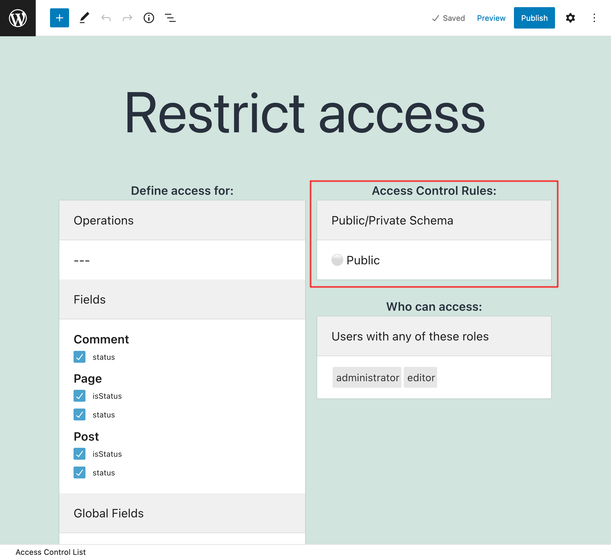
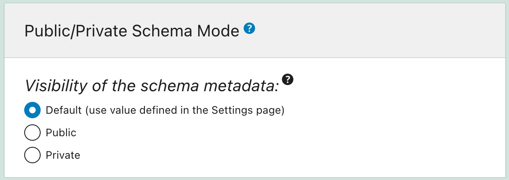
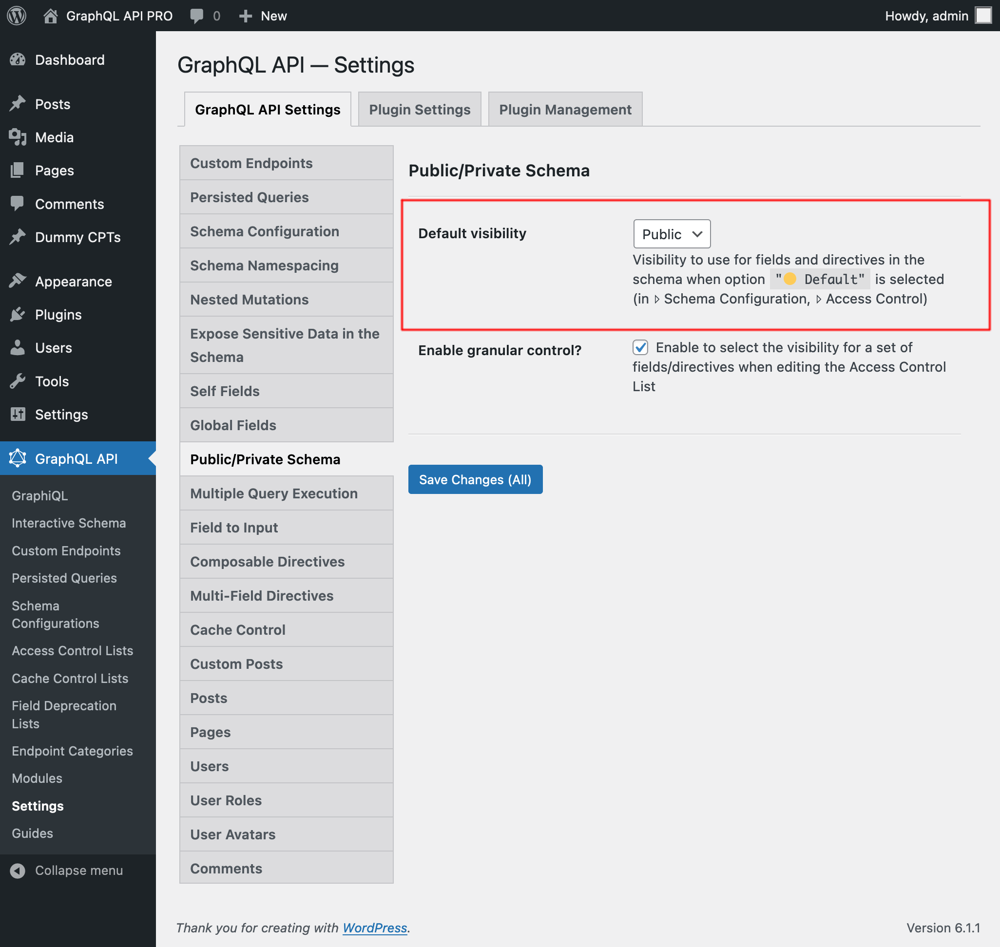

# Public/Private Schema

Define if the schema metadata is public, and everyone has access to it, or is private, and can be accessed only when the Access Control validations are satisfied.

## Description

When access to some a field or directive is denied through Access Control, there are 2 ways for the API to behave:

**Public mode**: the fields in the schema are exposed, and when the permission is not satisfied, the user gets an error message with a description of why the permission was rejected. This behavior makes the metadata from the schema always available.

**Private mode**: the schema is customized to every user, containing only the fields available to him or her, and so when attempting to access a forbidden field, the error message says that the field doesn't exist. This behavior exposes the metadata from the schema only to those users who can access it.

## How to use

The mode to use can be configured as follows, in order of priority:

✅ (If option `Enable granular control?` in the settings is `on`) Specific mode for a set of operations, fields and directives, defined in the Access Control List

✅ Specific mode for the custom endpoint or persisted query, defined in the schema configuration

✅ Default mode, defined in the Settings

If the schema configuration has value `"Default"`, it will use the mode defined in the Settings:

## Resources

Video demonstrating usage of the public/private schema modes: <a href="https://vimeo.com/413503284" target="_blank">vimeo.com/413503284</a>.
