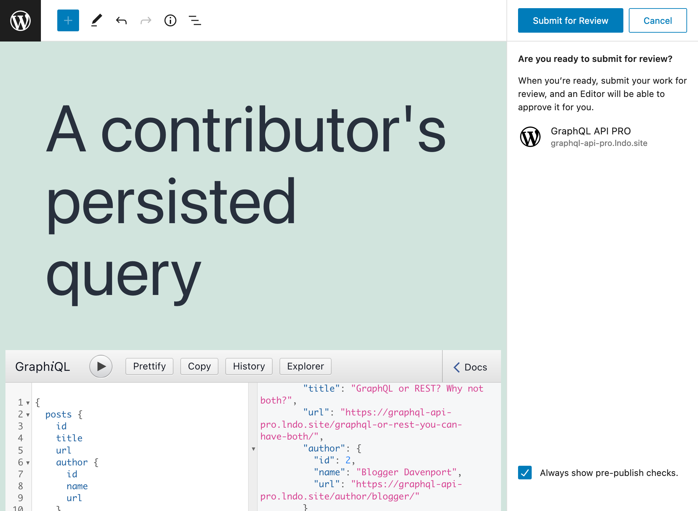
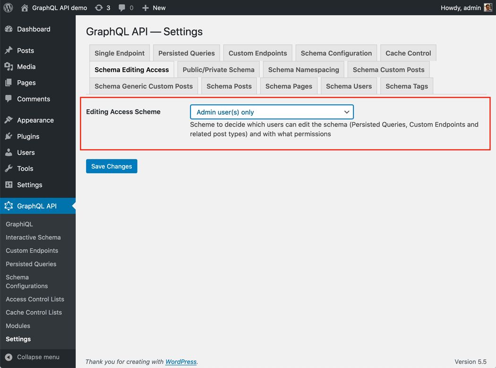

# Schema Editing Access

Grant access to users other than admins to edit the GraphQL schema

## Description

By default, only admin users (those with the `manage_options` capability) have access to the different screens of plugin GraphQL API for WordPress in the admin.

This module `Schema Editing Access` enables to grant non-admin users access to the GraphiQL and Interactive schema clients in the admin, and to read or write the different Custom Post Types from this plugin:

- Persisted Queries
- Custom Endpoints
- Schema Configurations
- Access Control Lists
- Cache Control Lists
- Others

<!-- The non-admin roles that can be selected are:

- Administrator (capability: `manage_options`)
- Editor (capability: `edit_others_posts`)
- Author (capability: `publish_posts`) -->

<!-- What permissions are given to non-admin users follows the same <a href="https://wordpress.org/support/article/roles-and-capabilities/#summary-of-roles" target="_blank">scheme as when editing posts in WordPress</a>, where users with different roles (`subscriber`, `contributor`, `author` and `editor`) have access to different capabilities:

| Role | Capabilities |
| --- | --- |
| Editor | Can publish and manage posts including the posts of other users |
| Author | Can publish and manage their own posts |
| Contributor | Can write and manage their own posts but cannot publish them |
| Subscriber | Can only read posts |

For instance, a contributor can create, but not publish, a persisted query:

 -->

## How to use

Decide what users can edit the schema by selecting the appropriate configuration from the dropdown in the "Plugin Configuration > Schema Editing Access" tab on the Settings page:

- `"Admin users"` (capability: `manage_options`)
- `"Admin + Editor users"` (capability: `edit_others_posts`)
- `"Admin + Editor + Author users"` (capability: `publish_posts`)

