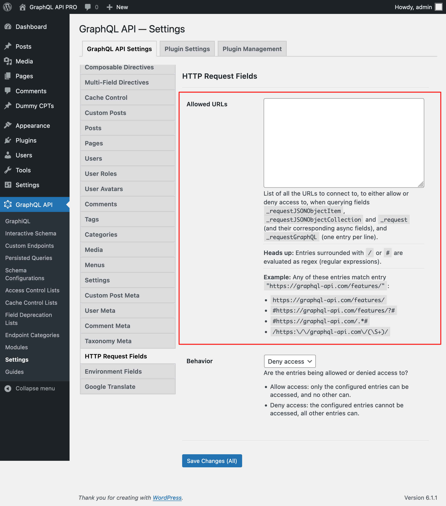
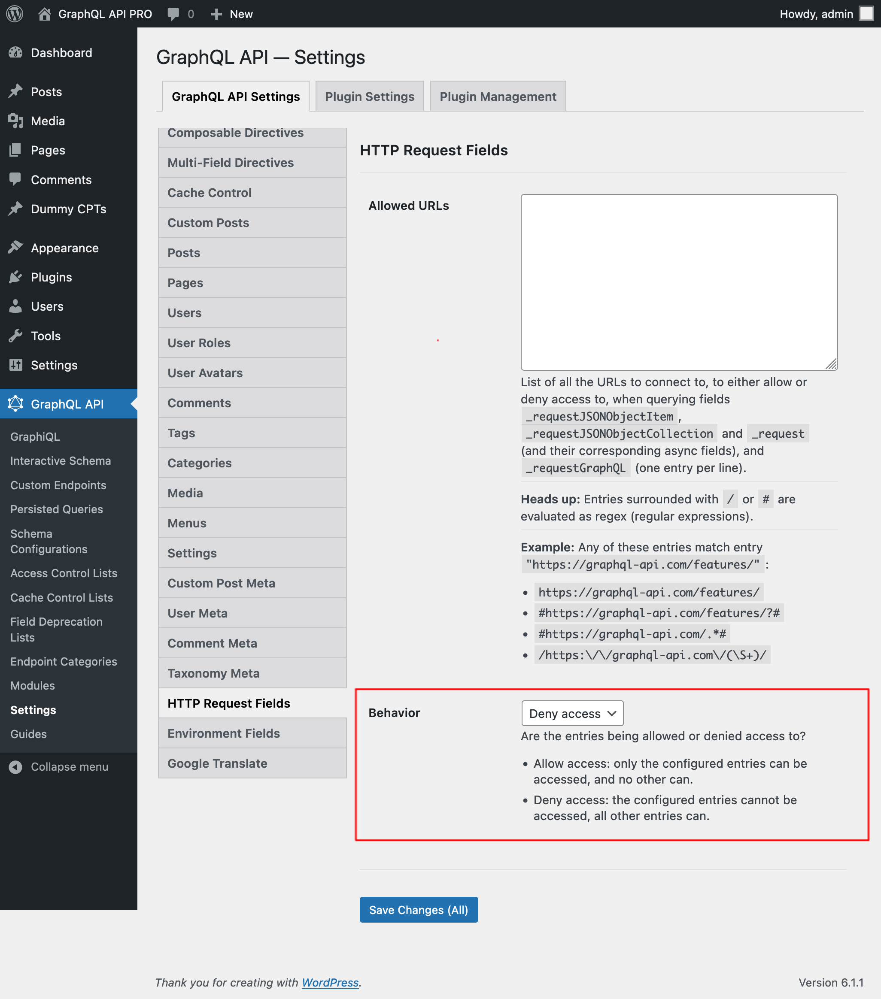

# Send HTTP Request Fields

Addition of fields to execute HTTP requests against a webserver and fetch their response:

- `_requestJSONObjectItem`
- `_multipleRequestJSONObjectItems`
- `_requestJSONObjectCollection`
- `_multipleRequestJSONObjectCollections`
- `_request`
- `_multipleRequest`
- `_requestGraphQL`

## Description

This module adds global fields to the GraphQL schema to retrieve data from an external source or list of sources.

Due to security reasons, the URLs that can be connected to must be explicitly configured (explained in the next section).

### `_requestJSONObjectItem`

It retrieves the (REST) response for a single JSON object.

**Signature:** `_requestJSONObjectItem(input: HTTPRequestInput!): JSONObject`.

### `_multipleRequestJSONObjectItems`

It retrieves the (REST) response for a single JSON object from multiple endpoints, executed asynchronously (in parallel) or synchronously (one after the other).

**Signature:** `_multipleRequestJSONObjectItems(inputs: [HTTPRequestInput!]!): [JSONObject]`.

### `_requestJSONObjectCollection`

It retrieves the (REST) response for a collection of JSON objects.

**Signature:** `_requestJSONObjectCollection(input: HTTPRequestInput!): [JSONObject]`.

### `_multipleRequestJSONObjectCollections`

It retrieves the (REST) response for a collection of JSON objects from multiple endpoints, executed asynchronously (in parallel) or synchronously (one after the other).

**Signature:** `_multipleRequestJSONObjectCollections(inputs: [HTTPRequestInput!]!): [[JSONObject]]`.

### `_request`

It connects to the specified URL and retrieves an `HTTPResponse` object, which contains the following fields:

- `statusCode: Int!`
- `contentType: String!`
- `body: String!`
- `headers: JSONObject!`
- `header(name: String!): String`
- `hasHeader(name: String!): Boolean!`

**Signature:** `_request(input: HTTPRequestInput!): HTTPResponse`.

### `_multipleRequest`

Similar to `_request` but it receives multiple URLs, and allows to connect to them asynchronously (in parallel).

**Signature:** `_multipleRequest(inputs: [HTTPRequestInput!]!): [HTTPResponse]`.

### `_requestGraphQL`

Execute a GraphQL query against the provided endpoint, and retrieve the response as a JSON object.

The input to this field accepts the data expected for GraphQL: the endpoint, GraphQL query, variables and operation name, and already sets the default method (`POST`) and content type (`application/json`).

**Signature:** `_requestGraphQL(input: GraphQLRequestInput!): JSONObject`.

## Configuring the allowed URLs

We must configure the list of URLs that we can connect to. By default, this list is initially empty. (Unless the unsafe default settings to <a href="https://graphql-api.com/guides/config/building-static-sites" target="_blank">build static sites</a> are enabled, in which case any URL is allowed by default.)

Each entry can either be:

- A regex (regular expression), if it's surrounded by `/` or `#`, or
- The complete URL, otherwise

For instance, any of these entries match URL `"https://graphql-api.com/features/"`:

- `https://graphql-api.com/features/`
- `#https://graphql-api.com/features/?#`
- `#https://graphql-api.com/.*#`
- `/https:\\/\\/graphql-api.com\\/(\S+)/`

There are 2 places where this configuration can take place, in order of priority:

1. Custom: In the corresponding Schema Configuration
2. General: In the Settings page

In the Schema Configuration applied to the endpoint, select option `"Use custom configuration"` and then input the desired entries:


Otherwise, the entries defined in the "Send HTTP Request Fields" tab from the Settings will be used:



There are 2 behaviors, "Allow access" and "Deny access":

- **Allow access:** only the configured entries can be accessed, and no other can
- **Deny access:** the configured entries cannot be accessed, all other entries can



## When to use each field

All fields are similar but different.

### `_requestJSONObjectItem`

This field retrieves a JSON object item, which is useful when querying a single item from a REST endpoint, as from the WP REST API endpoint `/wp-json/wp/v2/posts/1/`.

This query:

```graphql
{
  postData: _requestJSONObjectItem(input: { url: "https://newapi.getpop.org/wp-json/wp/v2/posts/1/" } )
}
```

...retrieves this response:

```json
{
  "data": {
    "postData": {
      "id": 1,
      "date": "2019-08-02T07:53:57",
      "date_gmt": "2019-08-02T07:53:57",
      "guid": {
        "rendered": "https:\/\/newapi.getpop.org\/?p=1"
      },
      "modified": "2021-01-14T13:18:39",
      "modified_gmt": "2021-01-14T13:18:39",
      "slug": "hello-world",
      "status": "publish",
      "type": "post",
      "link": "https:\/\/newapi.getpop.org\/uncategorized\/hello-world\/",
      "title": {
        "rendered": "Hello world!"
      },
      "content": {
        "rendered": "\n<p>Welcome to WordPress. This is your first post. Edit or delete it, then start writing!<\/p>\n\n\n\n<p>I&#8217;m demonstrating a Youtube video:<\/p>\n\n\n\n<figure class=\"wp-block-embed is-type-video is-provider-youtube wp-block-embed-youtube wp-embed-aspect-16-9 wp-has-aspect-ratio\"><div class=\"wp-block-embed__wrapper\">\n<iframe loading=\"lazy\" title=\"Introduction to the Component-based API by Leonardo Losoviz | JSConf.Asia 2019\" width=\"750\" height=\"422\" src=\"https:\/\/www.youtube.com\/embed\/9pT-q0SSYow?feature=oembed\" frameborder=\"0\" allow=\"accelerometer; autoplay; clipboard-write; encrypted-media; gyroscope; picture-in-picture\" allowfullscreen><\/iframe>\n<\/div><figcaption>This is my presentation in JSConf Asia 2019<\/figcaption><\/figure>\n",
        "protected": false
      },
      "excerpt": {
        "rendered": "<p>Welcome to WordPress. This is your first post. Edit or delete it, then start writing! I&#8217;m demonstrating a Youtube video:<\/p>\n",
        "protected": false
      },
      "author": 1,
      "featured_media": 0,
      "comment_status": "closed",
      "ping_status": "open",
      "sticky": false,
      "template": "",
      "format": "standard",
      "meta": [],
      "categories": [
        1
      ],
      "tags": [
        193,
        173
      ]
    }
  }
}
```

### `_requestJSONObjectCollection`

This field is similar to `_requestJSONObjectItem`, but it retrieves a collection of JSON objects, as from the WP REST API endpoint `/wp-json/wp/v2/posts/`.

This query:

```graphql
{
  postData: _requestJSONObjectItem(input: { url: "https://newapi.getpop.org/wp-json/wp/v2/posts/?per_page=3&_fields=id,type,title,date" } )
}
```

...retrieves this response:

```json
{
  "data": {
    "postData": [
      {
        "id": 1692,
        "date": "2022-04-26T10:10:08",
        "type": "post",
        "title": {
          "rendered": "My Blogroll"
        }
      },
      {
        "id": 1657,
        "date": "2020-12-21T08:24:18",
        "type": "post",
        "title": {
          "rendered": "A tale of two cities &#8211; teaser"
        }
      },
      {
        "id": 1499,
        "date": "2019-08-08T02:49:36",
        "type": "post",
        "title": {
          "rendered": "COPE with WordPress: Post demo containing plenty of blocks"
        }
      }
    ]
  }
}
```

### `_request`

This field retrieves an `HTTPResponse` object with all properties from the response, so we can independently query the body (which is of type `String`, i.e. it is not cast as JSON), the status code, content type and headers.

For instance, the following query:

```graphql
{
  _request(
    input: {
      url: "https://newapi.getpop.org/wp-json/wp/v2/comments/11/?_fields=id,date,content"
    }
  ) {
    statusCode
    contentType
    headers
    body
    contentLengthHeader: header(name: "Content-Length")
    cacheControlHeader: header(name: "Cache-Control")
  }
}
```

...brings this response:

```json
{
  "data": {
    "_request": {
      "statusCode": 200,
      "contentType": "application\/json; charset=UTF-8",
      "headers": {
        "Access-Control-Allow-Headers": "Authorization, X-WP-Nonce, Content-Disposition, Content-MD5, Content-Type",
        "Access-Control-Expose-Headers": "X-WP-Total, X-WP-TotalPages, Link",
        "Allow": "GET",
        "Cache-Control": [
            "max-age=300",
            "no-store",
        ],
        "Content-Length": "508"
      },
      "body": "{\"id\":11,\"date\":\"2020-12-12T04:09:36\",\"content\":{\"rendered\":\"<p>Wow, this sounds awesome!<\\\/p>\\n\"},\"_links\":{\"self\":[{\"href\":\"https:\\\/\\\/newapi.getpop.org\\\/wp-json\\\/wp\\\/v2\\\/comments\\\/11\"}],\"collection\":[{\"href\":\"https:\\\/\\\/newapi.getpop.org\\\/wp-json\\\/wp\\\/v2\\\/comments\"}],\"author\":[{\"embeddable\":true,\"href\":\"https:\\\/\\\/newapi.getpop.org\\\/wp-json\\\/wp\\\/v2\\\/users\\\/3\"}],\"up\":[{\"embeddable\":true,\"post_type\":\"post\",\"href\":\"https:\\\/\\\/newapi.getpop.org\\\/wp-json\\\/wp\\\/v2\\\/posts\\\/28\"}]}}",
      "contentLengthHeader": "508",
      "cacheControlHeader": "max-age=300, no-store"
    }
  }
}
```

Please notice that the `headers` field retrieves a `JSONObject`, with the keys as the header names, and their values can be either `String` (as with `Content-Length` in the example above) or `[String]` (as with `Cache-Control`).

The field `header`, though, retrieves a `String`. Then, a header with multiple entries (such as `Cache-Control`) has all its values joined with `", "`.

### `_requestGraphQL`

Executing the following query:

```graphql
{
  graphQLRequest: _requestGraphQL(
    input: {
      endpoint: "https://newapi.getpop.org/api/graphql/"
      query: """
        query GetPosts($postIDs: [ID]!) {
          posts(filter: { ids: $postIDs }) {
            id
            title
          }
        }
      """
      variables: [
        {
          name: "postIDs",
          value: [1, 1499]
        }
      ]
    }
  )
}
```

...brings the following response:

```json
{
  "data": {
    "graphQLRequest": {
      "data": {
        "posts": [
          {
            "id": 1499,
            "title": "COPE with WordPress: Post demo containing plenty of blocks"
          },
          {
            "id": 1,
            "title": "Hello world!"
          }
        ]
      }
    }
  }
}
```

### Multiple-request fields: `_multipleRequestJSONObjectItems`, `_multipleRequestJSONObjectCollections` and `_multipleRequest`

These fields work similar to their corresponding non-multiple fields, but they retrieve data from several endpoints at once, either asynchronously (in parallel) or synchronously (one after the other). The responses are placed in a list, in the same order in which the URLs were defined in the `urls` parameter.

For instance, the following query:

```graphql
{
  weatherForecasts: _multipleRequestJSONObjectItems(
    urls: [
      "https://api.weather.gov/gridpoints/TOP/31,80/forecast",
      "https://api.weather.gov/gridpoints/TOP/41,55/forecast"
    ]
  )
}
```

...produces this response:

```json
{
  "data": {
    "weatherForecasts": [
      {
        "type": "Feature",
        "geometry": {
          "type": "Polygon",
          "coordinates": [
            [
              [
                -97.1089731,
                39.766826299999998
              ],
              [
                -97.108526900000001,
                39.744778799999999
              ]
            ]
          ]
        },
        "properties": {
          "updated": "2022-03-04T09:39:46+00:00",
          "units": "us",
          "forecastGenerator": "BaselineForecastGenerator",
          "generatedAt": "2022-03-04T10:31:47+00:00",
          "updateTime": "2022-03-04T09:39:46+00:00",
          "validTimes": "2022-03-04T03:00:00+00:00/P7DT22H",
          "elevation": {
            "unitCode": "wmoUnit:m",
            "value": 441.95999999999998
          }
        }
      },
      {
        "type": "Feature",
        "geometry": {
          "type": "Polygon",
          "coordinates": [
            [
              [
                -96.812529900000001,
                39.218048000000003
              ],
              [
                -96.812148500000006,
                39.195940300000004
              ]
            ]
          ]
        },
        "properties": {
          "updated": "2022-03-04T09:39:46+00:00",
          "units": "us",
          "forecastGenerator": "BaselineForecastGenerator",
          "generatedAt": "2022-03-04T10:42:26+00:00",
          "updateTime": "2022-03-04T09:39:46+00:00",
          "validTimes": "2022-03-04T03:00:00+00:00/P7DT22H",
          "elevation": {
            "unitCode": "wmoUnit:m",
            "value": 409.04160000000002
          }
        }
      }
    ]
  }
}
```

## Global Fields

All these fields are **Global Fields**, so they are added to every single type in the GraphQL schema: in `QueryRoot`, but also in `Post`, `User`, `Comment`, etc.

This allows us to connect to some external API endpoint generated on runtime in the same GraphQL query, based on the data stored on some entity.

For instance, we can iterate a list of users in our database and, for each, connect to an external system (such as a CRM) to retrieve further data about them.

In this query, we generate the API endpoint using the **Field to Input** feature, and the `_arrayJoin` function field:

```graphql
{
  users(
    pagination: { limit: 2 },
    sort: { order: ASC, by: ID }
  ) {
    id
    endpoint: _arrayJoin(values: [
      "https://newapi.getpop.org/wp-json/wp/v2/users/",
      $__id,
      "?_fields=name"
    ])
    _requestJSONObjectItem(input: { url: $__endpoint } )
  }
}
```

...producing:

```json
{
  "data": {
    "users": [
      {
        "id": 1,
        "endpoint": "https://newapi.getpop.org/wp-json/wp/v2/users/1?_fields=name",
        "_requestJSONObjectItem": {
          "name": "leo",
          "_links": {
            "self": [
              {
                "href": "https://newapi.getpop.org/wp-json/wp/v2/users/1"
              }
            ],
            "collection": [
              {
                "href": "https://newapi.getpop.org/wp-json/wp/v2/users"
              }
            ]
          }
        }
      },
      {
        "id": 2,
        "endpoint": "https://newapi.getpop.org/wp-json/wp/v2/users/2?_fields=name",
        "_requestJSONObjectItem": {
          "name": "themedemos",
          "_links": {
            "self": [
              {
                "href": "https://newapi.getpop.org/wp-json/wp/v2/users/2"
              }
            ],
            "collection": [
              {
                "href": "https://newapi.getpop.org/wp-json/wp/v2/users"
              }
            ]
          }
        }
      }
    ]
  }
}
```
