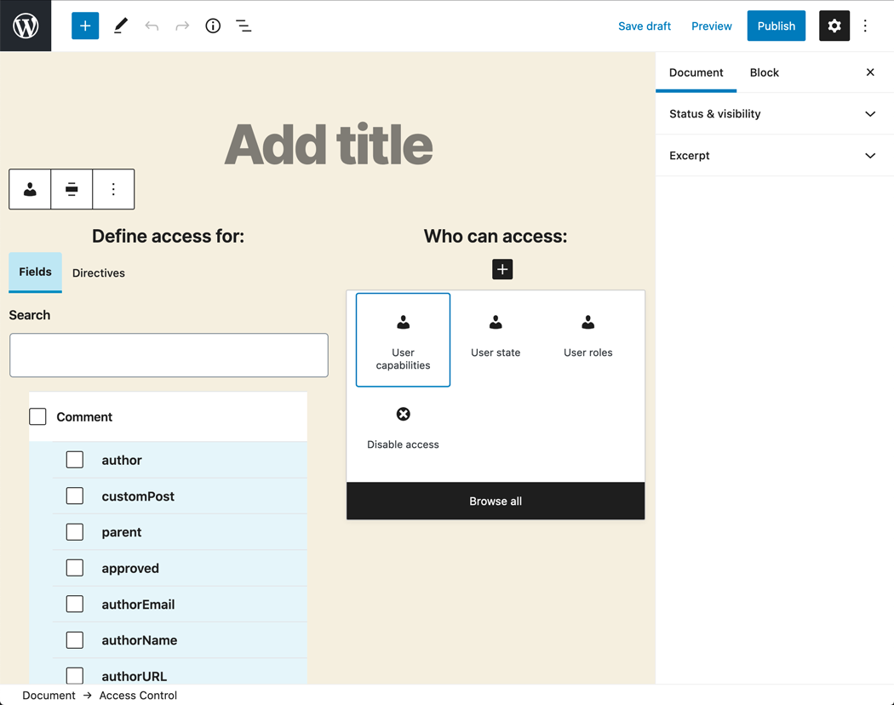
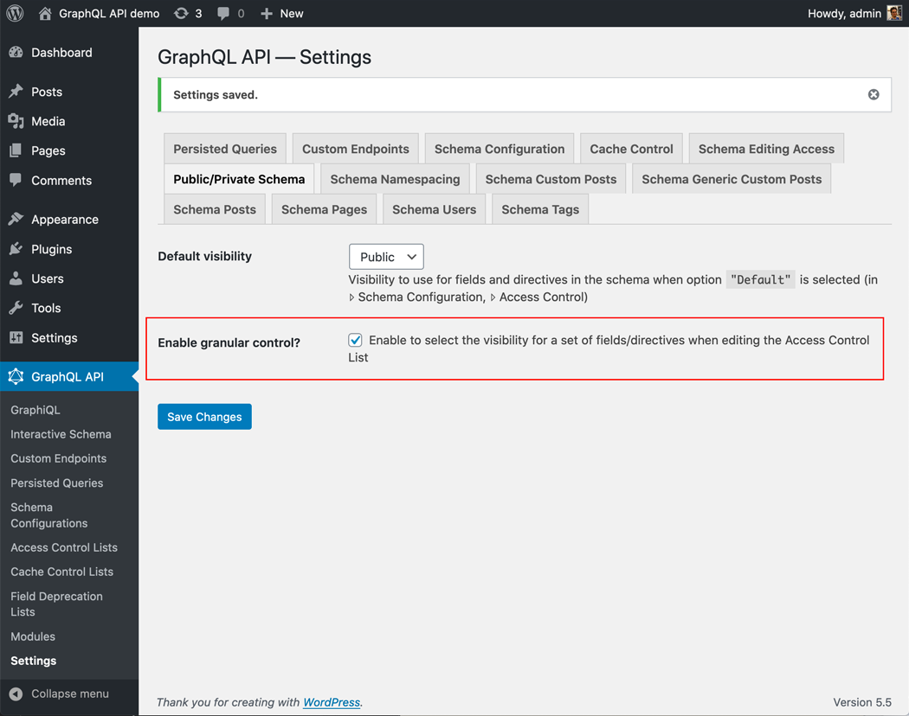
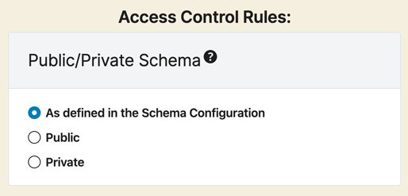
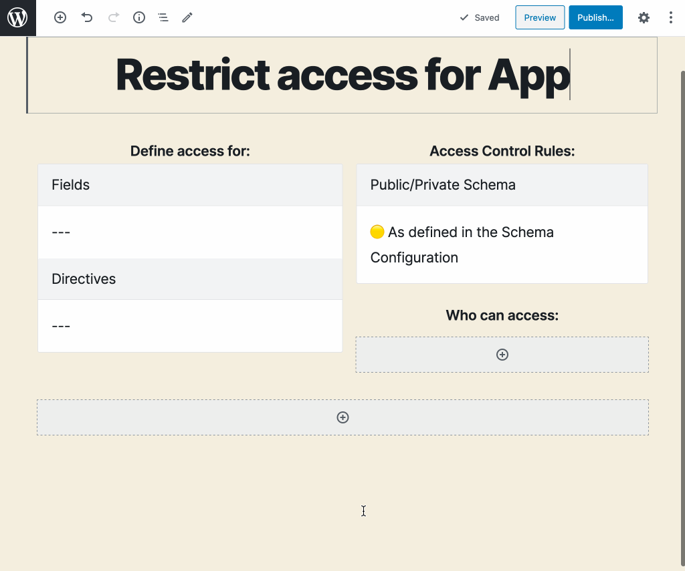
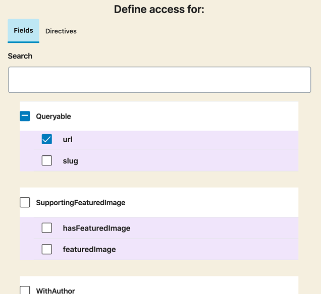
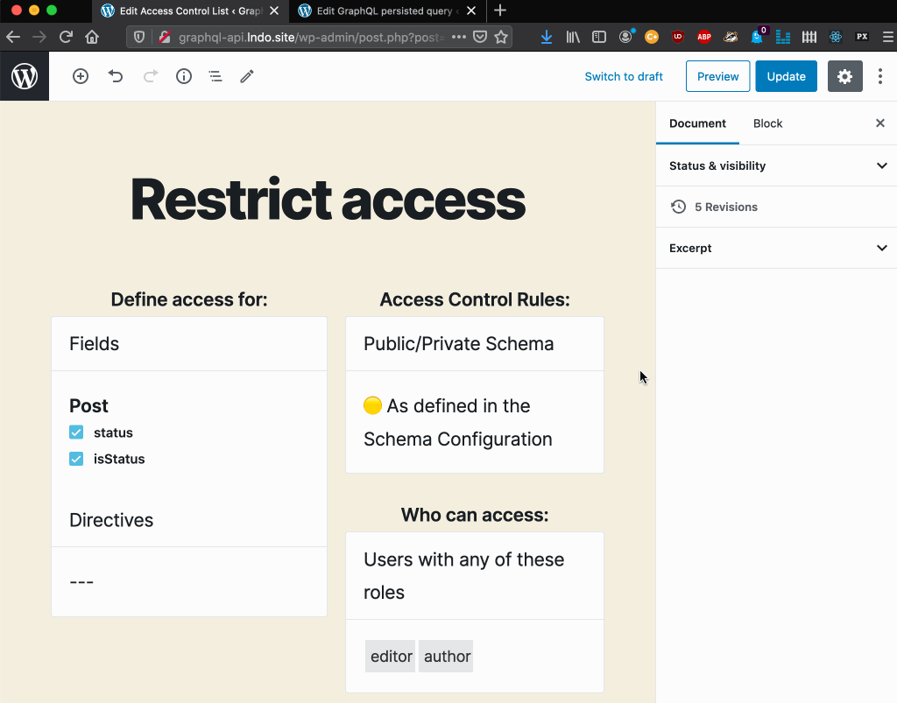

# Access Control

Manage who can access every field and directive in the schema through Access Control Lists.

GraphQL API ships with the following access control rules:

- Disable access
- Grant access if the user is logged-in or out
- Grant access if the user has some role
- Grant access if the user has some capability

Custom access control rules can be added.

## How to use

Every Access Control List contains one or many entries, each of them with the following elements:

- The fields to grant or deny access to
- The directives to grant or deny access to
- The list of rules to validate

If module `Public/Private Schema` is enabled, and option `Enable granular control?` in the settings is `on`, there is an additional element:

- Public/Private Schema: behavior when access is denied

Every entry is created by selecting the fields and directives, and configuring the rules:

Validation for fields from an interface is carried on all types implementing the interface.

## How it works

Whenever the requested query, either executed through a custom endpoint or as a persisted query, contains one of the selected fields or directives, the corresponding list of rules is evaluated. If any rule is not satisfied, access to that field or directive is denied.

If module `Public/Private Schema` is enabled, when access to some field or directive is denied, there are 2 ways for the API to behave:

- **Public mode**: Provide an error message to the user, indicating why access is denied
- **Private mode**: The error message indicates that the field or directive does not exist

If this module is not enabled, the default behavior ir `Public`.

## Resources

Video showing how access to different fields is granted or not, according to the configuration and the user executing the query: <https://vimeo.com/413503383>.
