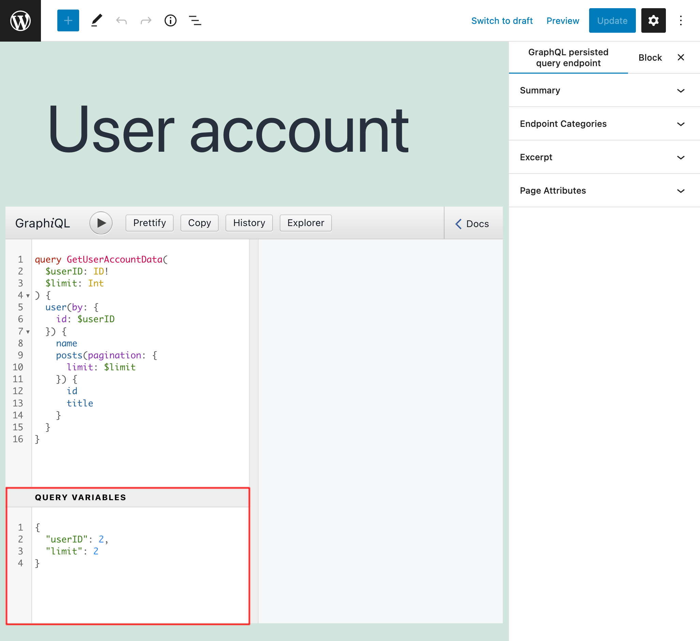
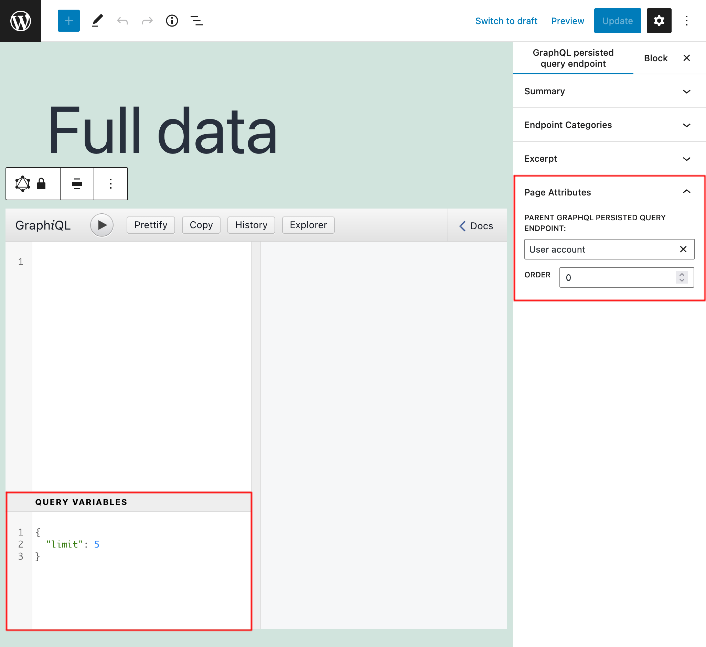
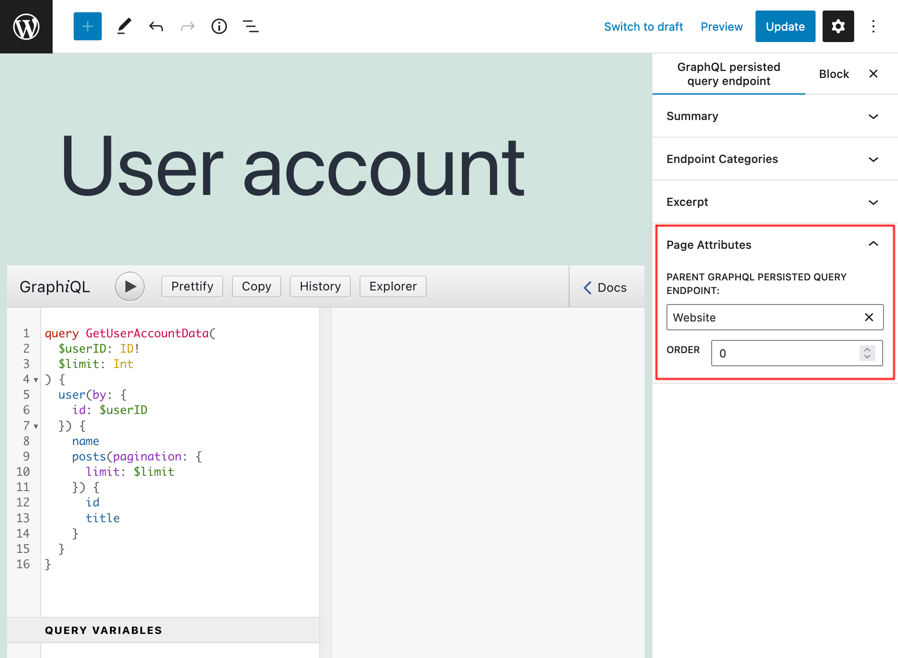

# API Hierarchy

Persisted queries and custom endpoints can declare a parent, from which it can inherit its properties:

- Its schema configuration

For persisted queries, it will also inherit:

- Its GraphQL query
- The query variables, but these can also be independently overriden

The child custom endpoint and persisted query will include, within their endpoint, the full path of its ancestor endpoint(s), such as `/graphql-query/posts/mobile-app/`.

## How it works

Inheritance is useful for creating a hierarchy of API endpoints, such as:

- `/graphql-query/posts/mobile-app/`
- `/graphql-query/posts/website/`

The number of levels is unlimited, so we can also create:

- `/graphql-query/posts/mobile-app/english/`
- `/graphql-query/posts/mobile-app/french/`
- `/graphql-query/posts/website/english/`
- `/graphql-query/posts/website/french/`

Children persisted queries can override variables defined in the parent query. For instance, variable `$limit` is defined in the parent, and overriden in the child:

## How to use

In the custom endpoint or persisted query, in the Document settings, there is section `Page Attributes` with a dropdown of all other entities, to select as the parent:

When selected, in the Options of the persisted query we can choose to inherit the parent's query:

Different strategies can be applied to create the API hierarchy.

For persisted queries, we can define the GraphQL query only on the parent (in this case, called `posts`), and then each child persisted query (in this case, `mobile-app` and `website`) will obtain the query from the parent, and define only the schema configuration:

- `/graphql-query/posts/mobile-app/`
- `/graphql-query/posts/website/`

Alternatively, we can declare the configuration at the parent level, and then all children implement only the GraphQL query:

- `/graphql-query/mobile-app/posts/`
- `/graphql-query/mobile-app/users/`
- `/graphql-query/website/posts/`
- `/graphql-query/website/users/`

## Resources

Video showing how to create an API hierarchy, and override the variables defined in the parent query: https://vimeo.com/413503010.
