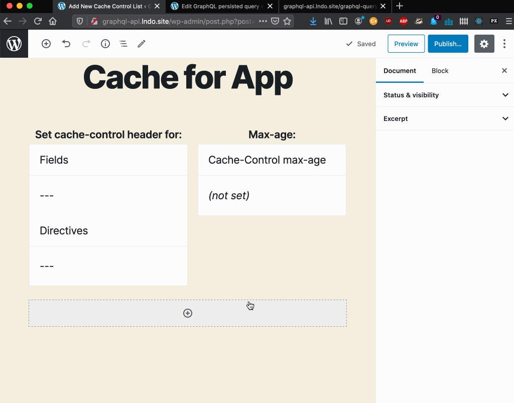

# Cache Control

Because it sends the queries via `POST`, GraphQL is normally not cacheable on the server-side or intermediate stages between the client and the server, such as a CDN.

However, persisted queries can be accessed via `GET`, hence their response can be cached via the `Cache-Control` header.

## How it works

The `Cache-Control` header indicates for how long the response is to be cached through its `max-age` value.

GraphQL API has Cache Control Lists, where custom `max-age` values are defined for fields and directives. Hence, different queries containing different combinations of fields and directives will produce a different `max-age` value.

The response's `max-age` value is calculated as the lowest value from all the fields and directives in the requested query, or `no-store` if either:

- any field or directive has `max-age` with value `0`
- an Access Control rule must check the user state for any field or directive (in which case, the response is specific to the user, so it cannot be cached)

## Resources

Video showing how the response's `Cache-Control` header contains different `max-age` values depending on the Cache Control configuration for the fields in the query: https://vimeo.com/413503188.
