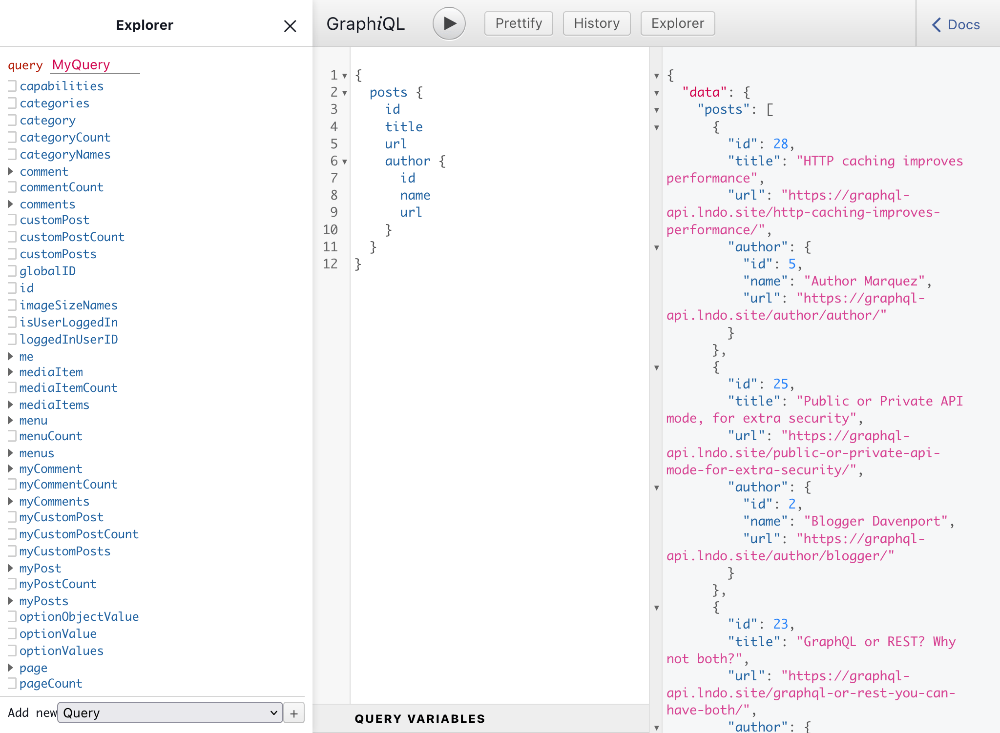
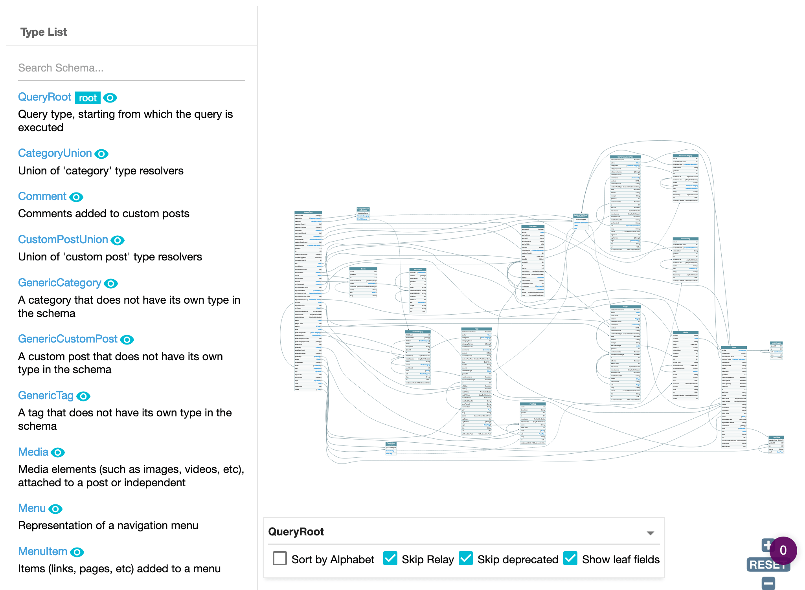
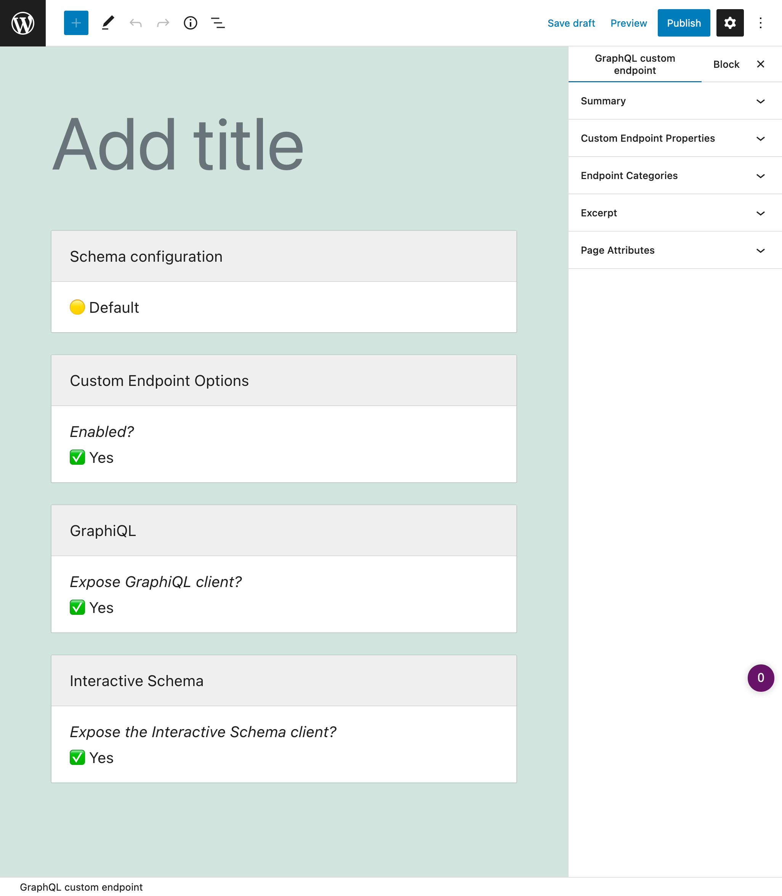
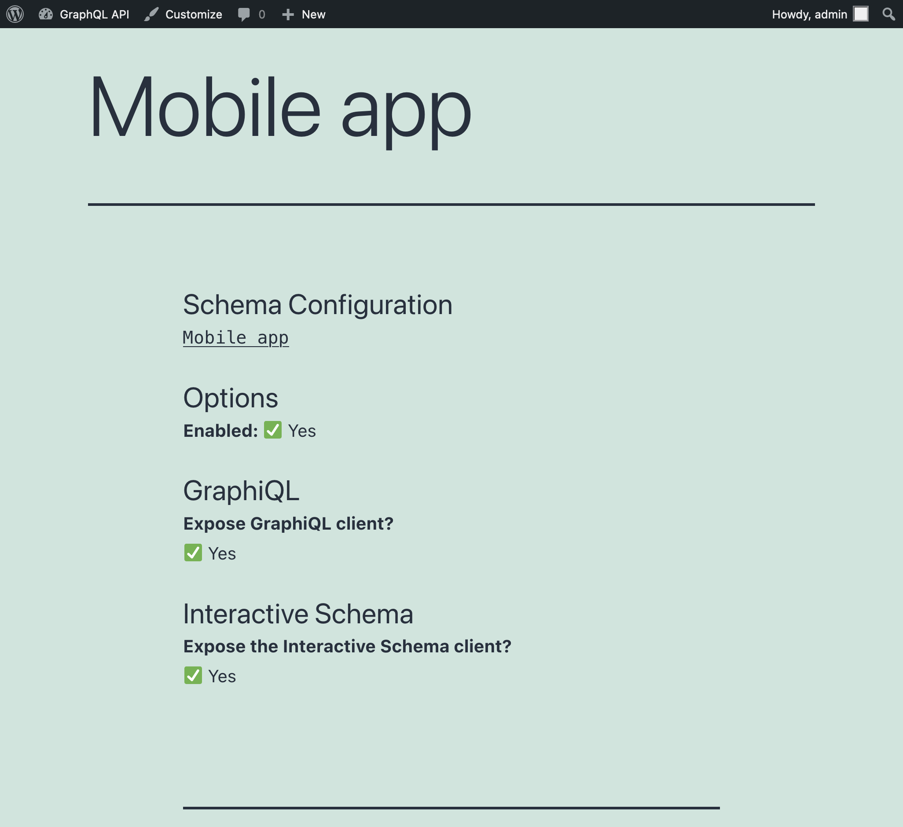
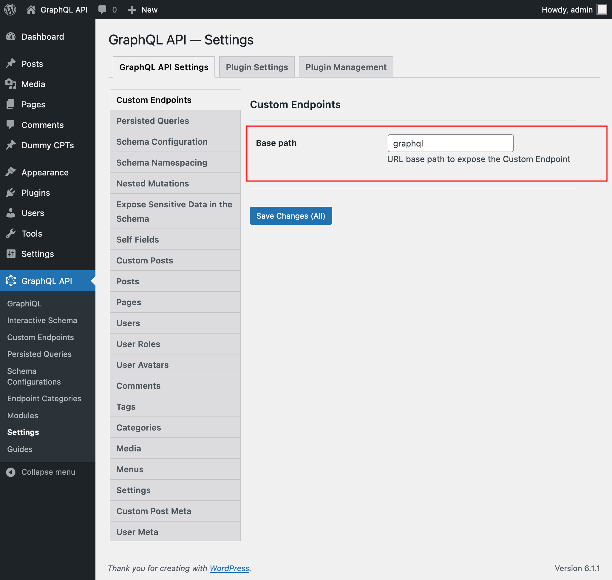

# Custom Endpoints

Create custom schemas, with custom access rules for different users, each available under its own endpoint.

## Description

A GraphQL server normally exposes a single endpoint for retrieving and posting data.

In addition to supporting the single endpoint, the GraphQL API also makes it possible to create custom endpoints, providing different schema configurations to deal with the needs from different targets, such as:

- Some specific client or user
- A group of users with more access to features (such as PRO users)
- One of the several applications, like mobile app or website
- 3rd-party APIs
- Any other

The custom endpoint is a Custom Post Type, and its permalink is the endpoint. An endpoint with title `"My endpoint"` and slug `my-endpoint` will be accessible under `/graphql/my-endpoint/`.

## Clients

Each custom endpoint has its own set of clients to interact with:

✅ A **GraphiQL client**, available under the endpoint + `?view=graphiql` (eg: `/graphql/my-endpoint/?view=graphiql`).

Module `GraphiQL for Custom Endpoints` must be enabled.

✅ An **Interactive schema client**, available under the endpoint + `?view=schema` (eg: `/graphql/my-endpoint/?view=schema`).

Module `Interactive Schema for Custom Endpoints` must be enabled.

## How to use

Clicking on the Custom Endpoints link in the menu, it displays the list of all the created custom endpoints:

A custom endpoint is a custom post type (CPT). To create a new custom endpoint, click on button "Add New GraphQL endpoint", which will open the WordPress editor:

When the endpoint is ready, publish it, and its permalink becomes its endpoint:

Appending `?view=source` to the permalink, it will show the endpoint's configuration (as long as the user has access to it):

By default, the custom endpoint has path `/graphql/`, and this value is configurable through the Settings:

## Editor Inputs

These are the inputs in the body of the editor:

<table markdown="1">
<thead>
<tr>
    <th>Input</th>
    <th>Description</th>
</tr>
</thead>
<tbody>
<tr>
  <td>**Title**</td>
  <td>Custom endpoint's title</td>
</tr>
<tr>
  <td>**Schema configuration**</td>
  <td>From the dropdown, select the schema configuration that applies to the custom endpoint, or one of these options: <ul markdown="1"><li>`"Default"`: the schema configuration is the one selected on the plugin's Settings</li><li>`"None"`: the custom endpoint will be unconstrained</li><li>`"Inherit from parent"`: Use the same schema configuration as the parent custom endpoint. This option is available when module `"API Hierarchy"` is enabled, and the custom endpoint has a parent query (selected on the Document settings)</li></ul></td>
</tr>
<tr>
  <td>**Options**</td>
  <td>Customize the behavior of the custom endpoint: <ul markdown="1"><li>**Enabled?:** If the custom endpoint is enabled. It's useful to disable a custom endpoint it's a parent query in an API hierarchy</li><li>**Expose GraphiQL client?:** Enable/disable attaching a GraphiQL client to the endpoint, accessible under `?view=graphiql`</li><li>**Expose the Interactive Schema client?:** Enable/disable attaching an Interactive schema client to the endpoint, accessible under `?view=schema`</li><li>**Inherit query from ancestor(s)?:** Use the same query as the parent custom endpoint. This option is available when module `"API Hierarchy"` is enabled, and the custom endpoint has a parent query (selected on the Document settings)</li></ul></td>
</tr>
</tbody>
</table>

These are the inputs in the Document settings:

| Input | Description | 
| --- | --- |
| **Permalink** | The endpoint under which the custom endpoint will be available |
| **Categories** | Can categorize the custom endpoint. Eg: `mobile`, `app`, etc |
| **Excerpt** | Provide a description for the custom endpoint. This input is available when module `"Excerpt as Description"` is enabled |
| **Page attributes** | Select a parent custom endpoint. This input is available when module `"API Hierarchy"` is enabled |

<!-- ## Settings

| Option | Description | 
| --- | --- |
| **Base path** | The base path for the custom endpoint URL. It defaults to `graphql` | -->

## Resources

Video showing how to create a custom endpoint: <https://vimeo.com/413503485>.
