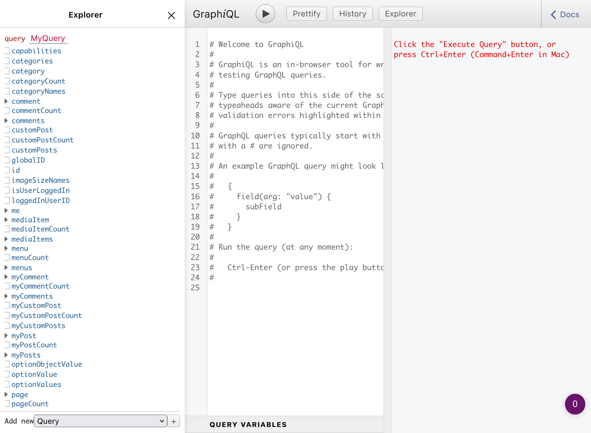
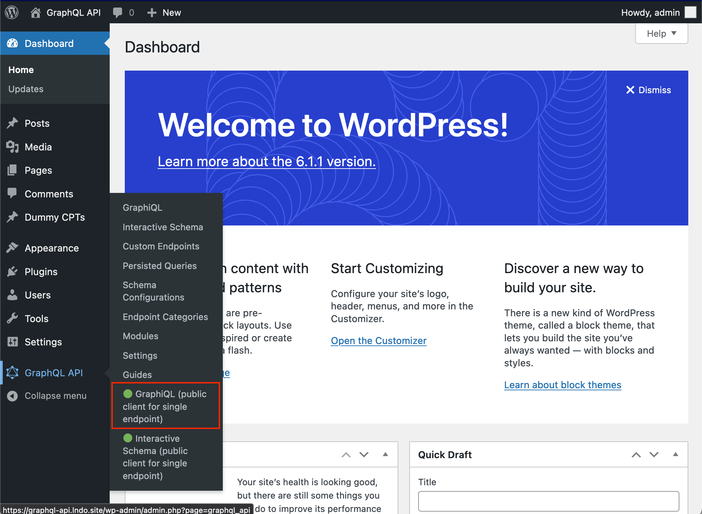

# GraphiQL for Single Endpoint
 
A public GraphiQL client can be made available to query the single GraphQL endpoint, by default available under `/graphiql/` (the path can be configured through the Settings):

The client can be opened from the Side menu, on link "GraphiQL (public client)":

