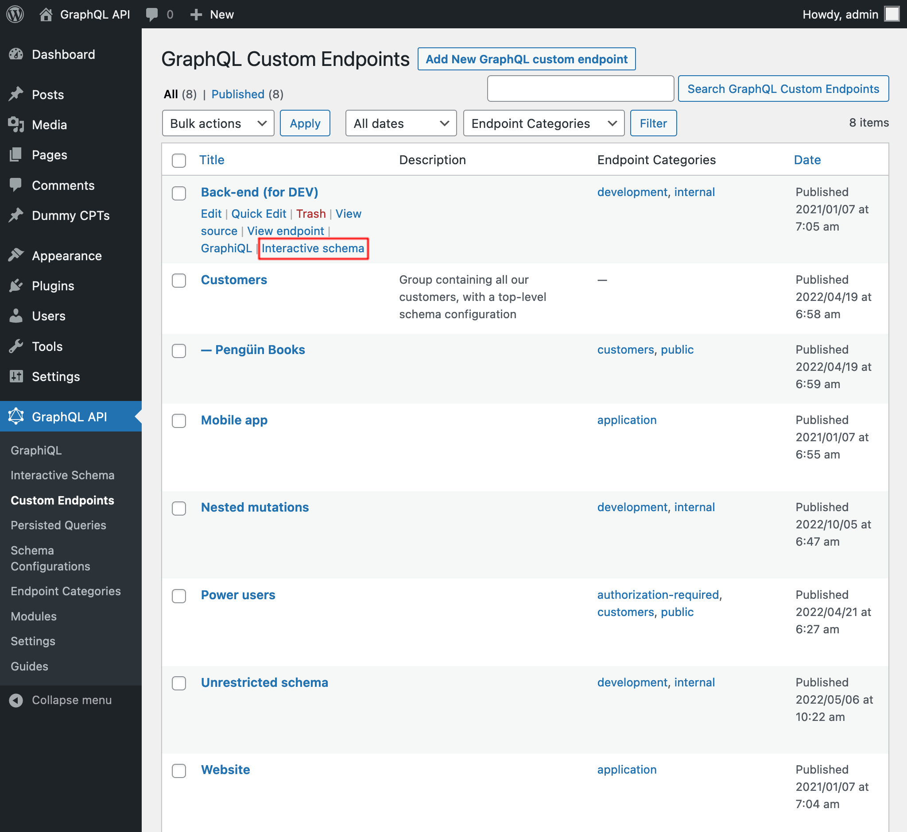

# Interactive Schema for Custom Endpoints

Each custom endpoint can be attached its own Interactive schema client, available under the endpoint + `?view=schema` (eg: `/graphql/my-endpoint/?view=schema`).

The client can be opened from the Custom Endpoints page, on link "Interactive schema" when hovering on the custom endpoint entry:

