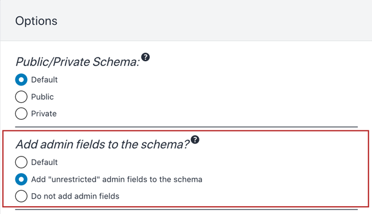
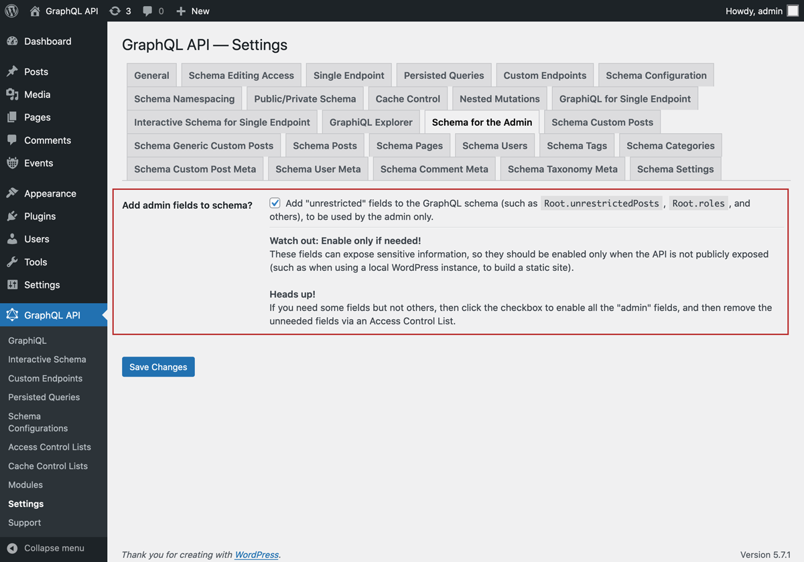

# Schema for the Admin

Add "unrestricted" admin fields to the GraphQL schema, which may expose private data.

The GraphQL schema must strike a balance between public and private fields, as to avoid exposing private information in a public API.

For instance, to access post data, we have field:

- `Root.posts`: exposes public data only, by fetching published posts only.

With this module, we can also access post data via field:

- `Root.unrestrictedPosts`: exposes public and private data, by fetching posts with any status (`"publish"`, `"draft"`, `"pending"`, `"trash"`).

## List of admin fields

The following fields will be added to the GraphQL schema:

**Root:**

- `unrestrictedPost`
- `unrestrictedPostBySlug`
- `unrestrictedPosts`
- `unrestrictedPostCount`
- `unrestrictedCustomPost`
- `unrestrictedCustomPostBySlug`
- `unrestrictedCustomPosts`
- `unrestrictedCustomPostCount`
- `unrestrictedGenericCustomPost`
- `unrestrictedGenericCustomPostBySlug`
- `unrestrictedPage`
- `unrestrictedPageBySlug`
- `unrestrictedPages`
- `unrestrictedPageCount`
- `roles`
- `capabilities`

**User:**

- `unrestrictedPosts`
- `unrestrictedPostCount`
- `unrestrictedCustomPosts`
- `unrestrictedCustomPostCount`
- `roles`
- `capabilities`

**PostCategory:**

- `unrestrictedPosts`
- `unrestrictedPostCount`

**PostTag:**

- `unrestrictedPosts`
- `unrestrictedPostCount`

---

Please notice the naming convention:

- If the field exposes public + private data, then the field name starts with `"unrestricted"`, such as `Root.posts` and `Root.unrestrictedPosts`
- If the field only exposes private data, then it doesn't need start with `"unrestricted"`, such as `User.roles`

## How to use

Adding admin fields to the schema can be configured as follows, in order of priority:

✅ Specific mode for the custom endpoint or persisted query, defined in the schema configuration

✅ Default mode, defined in the Settings

If the schema configuration has value `"Default"`, it will use the mode defined in the Settings:

## When to use

Use whenever exposing private information is allowed, such as when building a static website, fetching data from a local WordPress instance (i.e. not a public API).

