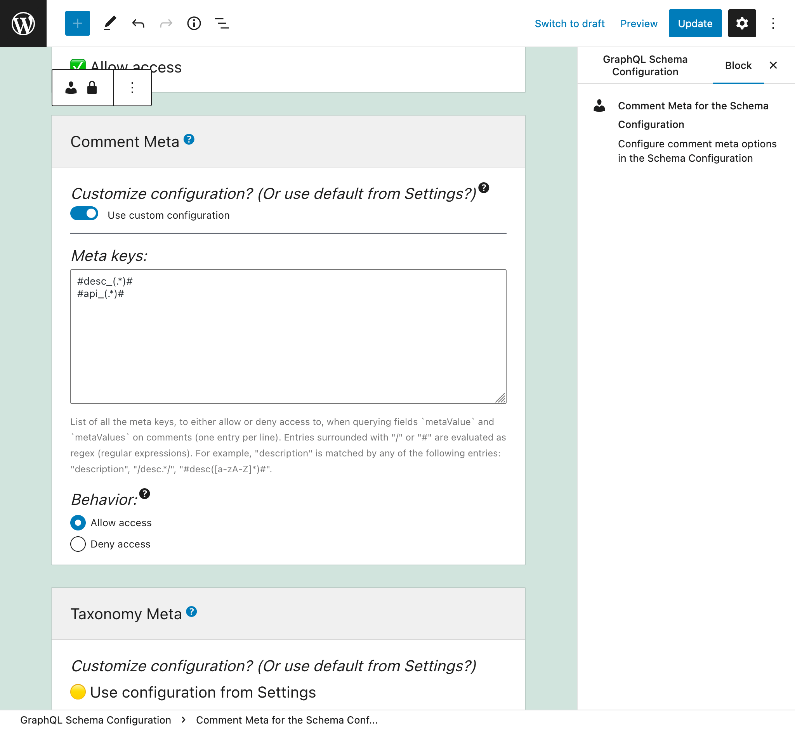
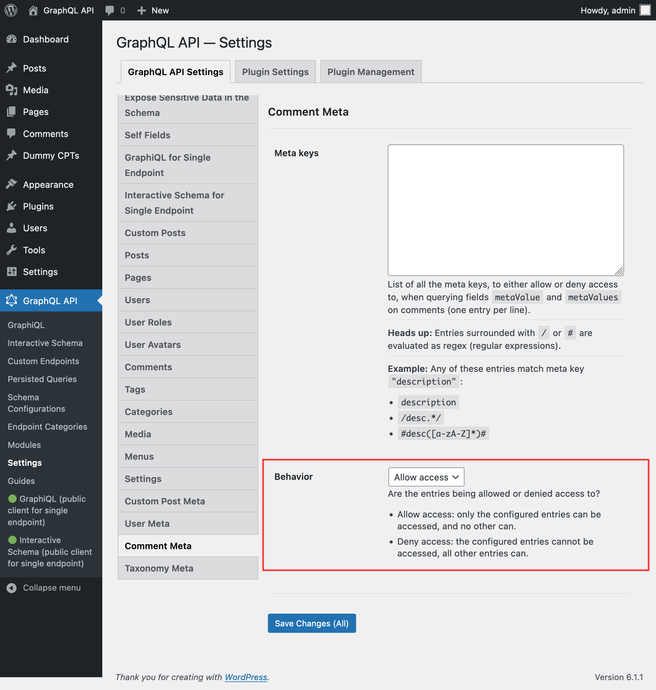

# Schema Comment Meta

Retrieve meta values for comments, by querying fields `metaValue` and `metaValues`.

For security reasons, which meta keys can be queried must be explicitly configured. By default, the list is empty.

Querying meta values is an expensive operation, requiring a call to the database per object and meta key, so enable this module (as to expose the meta fields in the GraphQL schema) only if needed.

## How to use

Query fields `metaValue` and `metaValues` on a comment, passing the required meta key as field argument `key`.

For instance, this query retrieves the comment's `description` meta value (as long as allowed by configuration):

```graphql
{
  posts {
    id
    comments {
      id
      description: metaValue(key: "description")
    }
  }
}
```

## Configure the allowed meta keys

In the "Schema Comment Meta" tab from the Settings, we must configure the list of meta keys that can be queried via the meta fields.

Each entry can either be:

- A regex (regular expression), if it's surrounded by `/`, or
- The full option name, otherwise

For instance, both entries `description` and `/desc*/` match meta key `"description"`.

<a href="../../images/schema-configuration-comment-meta-entries.png" target="_blank"></a>

There are 2 behaviors, "Allow access" and "Deny access":

👉🏽 <strong>Allow access:</strong> only the configured entries can be accessed, and no other can<br/>
👉🏽 <strong>Deny access:</strong> the configured entries cannot be accessed, all other entries can

<a href="../../images/schema-configuration-comment-meta-behavior.png" target="_blank"></a>
