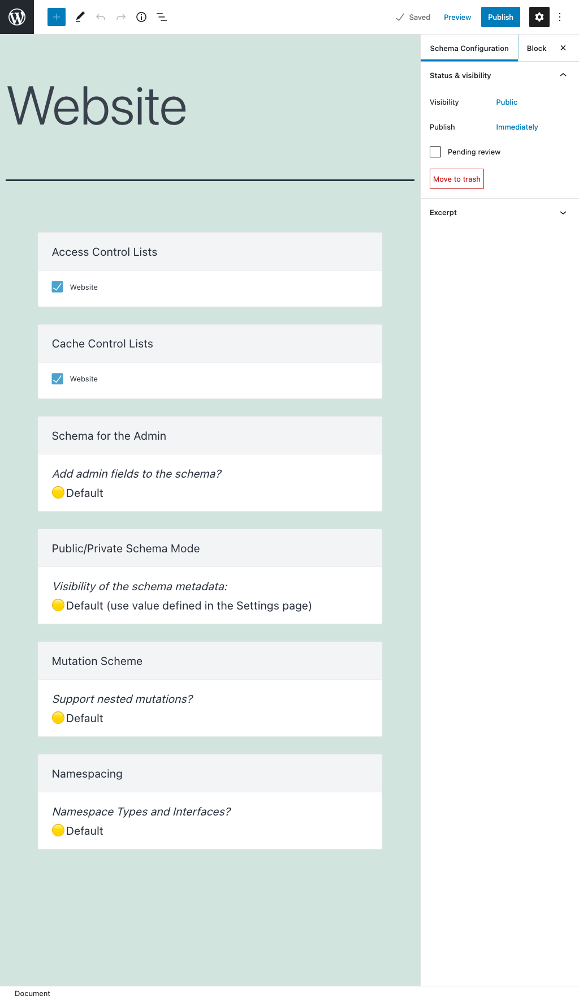
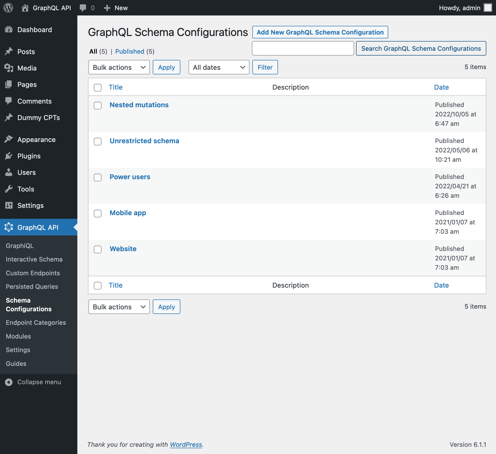
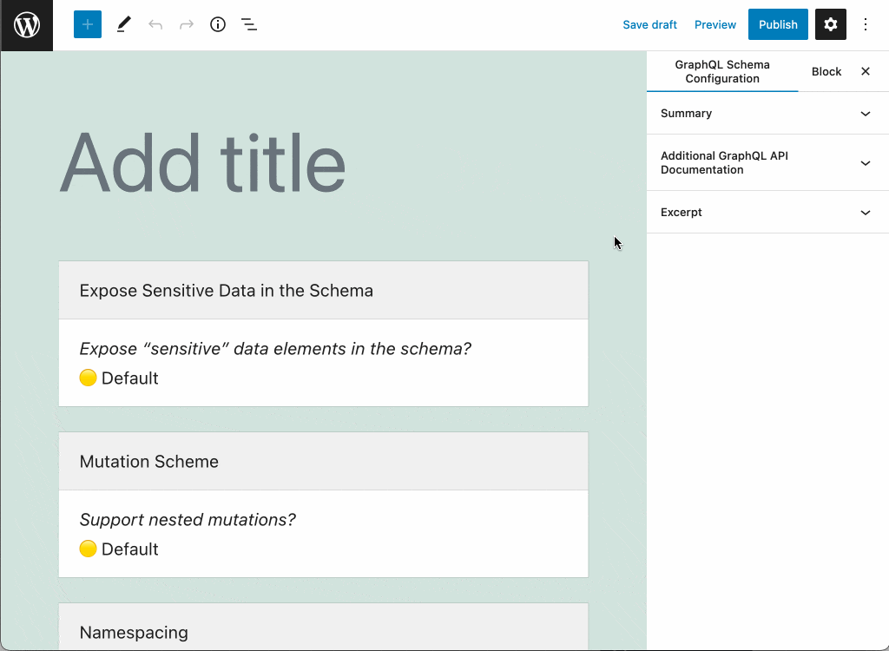
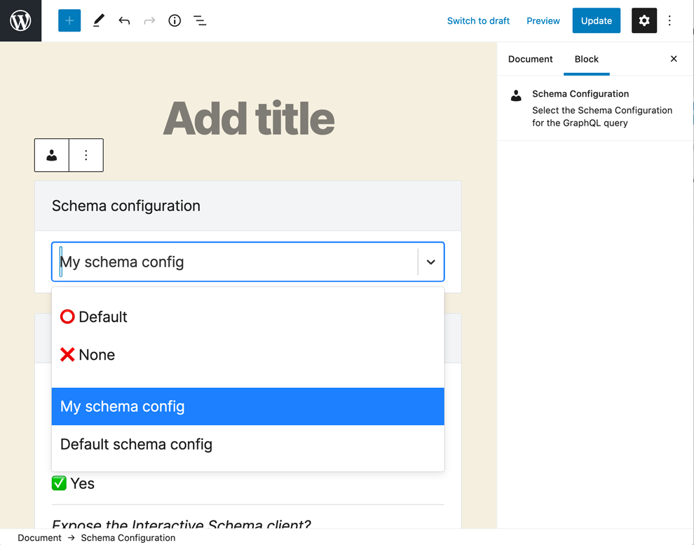
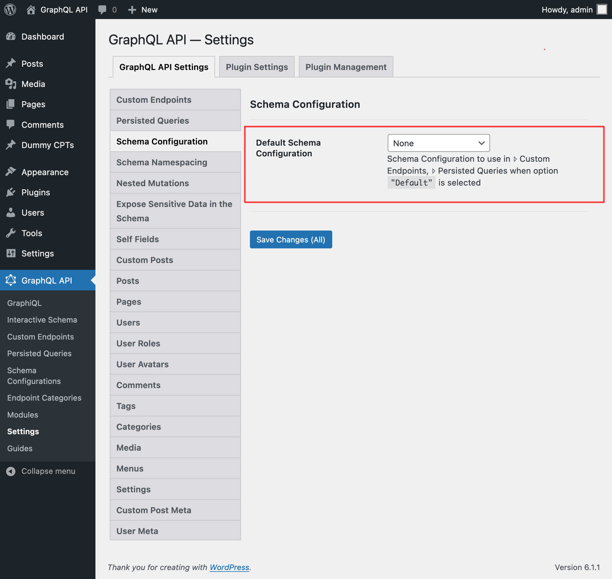

# Schema Configuration

A schema configuration is used by Custom Endpoints and Persisted Queries to customize their behavior.

## Description

The schema can be configured with the following elements (more items can also provided by extensions), and one or more entries can be selected for each:

- Access Control Lists: to define who can access the schema
- Cache Control Lists: to set-up HTTP caching
- Field Deprecation Lists: to version the schema

Modules can define their own configuration to be applied in the schema through the `Options` box, including:

- Setting the schema as public or private
- Namespacing the schema

## How to use

Clicking on the Schema Configurations link in the menu, it displays the list of all of them:

A schema configuration is a custom post type (CPT). To create a new schema configuration, click on button "Add New Schema Configuration", which will open the WordPress editor:

To configure the different elements in the schema configuration, click on corresponding input, and it becomes editable. Then select the entries that apply to the configuration. When you are done, click on "Publish":

Once published, the schema configuration becomes available when editing a Custom Endpoint or Persisted Query:

If the Custom Endpoint or Persisted Query has value `"Default"`, then the schema configuration selected in the Settings will be used:

## Editor Inputs

These are the inputs in the body of the editor:

<table markdown="1">
<thead>
<tr>
    <th>Input</th>
    <th>Description</th>
</tr>
</thead>
<tbody>
<tr>
    <td>**Access Control Lists**</td>
    <td>(If module `Access Control` is enabled) Manage who can access the schema, by selecting the Access Control Lists that must be applied to the custom endpoint or persisted query</td>
</tr>
<tr>
    <td>**Cache Control Lists**</td>
    <td>(If module `Cache Control` is enabled) Manage the behavior of HTTP caching, by selecting the Cache Control Lists that must be applied to the custom endpoint or persisted query</td>
</tr>
<tr>
    <td>**Field Deprecation Lists**</td>
    <td>(If module `Field Deprecation` is enabled) Manage deprecation of fields in the schema, by selecting the Field Deprecation Lists that must be applied to the custom endpoint or persisted query</td>
</tr>
<tr>
    <td>**Options**</td>
    <td>Customize the behavior of the schema configuration:  **Public/Private Schema:** (If module `Public/Private Schema` is enabled) When access to some a field or directive is denied, there are 2 ways for the API to behave:<ul markdown="1"><li>`"Public"`: Provide an error message to the user, indicating why access is denied. This behavior makes the metadata from the schema always available.</li><li>`"Private"`: The error message indicates that the field or directive does not exist. This behavior exposes the metadata from the schema only to those users who can access it.</li></ul>If `"Default"` is selected, the value selected in the Settings is used.  **Namespace Types and Interfaces?:** (If module `Schema Namespacing` is enabled) Define if to have all types and interfaces in the schema automatically namespaced. If `"Default"` is selected, the value selected in the Settings is used.  **Mutation Scheme:** (If module `Nested Mutations` is enabled) Define if to enable mutations, and if the redundant fields from the root must be removed. If `"Default"` is selected, the value selected in the Settings is used.</td>
</tr>
</tbody>
</table>

These are the inputs in the Document settings:

| Input | Description | 
| --- | --- |
| **Excerpt** | Provide a description for the schema configuration. This input is available when module `Excerpt as Description` is enabled |
