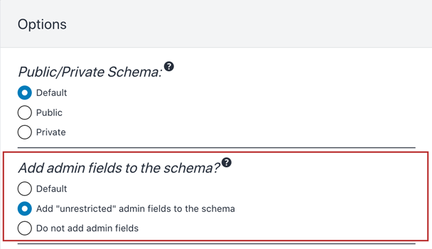

# Schema Expose Admin Data

Expose "admin" elements in the GraphQL schema, which provide access to private data.

The GraphQL schema must strike a balance between public and private elements (including fields and input fields), as to avoid exposing private information in a public API.

For instance, to access post data, we have field `Root.posts`, which by default can only retrieve published posts.

With this module, a new property `Schema Expose Admin Data` is added to the Schema Configuration. When enabled, argument `filter` in `Root.posts` exposes an additional input `status`, enabling to filter non-published posts (eg: posts with status `"draft"`), which is private data.

## List of admin elements

The following elements will be added to the GraphQL schema:

**User:**

- `email`
- `roles`
- `capabilities`

**Custom Posts:**

- `status`

**Comments:**

- `status`

## How to use

Exposing admin elements in the schema can be configured as follows, in order of priority:

✅ Specific mode for the custom endpoint or persisted query, defined in the schema configuration

✅ Default mode, defined in the Settings

If the schema configuration has value `"Default"`, it will use the mode defined in the Settings:

## When to use

Use whenever exposing private information is allowed, such as when building a static website, fetching data from a local WordPress instance (i.e. not a public API).
