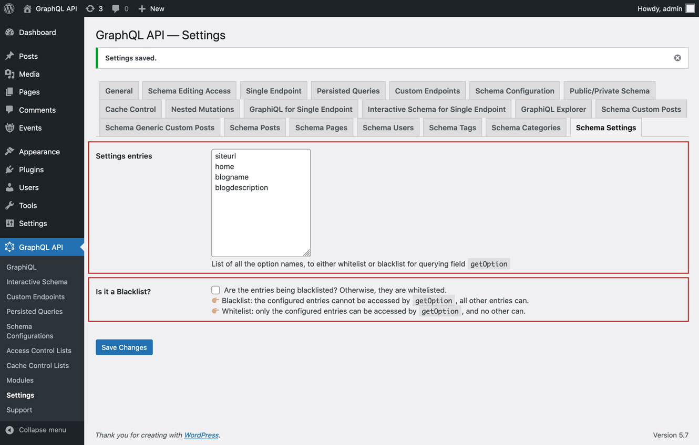

# Schema Settings

Retrieve the settings from the site (stored in table `wp_options`), by querying field `getOption`.

For security reasons, which options can be queried must be explicitly configured.

By default, only the following options can be queried:

- siteurl
- home
- blogname
- blogdescription

## How to use

In the "Schema Settings" tab from the Settings, we can configure the list of options that can be queried via `getOption`.

There are 2 behaviors, "Whitelist" and "Blacklist":

👉🏽 <strong>Whitelist:</strong> only the configured entries can be accessed by `getOption`, and no other can<br/>
👉🏽 <strong>Blacklist:</strong> the configured entries cannot be accessed by `getOption`, all other entries can

<a href="../../images/schema-configuration-settings.jpg" target="_blank"></a>

Execute the following query, passing the required option name (in this case, `siteurl`):

```graphql
{
  option(name: "siteurl")
}
```
