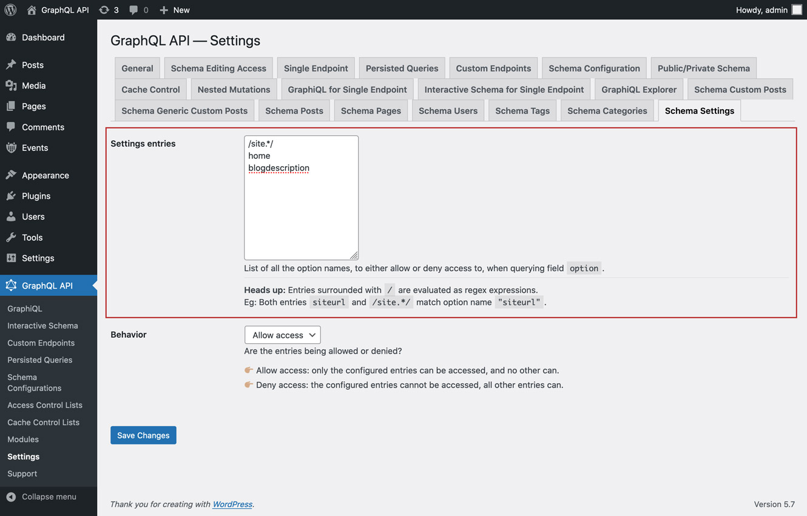

# Schema Settings

Retrieve the settings from the site (stored in table `wp_options`), by querying field `option`.

For security reasons, which options can be queried must be explicitly configured.

By default, only the following options can be queried:

- siteurl
- home
- blogname
- blogdescription

## How to use

Query field `Root.option`, passing the required option as field argument `name`.

For instance, this query retrieves the site's URL:

```graphql
{
  option(name: "siteurl")
}
```

## Configure queryable options

In the "Schema Settings" tab from the Settings, we must configure the list of options that can be queried via `option`.

Each entry can either be:

- A regex (regular expression), if it's surrounded by `/`, or
- The full option name, otherwise

For instance, both entries `siteurl` and `/site.*/` match option name `"siteurl"`.

<a href="../../images/schema-configuration-settings-entries.jpg" target="_blank"></a>

There are 2 behaviors, "Allow access" and "Deny access":

👉🏽 <strong>Allow access:</strong> only the configured entries can be accessed, and no other can<br/>
👉🏽 <strong>Deny access:</strong> the configured entries cannot be accessed, all other entries can

<a href="../../images/schema-configuration-settings-behavior.jpg" target="_blank"></a>
