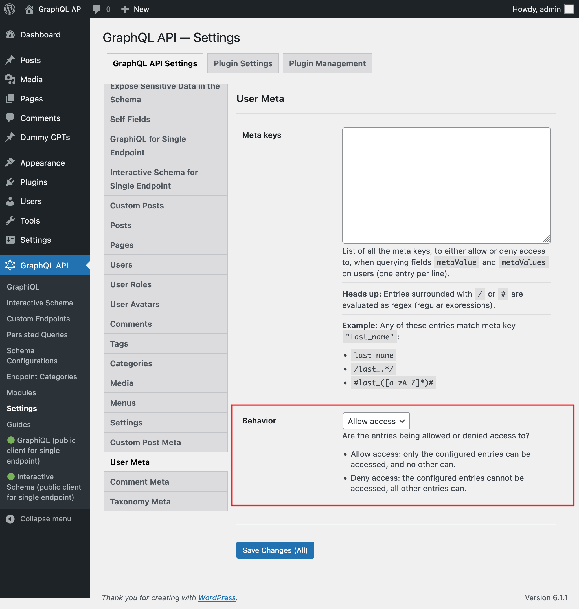

# Schema User Meta

Retrieve meta values for users, by querying fields `metaValue` and `metaValues`.

For security reasons, which meta keys can be queried must be explicitly configured. By default, the list is empty.

Please notice: Querying meta values is an expensive operation, requiring a call to the database per object and meta key, so it should be used sparingly.

## How to use

Query fields `metaValue` and `metaValues` on a user, passing the required meta key as field argument `key`.

For instance, this query retrieves the user's `last_name` meta value (as long as allowed by configuration):

```graphql
{
  users {
    id
    lastName: metaValue(key: "last_name")
  }
}
```

## Configure the allowed meta keys

In the "Schema User Meta" tab from the Settings, we must configure the list of meta keys that can be queried via the meta fields.

Each entry can either be:

- A regex (regular expression), if it's surrounded by `/`, or
- The full option name, otherwise

For instance, both entries `last_name` and `/last_.*/` match meta key `"last_name"`.

<a href="../../images/schema-configuration-user-meta-entries.png" target="_blank"></a>

There are 2 behaviors, "Allow access" and "Deny access":

👉🏽 <strong>Allow access:</strong> only the configured entries can be accessed, and no other can<br/>
👉🏽 <strong>Deny access:</strong> the configured entries cannot be accessed, all other entries can

<a href="../../images/schema-configuration-user-meta-behavior.png" target="_blank"></a>
