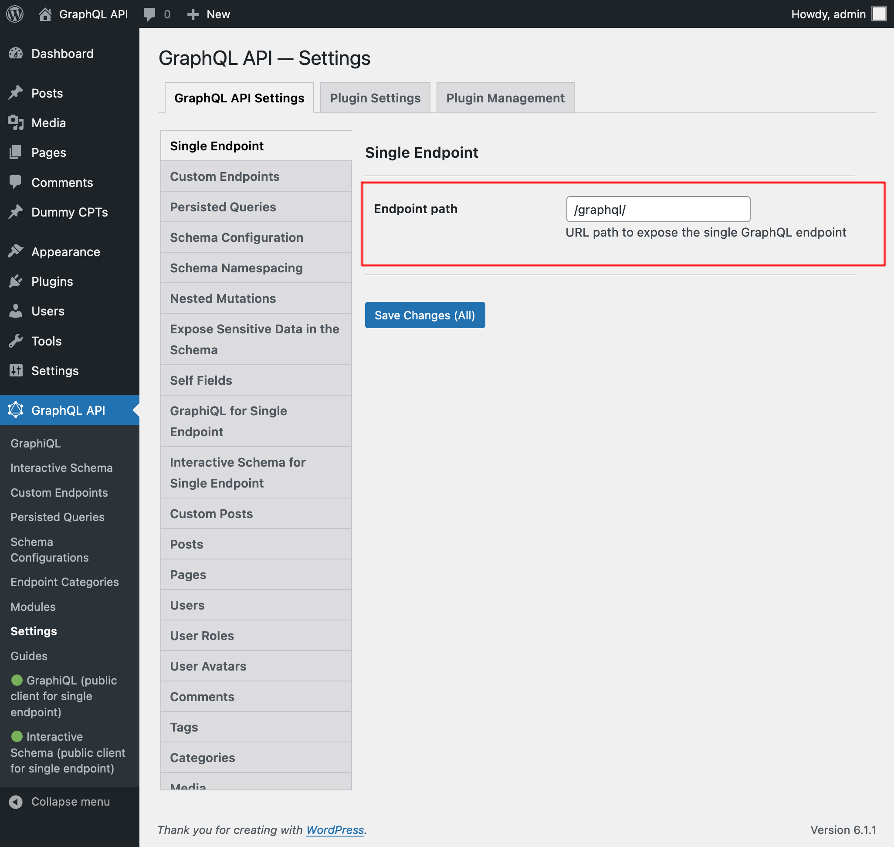

# Single Endpoint

Execute queries against the GraphQL server through the public single endpoint.

By default the endpoint is `/graphql/`, and the path can be configured through the Settings.

The GraphQL single endpoint can be configured by assigning a Schema Configuration to it. To do this, on section "Schema Configuration" select the desired entry from the dropdown for "Schema Configuration for the Single Endpoint":

