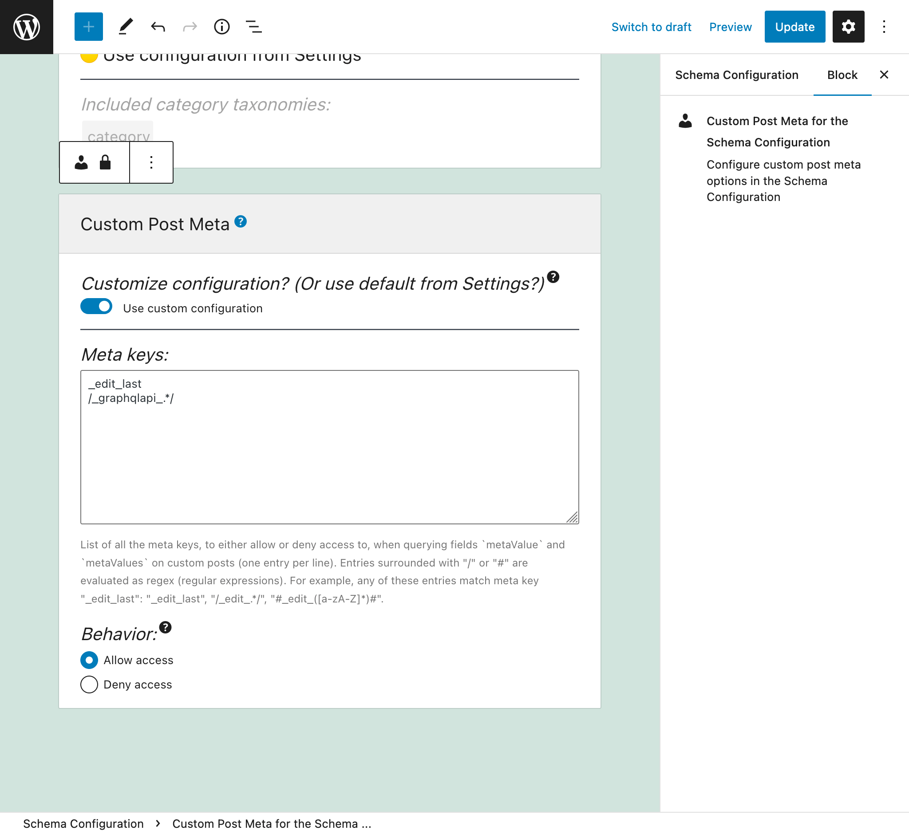
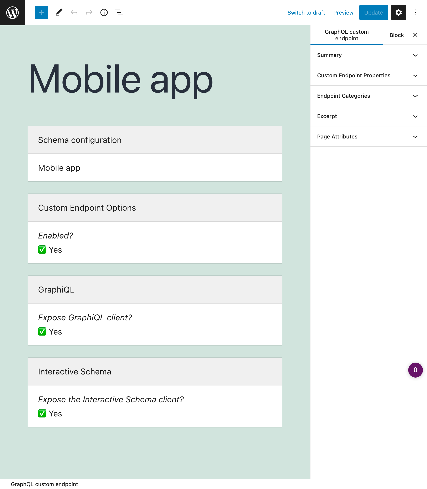

# Release Notes: 0.8

This is a huge release, which focuses on three areas:

1. Refactoring the codebase to enable extensions
2. Further satisfying the GraphQL specification
3. Completing the GraphQL schema

In addition, it supports the new WordPress 5.8, and contains plenty of bug fixes and improvements.

**Important:** this release contains breaking changes! Scroll down to find out.

## Support for WordPress 5.8

WordPress 5.8 [deprecates several filter hooks](https://github.com/WordPress/wordpress-develop/pull/1118), including `allowed_block_types` and `block_categories` (used by this plugin).

The affected hooks have been replaced:

1. `allowed_block_types` => `allowed_block_types_all`
2. `block_categories` => `block_categories_all`

## Improved support for PHP 8.1

This release fixes a few issues when using PHP 8.1.

## Simplified the codebase, using container services everywhere

The codebase for the GraphQL server has been refactored, to use a service container for registering all elements for the schema (type resolvers, field resolvers, interface resolvers, custom scalar resolvers, and others).

This is a milestone, which introduces a single approach for developing the plugin and its extensions, greatly simplifying their code and documentation.

Docs on how to create custom extensions for the GraphQL API can finally be written. Work on them will start soon, and will be published on [graphql-api.com/guides](https://graphql-api.com/guides).

## Cache is saved under `wp-content`

The plugin caches results to disk to optimize performance.

The cached files were previously stored under a system folder, out of view to the admin user. From now on, they are stored under `wp-content/graphql-api/cache/`.

## A "fixed schema" GraphQL endpoint was introduced to power the WordPress editor

Now, there are 2 endpoints in the `wp-admin`:

1. `GRAPHQL_API_ADMIN_CONFIGURABLESCHEMA_ENDPOINT`
2. `GRAPHQL_API_ADMIN_FIXEDSCHEMA_ENDPOINT`

With `GRAPHQL_API_ADMIN_CONFIGURABLESCHEMA_ENDPOINT`, the GraphQL schema is modified by user preferences, such as being namespaced or not, having types/directives enabled or not, and others.

With `GRAPHQL_API_ADMIN_FIXEDSCHEMA_ENDPOINT`, the GraphQL schema is not modified by user preferences, always exposing all types, fields and directives, including the "unrestricted" admin fields.

The fixed endpoint enables Gutenberg blocks to query all fields, independently of those being enabled or not by the user, and with unrestricted access.

## Further support of field types in the schema

Support for lists as field types has been expanded, now supporting the following features:

- Lists with non-null items: `[String!]`
- Lists of lists: `[[String]]`
- Any combination of them: `[[String!]!]`

## Input coercion: accept a single value when a list is expected

We can now input a single value in the GraphQL query where a list is expected, as [defined in the GraphQL spec](https://spec.graphql.org/draft/#sec-List.Input-Coercion).

For instance, this query:

```graphql
{
  posts(ids: 1) {
    title
  }
}
```

...is equivalent to:

```graphql
{
  posts(ids: [1]) {
    title
  }
}
```

## Further completed the WordPress schema

Additional entities from the WordPress data model have been added to the GraphQL schema:

<a href="../../images/graphql-schema-v08.png" target="_blank"></a>

Let's see what new elements have been added.

### Categories

Categories have been mapped, via the new `PostCategory` type, and the new fields:

- `Root.postCategories: [PostCategory]`
- `Root.postCategory: PostCategory`
- `Post.categories: [PostCategory]`

For instance, this query retrieves the categories for the posts:

```graphql
{
  posts {
    id
    title
    categories {
      id
      name
      url
    }
  }
}
```

A mutation field, to assign categories to posts, has also been added:

- `MutationRoot.setCategoriesOnPost: Post`

And an input `categories` has been added to the mutation fields for posts:

- `MutationRoot.createPost`
- `MutationRoot.updatePost`
- `Post.update` (when nested mutations are enabled)

### Meta

Custom post, user, comment and taxonomy meta values can now be queried, via the new fields:

- `Post.metaValue: AnyScalar`
- `Post.metaValues: [AnyScalar]`
- `User.metaValue: AnyScalar`
- `User.metaValues: [AnyScalar]`
- `Comment.metaValue: AnyScalar`
- `Comment.metaValues: [AnyScalar]`
- `PostCategory.metaValue: AnyScalar`
- `PostCategory.metaValues: [AnyScalar]`
- `PostTag.metaValue: AnyScalar`
- `PostTag.metaValues: [AnyScalar]`

For instance, this query retrieves the meta `last_name` for the users:

```graphql
{
  users {
    id
    lastName: metaValue(key: "last_name")
  }
}
```

Since meta values can be anything (string, integer, float, or boolean) they have been mapped via the newly-introduced generic scalar type `AnyScalar`.

Meta values may be public or private. Which meta keys can be queried must be explicitly configured in the settings page:

<a href="../../images/schema-configuration-custompost-meta-entries.png" target="_blank"></a>

By default, the list of allowed meta keys is empty.

### Menus

Menus have been mapped, via the new `Menu` type, and the new field `Root.menu`.

### Settings

The settings from the site (stored in table `wp_options`) can be queried via the new field `Root.option: AnyScalar`.

For instance, this query retrives the site's name:

```graphql
{
  siteName: option(name: "blogname")
}
```

Which options can be accessed must be explicitly configured in the settings page:

<a href="../../images/schema-configuration-settings-entries.jpg" target="_blank"></a>

By default, only the following options can be queried:

- `"home"`
- `"blogname"`
- `"blogdescription"`

### User posts

Logged-in users can retrieve their own posts, for any status (`publish`, `pending`, `draft` or `trash`), via the new fields:

- `Root.myPosts: [Post]`
- `Root.myPostCount: Int`
- `Root.myPost: Post`

For instance, we can now run this query:

```graphql
{
  myPosts {
    id
    title
    url
    status
  }
}
```

## Added "unrestricted" admin fields to the GraphQL schema

The GraphQL schema must strike a balance between public and private fields, as to avoid exposing private information in a public API.

The new module `Schema for the Admin` adds "unrestricted" admin fields to the GraphQL schema, which may expose private data:

**Root:**

- `unrestrictedPost`
- `unrestrictedPosts`
- `unrestrictedPostCount`
- `unrestrictedCustomPost`
- `unrestrictedCustomPosts`
- `unrestrictedCustomPostCount`
- `unrestrictedPage`
- `unrestrictedPages`
- `unrestrictedPageCount`
- `roles`
- `capabilities`

**User:**

- `unrestrictedPosts`
- `unrestrictedPostCount`
- `unrestrictedCustomPosts`
- `unrestrictedCustomPostCount`
- `roles`
- `capabilities`

**PostCategory:**

- `unrestrictedPosts`
- `unrestrictedPostCount`

**PostTag:**

- `unrestrictedPosts`
- `unrestrictedPostCount`

For instance, to access post data, currently we have field `posts`, which exposes public data only, by fetching published posts.

From now on, we can also access post data via field `unrestrictedPosts`, which exposes public and private data, by fetching posts with any status (`"publish"`, `"draft"`, `"pending"`, `"trash"`).

## Introduced scalar type `AnyScalar`

Scalar type `AnyScalar` represents any of the built-in scalars (`String`, `Int`, `Boolean`, `Float` or `ID`).

It is used on the newly-introduced `option` and `metaValue(s)` field, because we do not know in advance the type of their returned data, and the union of scalar types is not yet supported by the GraphQL spec.

## Settings in long format

Options in the Settings page are divided by tabs. From `v0.8` it is also possible to visualize them all together in a single long page.

To enable this behavior, uncheck item `"Have all options in this Settings page be organized under tabs, one tab per module."` on the Settings, and press on `"Save Changes"`:

<a href="../../images/settings-without-tabs-checkbox.png" target="_blank"></a>

Then, all settins will be shown together in long form:

<a href="../../images/settings-without-tabs.png" target="_blank"></a>

---

## Breaking changes

Release `v0.8` produces breaking changes with the previous version.

### Configuration breaking changes

The following CPTs have had their "Options" block rebuilt:

- Schema Configurations
- Custom Endpoints
- Persisted Queries

In the previous `v0.7`, a single Options block for these entities contained many configuration items. Since `v0.8`, this block has been decoupled into several independent blocks, each containing its own configuration.

For instance, in `v0.7`, (in addition to enabling/disabling the endpoint) the Custom Endpoint Options block allowed to configure the GraphiQL and Interactive Schema clients:

<a href="../../images/legacy/v07/custom-endpoint.png" target="_blank"></a>

Since `v0.8`, this configuration is added through the GraphiQL and Interactive Schema blocks:

<a href="../../images/custom-endpoint.png" target="_blank"></a>

The configuration stored in the Options blocks for all 3 CPTs is not automatically migrated to the new format. Hence, before upgrading to `v0.8`, please write down your stored configuration, and replicate it after upgrading to the new version.

Sorry for this inconvenience.

In addition, you will need to click on the "Reset the template" button shown in the WordPress editor, for all entries for the 3 CPTs.

<a href="../../images/legacy/v07/reset-template.png" target="_blank"></a>

### Removed non-standard directives

The non-standard directives have been removed from the plugin:

- `@default`
- `@removeIfNull`
- `@export`

### Removed modules

The following modules have been removed from the plugin:

- Field Deprecation
- Configuration Cache
- Schema Cache
- Multiple Query Execution
- Proactive Feedback
- Schema Editing Access
- Embeddable fields

---

## Upcoming Roadmap

Now that `v0.8` has shipped, we can start planning the road ahead.

The current plan is the following:

Ship `v0.9` in September 2019, including:

- Custom scalars
- An updated GraphQL schema, using custom scalars whenever appropriate (eg: `Post.date` will return type `Date` instead of `String`)
- Further enhancements to support extensions

And then, ship `1.0` around year-end or early 2022, including:

- A demo of an extension plugin
- Complete documentation guides on creating extensions
- Launch of the GraphQL API plugin in `wp.org`

To receive notifications on the current status, you can [subscribe to the newsletter](https://graphql-api.com/newsletter/).

---

## Run into issues?

If you have any problem installing or running `v0.8`, please create an issue in [github.com/leoloso/PoP/issues](https://github.com/leoloso/PoP/issues).

👋