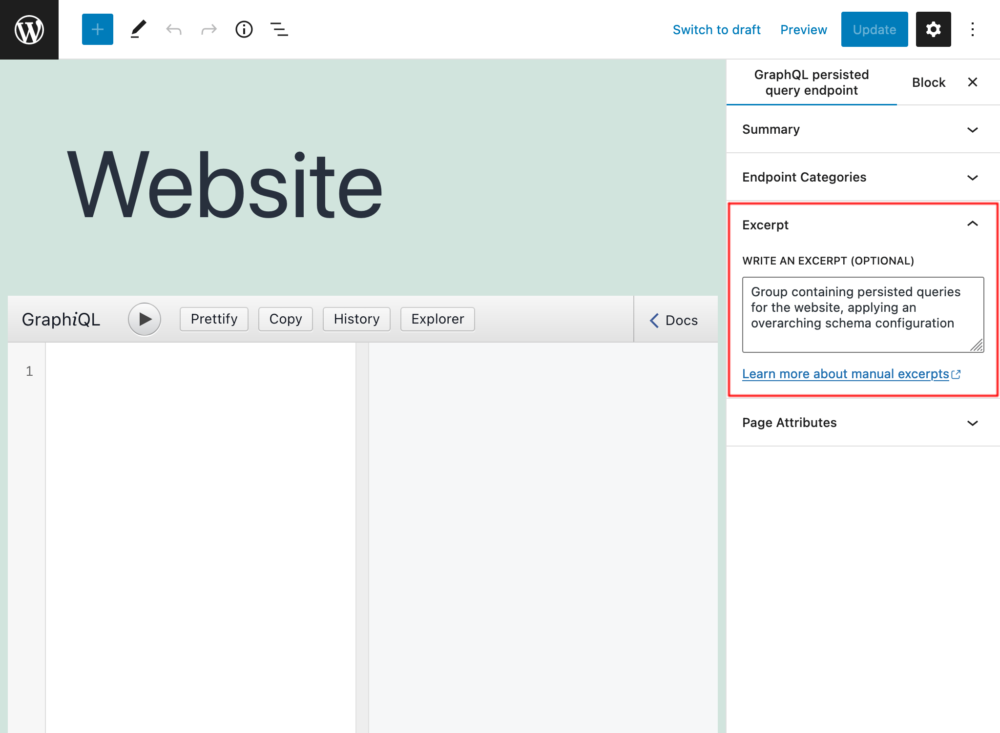

# Excerpt as Description

Provide a description for custom endpoints, persisted queries, and others, through their excerpt

## Description

Use the excerpt field to provide a description for the different Custom Post Type entities in this plugin:

- Persisted Queries
- Custom Endpoints
- Schema Configurations
- Access Control Lists
- Cache Control Lists
- Field Deprecation Lists

The description is shown in the table listing the entities for each Custom Post Type, under column `Description`:

The description is also displayed when visualizing the entity:

## How to use

When editing the entity, use the excerpt field to provide a description:

