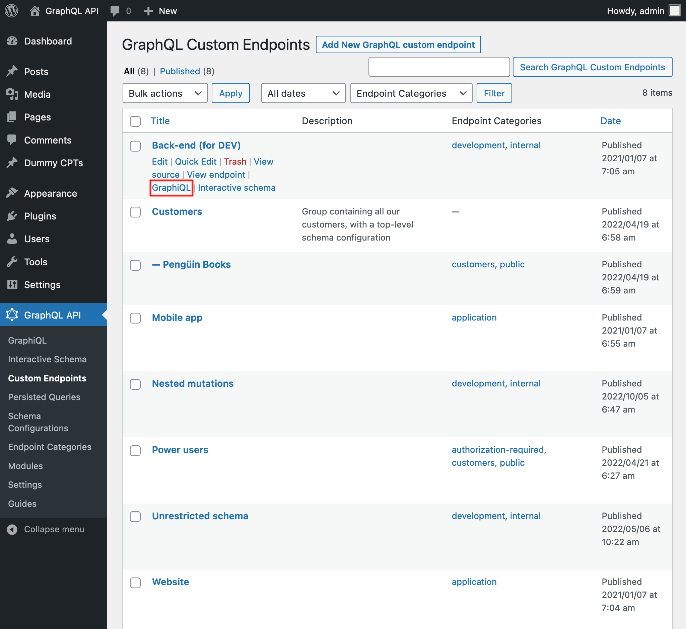

# GraphiQL for Custom Endpoints

Each custom endpoint can be attached its own GraphiQL client, available under the endpoint + `?view=graphiql` (eg: `/graphql/my-endpoint/?view=graphiql`).

The client can be opened from the Custom Endpoints page, on link "GraphiQL" when hovering on the custom endpoint entry:

