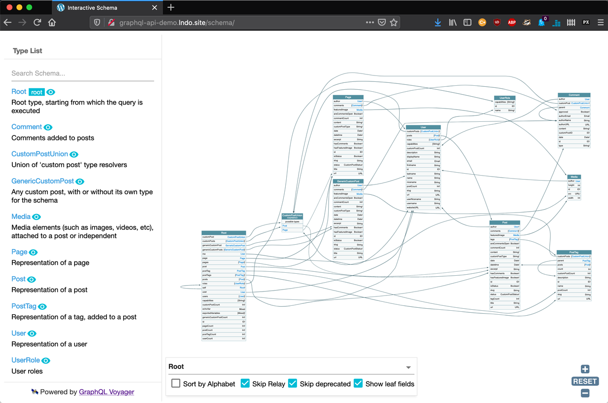
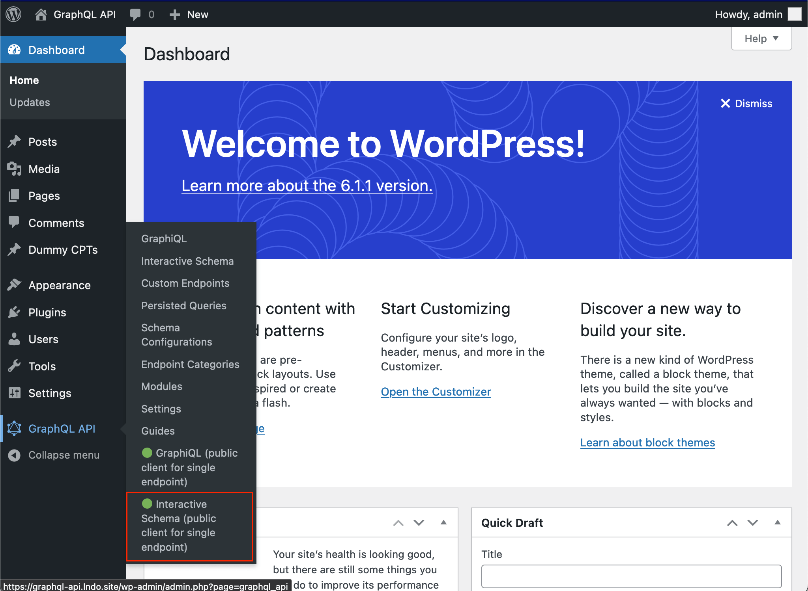

# Interactive Schema for Single Endpoint

A public Interactive schema client can be made available to query the single GraphQL endpoint, by default available under `/schema/` (the path can be configured through the Settings):

The client can be opened from the Side menu, on link "Interactive Schema (public client)":

