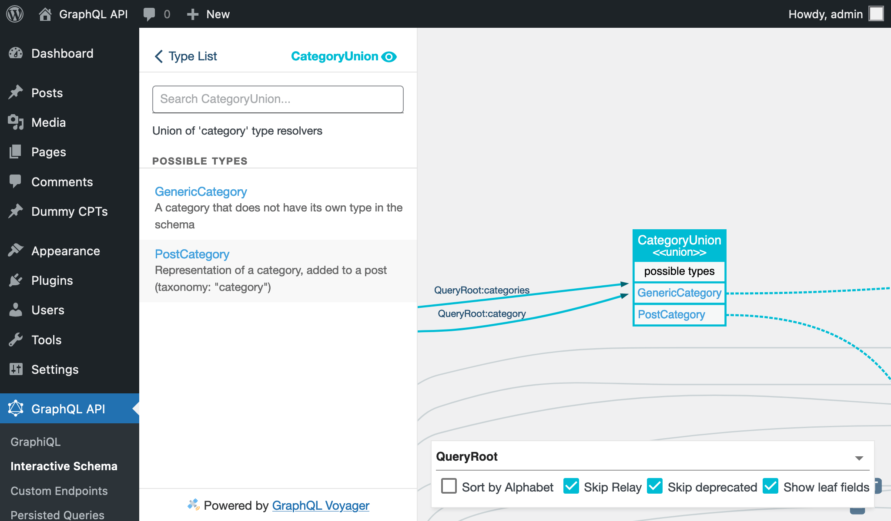
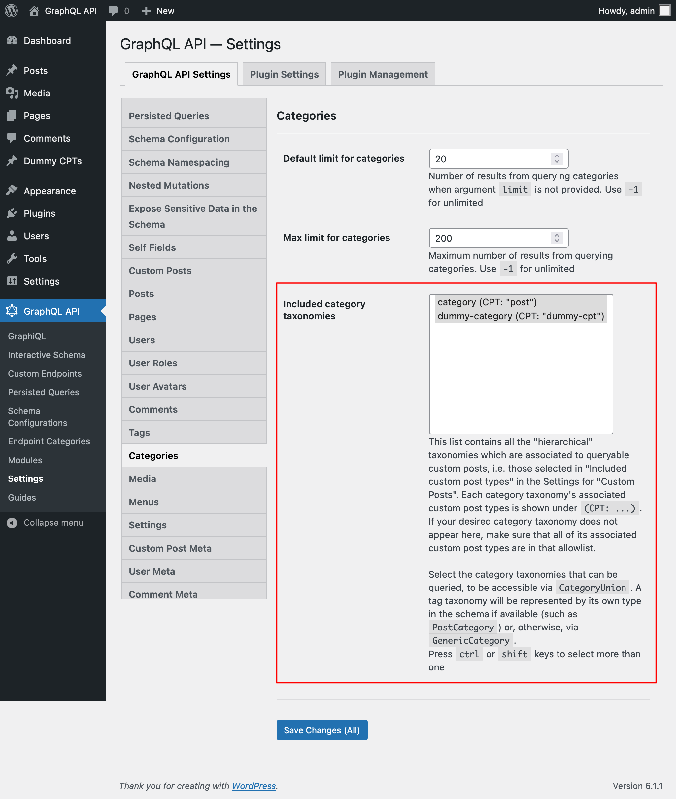
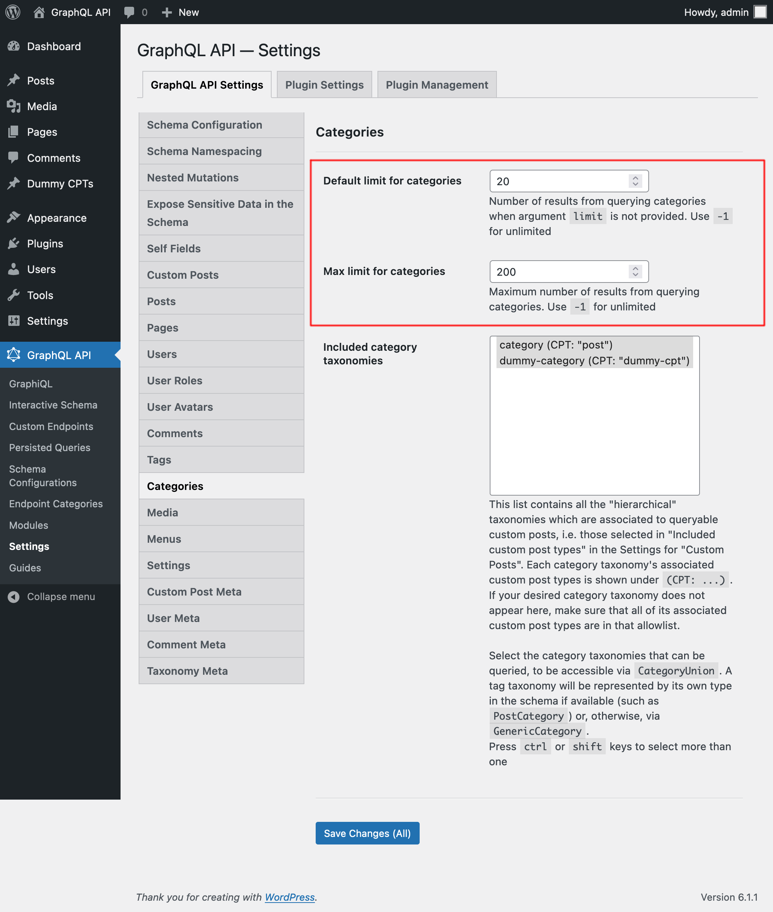

# Categories

Query post categories and custom categories

## Description

We can add categories to posts in WordPress (i.e. using the taxonomy with name `"category"`). This is already mapped in the GraphQL schema via the `PostCategory`, associated to a `Post` entry.

Custom Post Types defined by any theme or plugin (such as `"product"`) can likewise have their own category taxonomy associated to them (such as `"product-cat"`). As these category taxonomies don't ship their own specific type for the GraphQL schema (that would require an extension via PHP code), these are resolved via the `GenericCategory` type.

We use fields `category` and `categories` to fetch category data, which must indicate which taxonomy they refer to via mandatory field argument `taxonomy`. The result is of the union type `CategoryUnion`, which includes entries from either `PostCategory` or `GenericCategory` (depending on the entry's taxonomy).



## Querying categories

This query retrieves categories with taxonomy `"product-category"`:

```graphql
{
  categories(taxonomy: "product-category") {
    __typename

    ...on Category {
      count
      description
      id
      name
      slug
      url
    }
    
    ...on GenericCategory {
      taxonomy   
      customPostCount
      customPosts {
        __typename
        ...on CustomPost {
          id
          title
        }
      }
    }
  }
}
```

Type `GenericCustomPost` has field `categories`, to retrieve the custom categories added to the custom post:

```graphql
{
  customPosts(
    filter: { customPostTypes: "product" }
  ) {
    __typename

    ... on GenericCustomPost {
      categories(taxonomy: "product-cat") {
        __typename
        id
        name
        taxonomy
      }
    }
  }
}
```

## Configuration

The category taxonomies that can be queried must be explicitly configured in the Settings page, under section "Included category taxonomies":



Through the Settings for `Schema Categories`, we can also define:

- The default number of elements to retrieve (i.e. when field argument `limit` is not set) when querying for a list of any category taxonomy
- The maximum number of elements that can be retrieved in a single query execution


