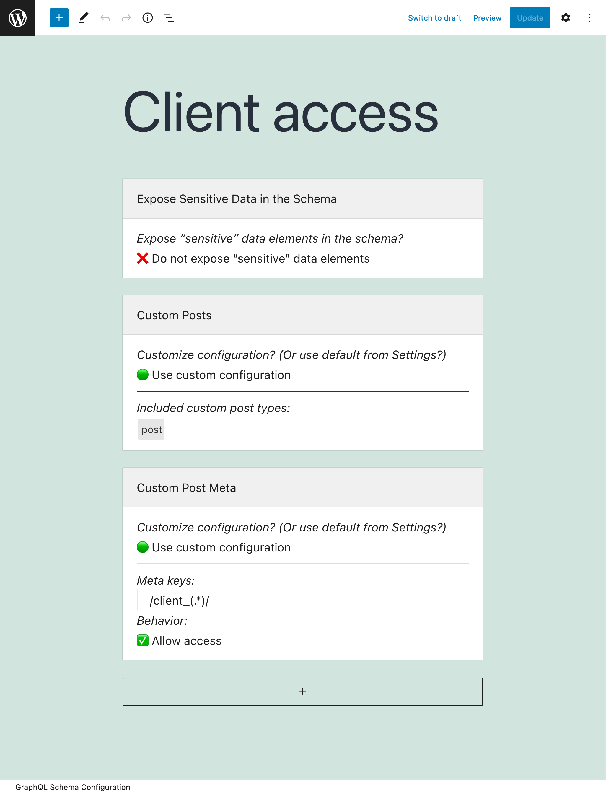
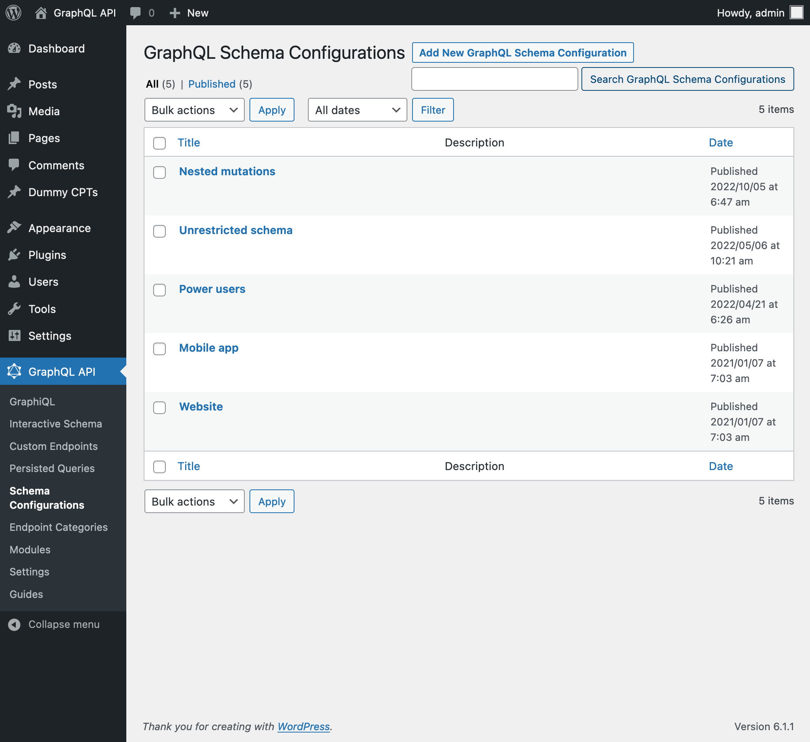
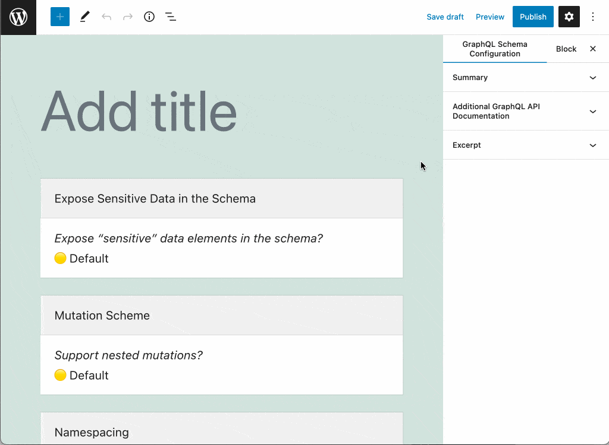
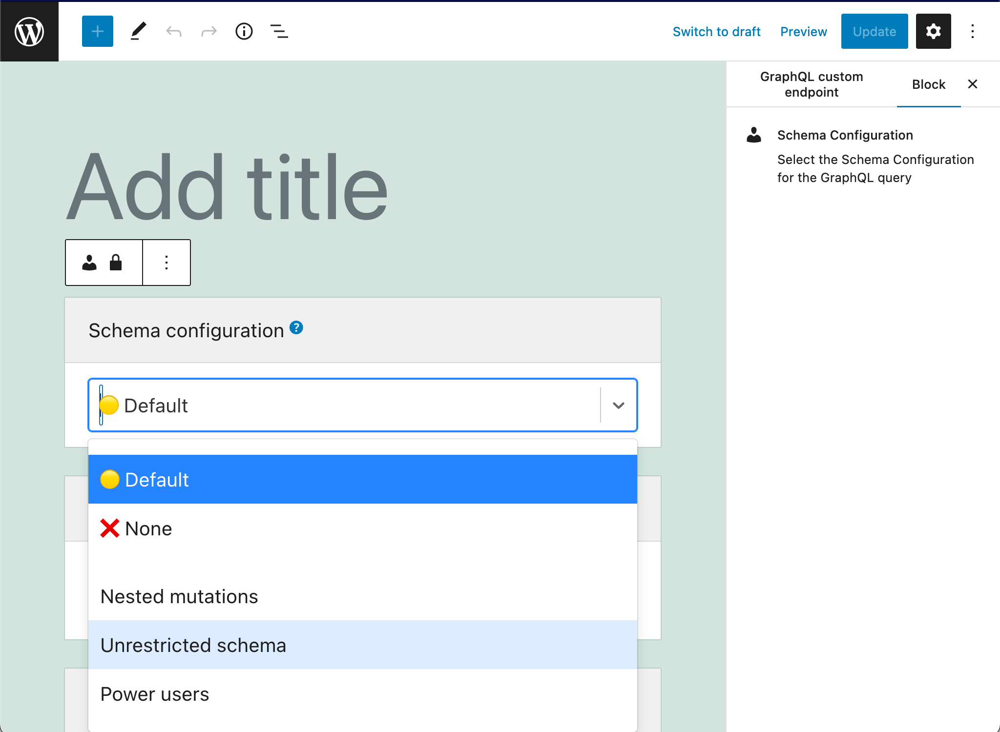

# Schema Configuration

A schema configuration is used by Custom Endpoints and Persisted Queries to customize their behavior.

## Description

The schema can be configured with those elements provided by the different installed and enabled modules.
<!-- The schema can be configured with the following elements (more items can also provided by extensions), and one or more entries can be selected for each:

- Access Control Lists: to define who can access the schema
- Cache Control Lists: to set-up HTTP caching -->

Modules can define their own configuration to be applied in the schema through their own option blocks, such as:

- Setting the schema as public or private
- Enabling “sensitive” data elements
- Namespacing the schema
- Using nested mutations

## How to use

Clicking on the Schema Configurations link in the menu, it displays the list of all of them:

A schema configuration is a custom post type (CPT). To create a new schema configuration, click on button "Add New Schema Configuration", which will open the WordPress editor:

To configure the different elements in the schema configuration, click on corresponding input, and it becomes editable. Then select the entries that apply to the configuration. When you are done, click on "Publish":

Once published, the schema configuration becomes available when editing a Custom Endpoint or Persisted Query:

If the Custom Endpoint or Persisted Query has value `"Default"`, then the schema configuration selected in the Settings will be used:

## Editor Inputs

These inputs in the body of the editor are shipped with the plugin (more inputs can be added by extensions):

<table>
<thead>
<tr>
    <th>Input</th>
    <th>Description</th>
</tr>
</thead>
<tbody>
<!-- <tr>
    <td><strong>Access Control Lists</strong></td>
    <td>(If module <code>Access Control</code> is enabled) Manage who can access the schema, by selecting the Access Control Lists that must be applied to the custom endpoint or persisted query</td>
</tr>
<tr>
    <td><strong>Cache Control Lists</strong></td>
    <td>(If module <code>Cache Control</code> is enabled) Manage the behavior of HTTP caching, by selecting the Cache Control Lists that must be applied to the custom endpoint or persisted query</td>
</tr> -->
<tr>
    <td><strong>Expose Sensitive Data in the Schema</strong></td>
    <td>Expose “sensitive” data elements in the GraphQL schema (such as field <code>Root.roles</code>, input field <code>Root.posts(status:)</code>, and others), which provide access to potentially private user data. If <code>"Default"</code> is selected, the value selected in the Settings is used.</td>
</tr>
<!-- <tr>
    <td><strong>Public/Private Schema</strong></td>
    <td>When access to some a field or directive is denied, there are 2 ways for the API to behave:<ul><li><code>"Public"</code>: Provide an error message to the user, indicating why access is denied. This behavior makes the metadata from the schema always available.</li><li><code>"Private"</code>: The error message indicates that the field or directive does not exist. This behavior exposes the metadata from the schema only to those users who can access it.</li></ul>If <code>"Default"</code> is selected, the value selected in the Settings is used.</td>
</tr> -->
<tr>
    <td><strong>Mutation Scheme</strong></td><td>Define if to enable mutations, and if the redundant fields from the root must be removed. If <code>"Default"</code> is selected, the value selected in the Settings is used.</td>
</tr>
<tr>
    <td><strong>Namespace Types?</strong></td><td>Define if to have all types in the schema automatically namespaced. If <code>"Default"</code> is selected, the value selected in the Settings is used.</td>
</tr>
</tbody>
</table>

These are the inputs in the Document settings:

| Input | Description |
| --- | --- |
| **Excerpt** | Provide a description for the schema configuration. This input is available when module `Excerpt as Description` is enabled |
