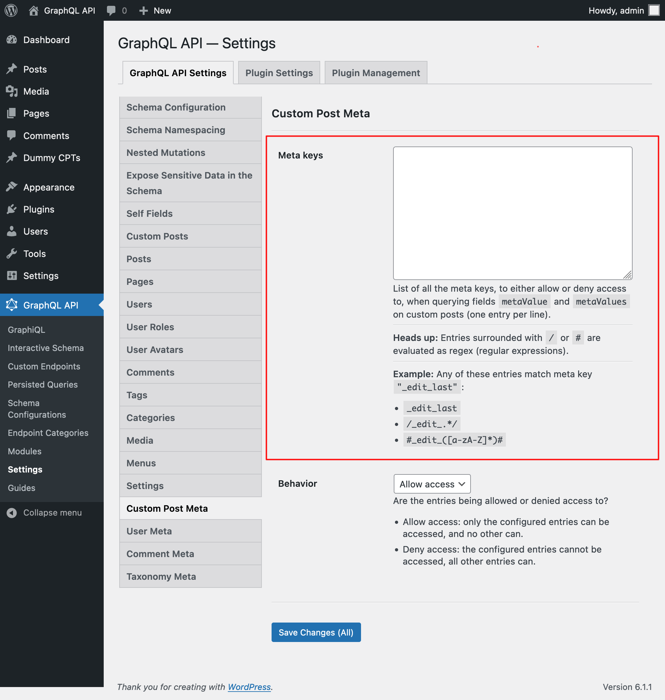
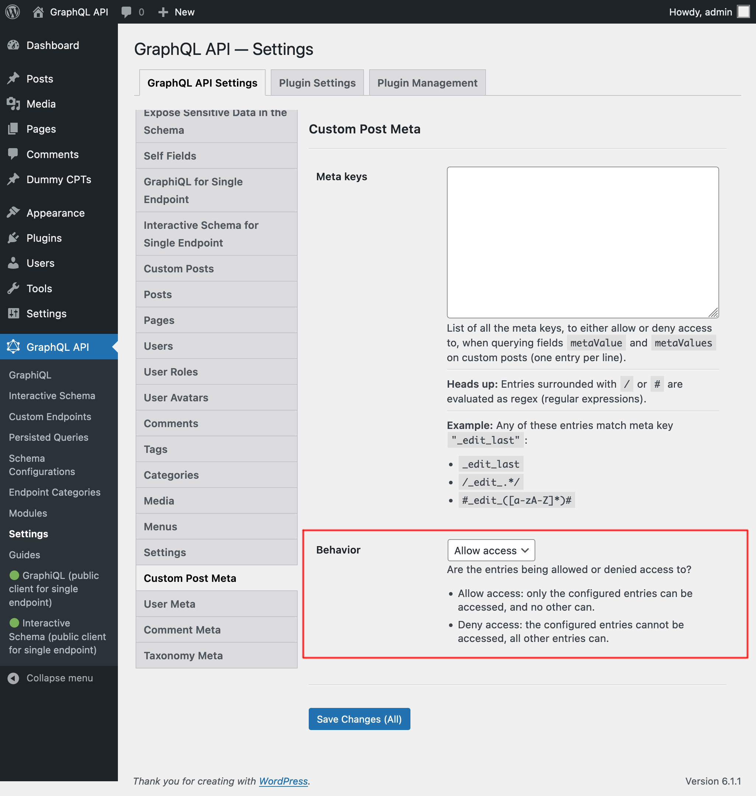

# Custom Post Meta

Retrieve meta values for custom posts, by querying fields `metaValue` and `metaValues`.

For security reasons, which meta keys can be queried must be explicitly configured. By default, the list is empty.

## Description

Query fields `metaValue` and `metaValues` on a custom post, passing the required meta key as field argument `key`.

For instance, this query retrieves the post's `_edit_last` meta value (as long as allowed by configuration):

```graphql
{
  posts {
    id
    editLast: metaValue(key: "_edit_last")
  }
}
```

## Configuring the allowed meta keys

We must configure the list of meta keys that can be queried via the meta fields.

Each entry can either be:

- A regex (regular expression), if it's surrounded by `/` or `#`, or
- The full meta key, otherwise

For instance, any of these entries match meta key `"_edit_last"`:

- `_edit_last`
- `/_edit_.*/`
- `#_edit_([a-zA-Z]*)#`

There are 2 places where this configuration can take place, in order of priority:

1. Custom: In the corresponding Schema Configuration
2. General: In the Settings page

In the Schema Configuration applied to the endpoint, select option `"Use custom configuration"` and then input the desired entries:


Otherwise, the entries defined in the "Custom Post Meta" tab from the Settings will be used:



There are 2 behaviors, "Allow access" and "Deny access":

- **Allow access:** only the configured entries can be accessed, and no other can
- **Deny access:** the configured entries cannot be accessed, all other entries can



## Performance considerations

Fetching multiple meta keys for the same object requires a single database call.

However, every call to the database involves only 1 object.

When the query involves a large number of results, resolving the query could become slow.
