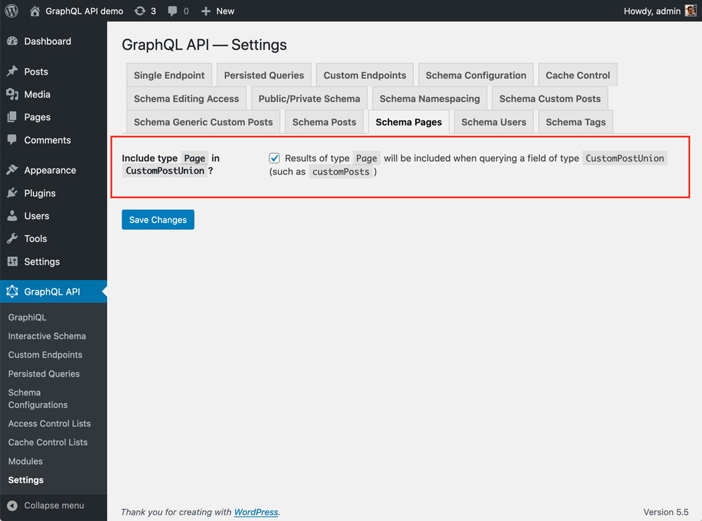
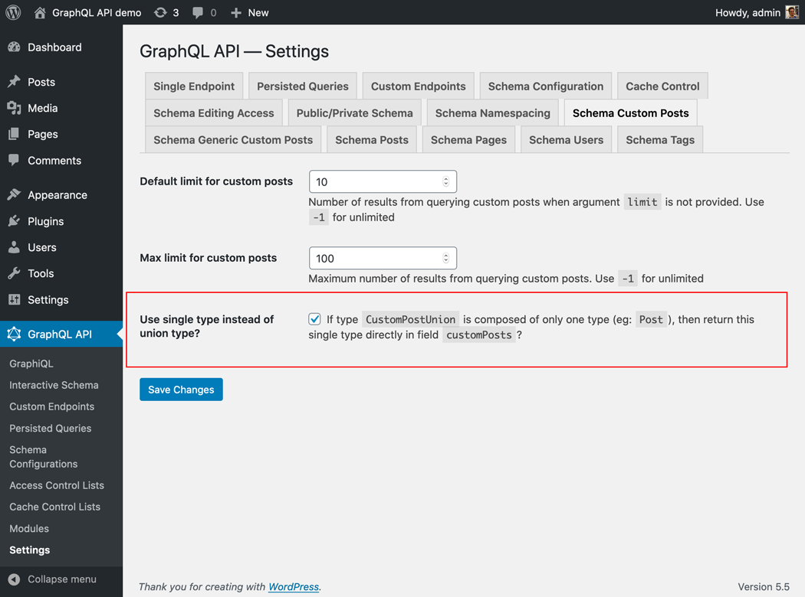
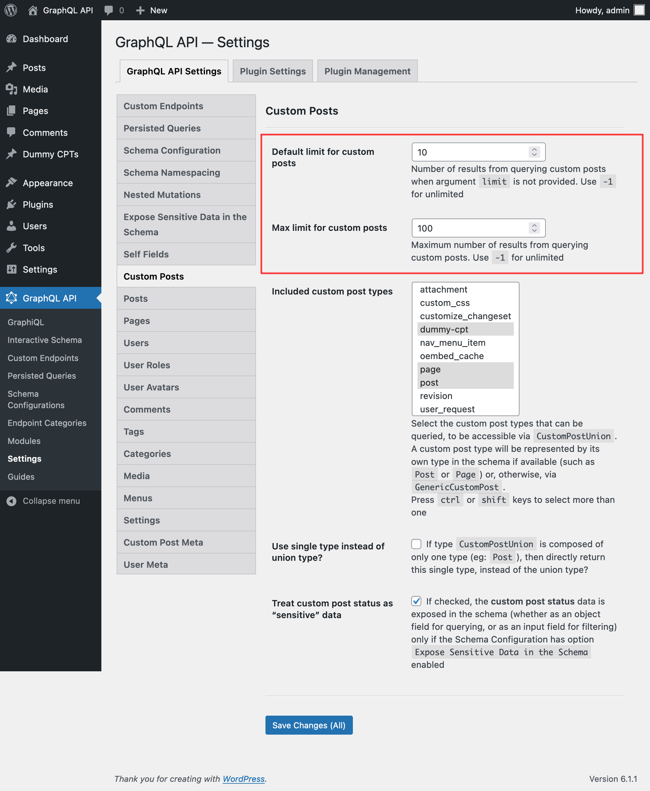

# Custom Posts

Base functionality for all custom posts

## Description

This module provides the basic schema functionality for custom posts, so it must also be enabled whenever any custom post entity (including posts, pages, or any Custom Post Type) must be added to the schema

In addition, it provides type `CustomPostUnion`, which is used whenever an entity can return custom posts.

For instance, a comment can be added to a post, but also to a page and to a CPT, hence type `Comment` must indicate where the comment has been added through field `customPost` of type `CustomPostUnion` (not through field `post` of type `Post`).

## How to use

The different CPT modules can make their type be part of `CustomPostUnion` through their Settings.

For instance, type `Page` is added to `CustomPostUnion` under the Settings for `Schema Pages`:

If there is only one type added to `CustomPostUnion`, we can then have the fields that resolve to `CustomPostUnion` be instead resolved to that unique type instead:

For instance, if `Post` is the only type, field `customPosts` from type `Root` resolves to it directly:

---

Through the Settings for `Schema Custom Posts`, we can also define:

- The default number of elements to retrieve (i.e. when field argument `limit` is not set) when querying for a list of any custom post type
- The maximum number of elements that can be retrieved in a single query execution

