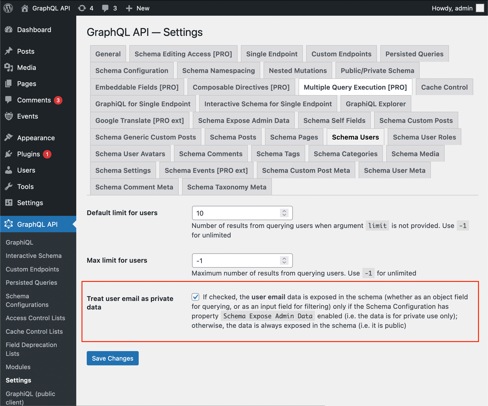

# Schema Expose Admin Data

Expose "admin" elements in the GraphQL schema, which provide access to private data.

The GraphQL schema must strike a balance between public and private elements (including fields and input fields), as to avoid exposing private information in a public API.

For instance, to access post data, we have field `Root.posts`, which by default can only retrieve published posts. With this module, a new property `Schema Expose Admin Data` is added to the Schema Configuration. When enabled, argument `filter` in `Root.posts` exposes an additional input `status`, enabling to retrieve non-published posts (eg: posts with status `"draft"`), which is private data.

## List of admin elements

The elements below (among others) are, by default, treated as private data:

**User:**

- `email`
- `roles`
- `capabilities`

**Custom Posts:**

- `status`
- `hasPassword`
- `password`

**Comments:**

- `status`

## Inspecting the "admin" elements via schema introspection

The `isAdminElement` property is added to field `extensions` when doing schema introspection. To find out which are the "admin" elements from the schema, execute this query:

```graphql
query ViewAdminElements {
  __schema {
    types {
      name
      fields {
        name
        extensions {
          isAdminElement
        }
        args {
          name
          extensions {
            isAdminElement
          }
        }
      }
      inputFields {
        name
        extensions {
          isAdminElement
        }
      }
      enumValues {
        name
        extensions {
          isAdminElement
        }
      }
    }
  }
}
```

And then search for entries with `"isAdminElement": true` in the results.

## Overriding the default configuration

The elements listed above can be made public.

In the Settings page, in the corresponding tab for each, there is a checkbox to configure if to treat them as private or public:



## How to use

Exposing admin elements in the schema can be configured as follows, in order of priority:

✅ Specific mode for the custom endpoint or persisted query, defined in the schema configuration


✅ Default mode, defined in the Settings

If the schema configuration has value `"Default"`, it will use the mode defined in the Settings:


## When to use

Use whenever exposing private information is allowed, such as when building a static website, fetching data from a local WordPress instance (i.e. not a public API).
