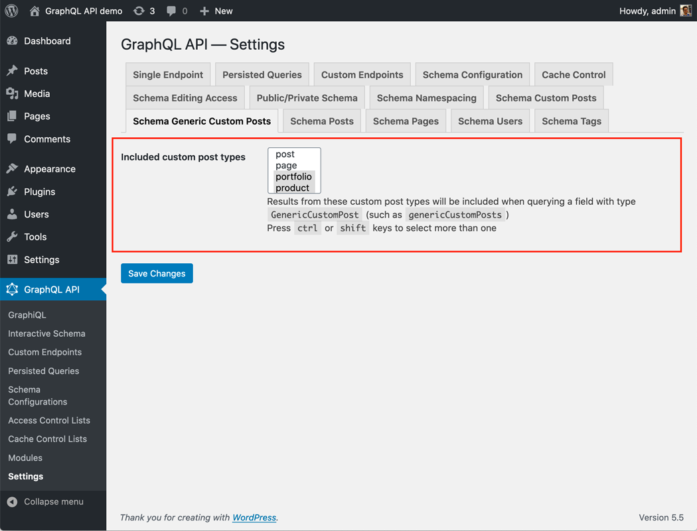

# Schema Generic Custom Posts

Query any Custom Post Type (added to the schema or not), through a generic type `GenericCustomPost`

## Description

GraphQL types for CPTs added to the schema (such as for posts and pages, which have their corresponding types `Post` and `Page`) can be added to `CustomPostUnion`, and their entries can be retrieved when executing field `customPosts` from the `Root`.

However, other CPTs which have been registered in the WordPress site but not as a GraphQL type (such as a CPT for "portfolio" or "product") cannot be retrieved through field `customPosts`.

This module `Schema Generic Custom Posts` enables to represent these other CPTs through the `GenericCustomPost` type, and have their entries retrieved through field `genericCustomPosts` in the `Root`.

## How to use

Input `Included custom post types` in the Settings lists down all the Custom Post Types registered in the WordPress site.

From the list, select those CPTs that need to be queried through GraphQL (more than one can be selected by pressing the `ctrl` or `shift` keys), and field `genericCustomPosts` will fetch their entries:

