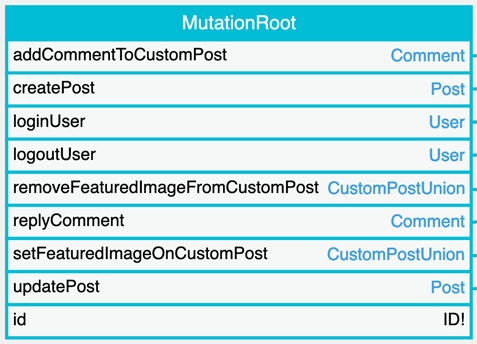

# Schema Mutations

GraphQL mutations enable to modify data (i.e. perform side-effect) through the query.

## How to use

The query must use the operation type `mutation`:

```graphql
mutation {
  updatePost(input: {
    id: 5,
    title: "New title"
  }) {
    title
  }
}
```

The available mutation fields are those under the `MutationRoot` type:

<a href="../../images/schema-mutations.png" target="_blank"></a>
