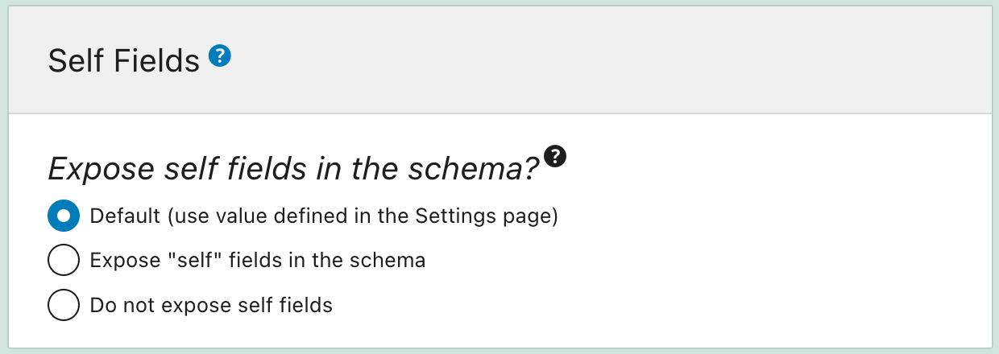
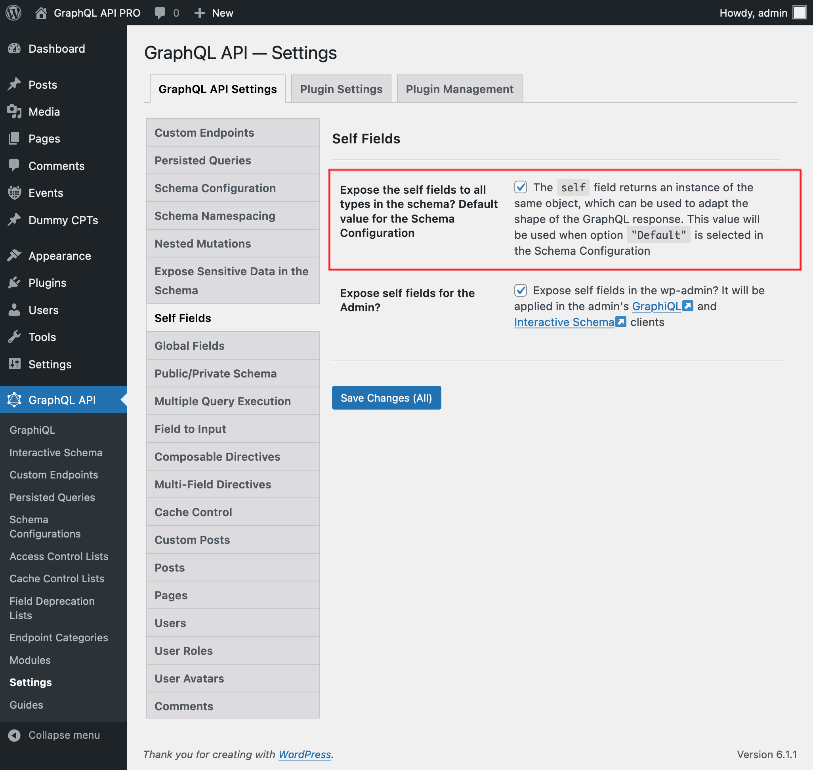
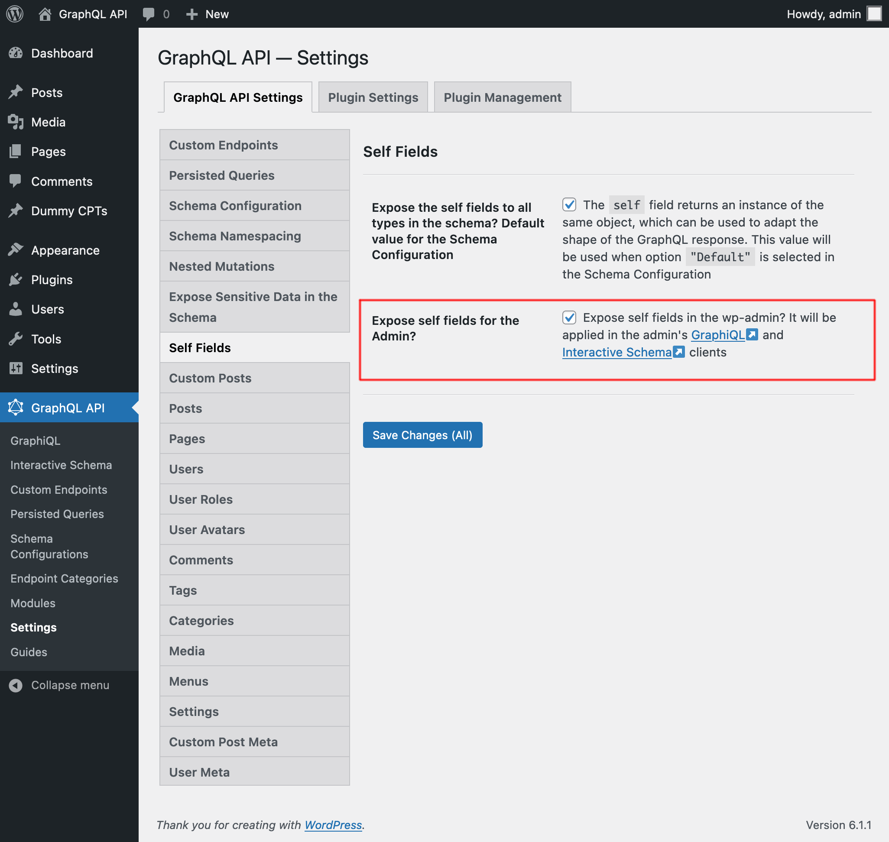

# Self Fields

Expose "self" fields in the GraphQL schema, which can help give a particular shape to the GraphQL response.

## Description

Sometimes we need to modify the shape of the response, to emulate the same response from another GraphQL server, or from the REST API.

We can do this via the `self` field, added to all types in the GraphQL schema, which echoes back the same object where it is applied:

```graphql
type QueryRoot {
  self: QueryRoot!
}

type Post {
  self: Post!
}

type User {
  self: User!
}
```

The `self` field allows to append extra levels to the query without leaving the queried object. Running this query:

```graphql
{
  __typename
  self {
    __typename
  }
  
  post(by: { id: 1 }) {
    self {
      id
      __typename
    }
  }
  
  user(by: { id: 1 }) {
    self {
      id
      __typename
    }
  }
}
```

...produces this response:

```json
{
  "data": {
    "__typename": "QueryRoot",
    "self": {
      "__typename": "QueryRoot"
    },
    "post": {
      "self": {
        "id": 1,
        "__typename": "Post"
      }
    },
    "user": {
      "self": {
        "id": 1,
        "__typename": "User"
      }
    }
  }
}
```

## Examples

This query uses `self` to artificially append the extra levels needed for the response, and field aliases to rename those levels appropriately, as to recreate the shape of another GraphQL server:

```graphql
{
  categories: self {
    edges: postCategories {
      node: self {
        name
        slug
      }
    }
  }
}
```

This query recreates the shape of the WP REST API:

```graphql
{
  post(by: {id: 1}) {
    content: self {
      rendered: content
    }
  }
}
```

## How to use

Exposing "self" fields in the schema can be configured as follows, in order of priority:

✅ Specific mode for the custom endpoint or persisted query, defined in the schema configuration



✅ Default mode, defined in the Settings

If the schema configuration has value `"Default"`, it will use the mode defined in the Settings:



### Adding `self` fields to the Admin clients

In the Settings, we can select to add the `self` fields to the wp-admin's GraphiQL and Interactive Schema clients:


