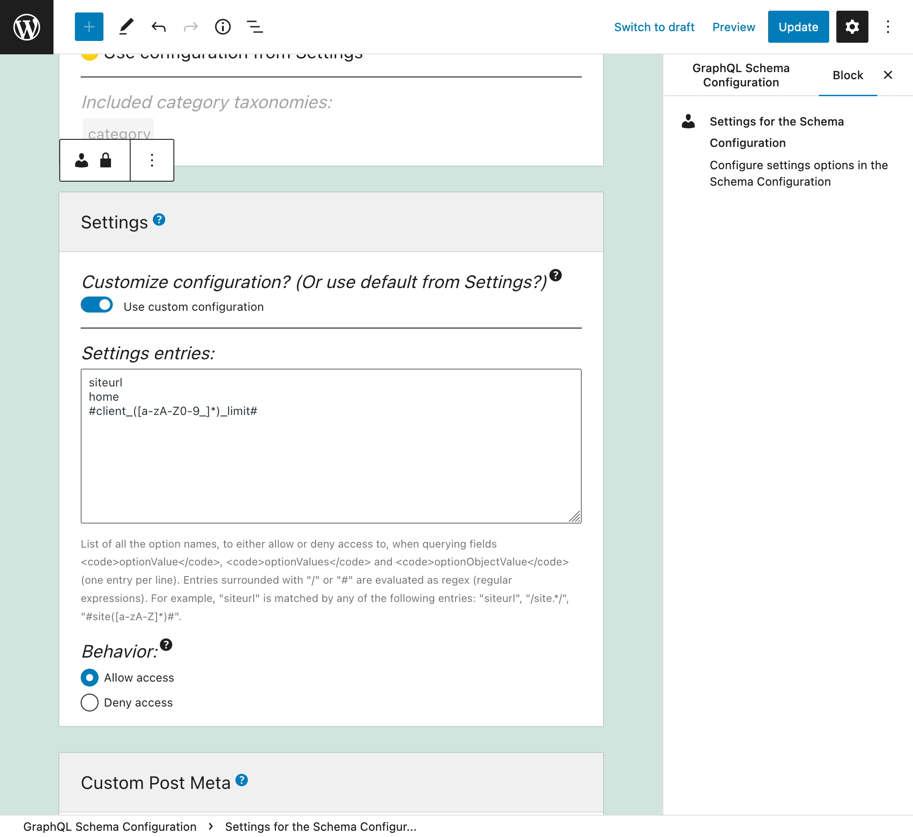
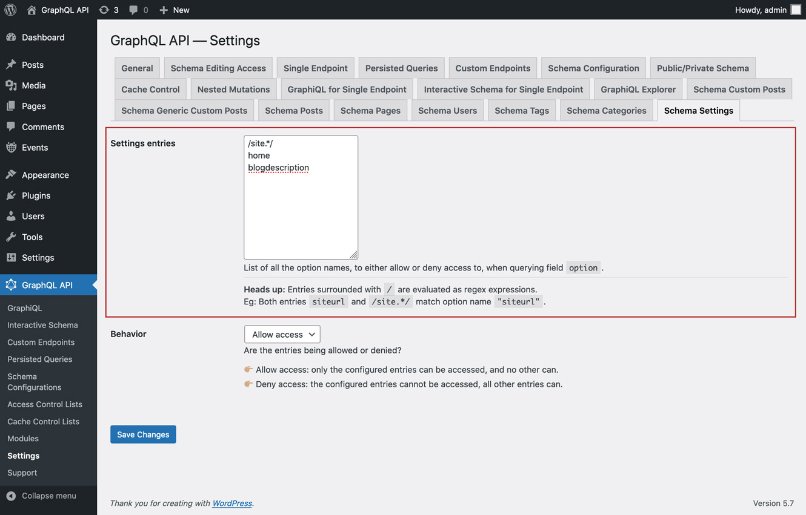

# Settings

Retrieve the settings from the site (stored in table `wp_options`), by querying fields `optionValue`, `optionValues` and `optionObjectValue`.

For security reasons, which options can be queried must be explicitly configured.

## Description

The following `Root` fields receive argument `name` and retrieve the corresponding option from the `wp_options` table:

- `optionValue: AnyBuiltInScalar`
- `optionValues: [AnyBuiltInScalar]`
- `optionObjectValue: JSONObject`

For instance, this query retrieves the site's URL:

```graphql
{
  homeURL: optionValue(name: "home")
}
```

## Configure the allowed options

We must configure the list of option names that can be queried.

Each entry can either be:

- A regex (regular expression), if it's surrounded by `/` or `#`, or
- The full option name, otherwise

For instance, any of these entries match meta key `"siteurl"`:

- `siteurl`
- `/site.*/`
- `#site([a-zA-Z]*)#`

There are 2 places where this configuration can take place, in order of priority:

1. Custom: In the corresponding Schema Configuration
2. General: In the Settings page

In the Schema Configuration applied to the endpoint, select option `"Use custom configuration"` and then input the desired entries:



Otherwise, the entries defined in the "Settings" tab from the Settings will be used:



There are 2 behaviors, "Allow access" and "Deny access":

👉🏽 <strong>Allow access:</strong> only the configured entries can be accessed, and no other can<br/>
👉🏽 <strong>Deny access:</strong> the configured entries cannot be accessed, all other entries can


## Default options

When the plugin is installed, the following options are pre-defined to be accessible:

- `"siteurl"`
- `"home"`
- `"blogname"`
- `"blogdescription"`
- `"WPLANG"`
- `"posts_per_page"`
- `"comments_per_page"`
- `"date_format"`
- `"time_format"`
- `"blog_charset"`
