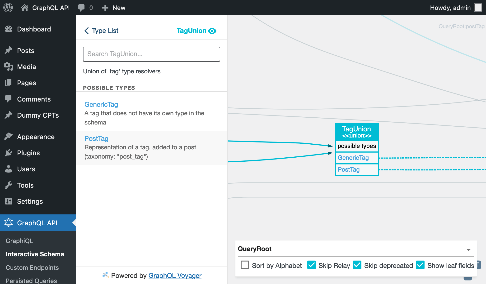
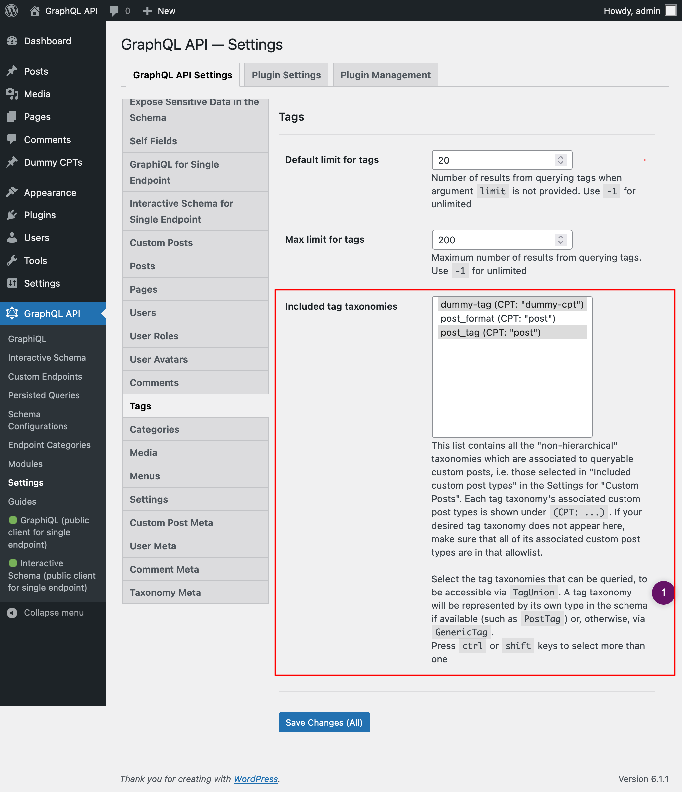
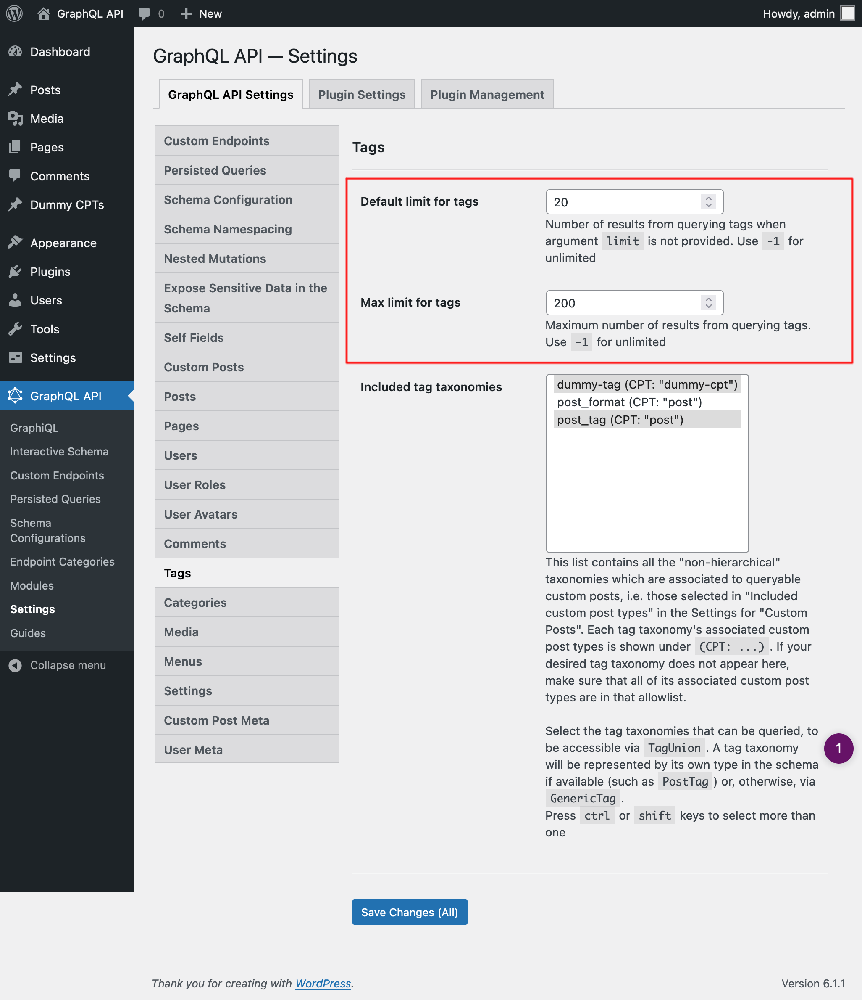

# Tags

Query post tags and custom tags

## Description

We can add tags to posts in WordPress (i.e. using the taxonomy with name `"post_tag"`). This is already mapped in the GraphQL schema via the `PostTag`, associated to a `Post` entry.

Custom Post Types defined by any theme or plugin (such as `"product"`) can likewise have their own tag taxonomy associated to them (such as `"product-tag"`). As these tag taxonomies don't ship their own specific type for the GraphQL schema (that would require an extension via PHP code), these are resolved via the `GenericTag` type.

We use fields `tag` and `tags` to fetch tag data, which must indicate which taxonomy they refer to via mandatory field argument `taxonomy`. The result is of the union type `TagUnion`, which includes entries from either `PostTag` or `GenericTag` (depending on the entry's taxonomy).



## Querying tags

This query retrieves tags with taxonomy `"product-tag"`:

```graphql
{
  tags(taxonomy: "product-tag") {
    __typename

    ...on Tag {
      count
      description
      id
      name
      slug
      url
    }
    
    ...on GenericTag {
      taxonomy   
      customPostCount
      customPosts {
        __typename
        ...on CustomPost {
          id
          title
        }
      }
    }
  }
}
```

Type `GenericCustomPost` has field `tags`, to retrieve the custom tags added to the custom post:

```graphql
{
  customPosts(
    filter: { customPostTypes: "product" }
  ) {
    __typename

    ... on GenericCustomPost {
      tags(taxonomy: "product-tag") {
        __typename
        id
        name
        taxonomy
      }
    }
  }
}
```

## Configuration

The tag taxonomies that can be queried must be explicitly configured in the Settings page, under section "Included tag taxonomies":



Through the Settings for `Schema Tags`, we can also define:

- The default number of elements to retrieve (i.e. when field argument `limit` is not set) when querying for a list of any tag taxonomy
- The maximum number of elements that can be retrieved in a single query execution


