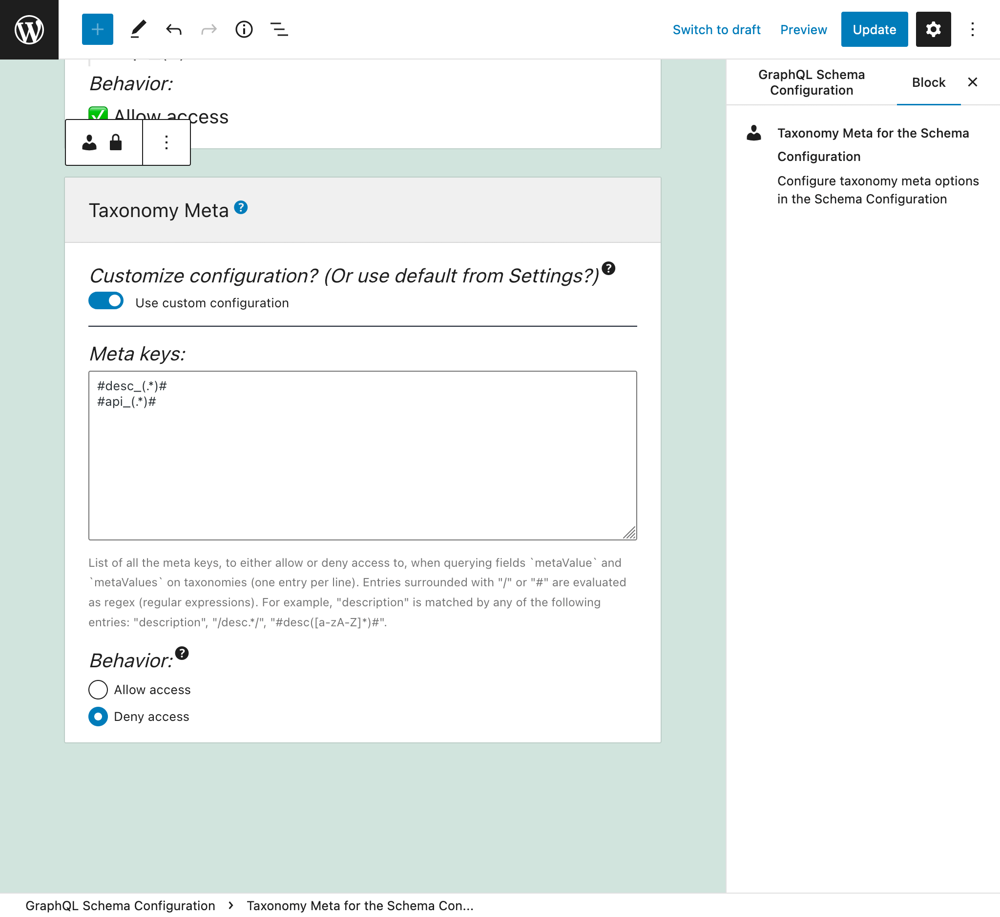
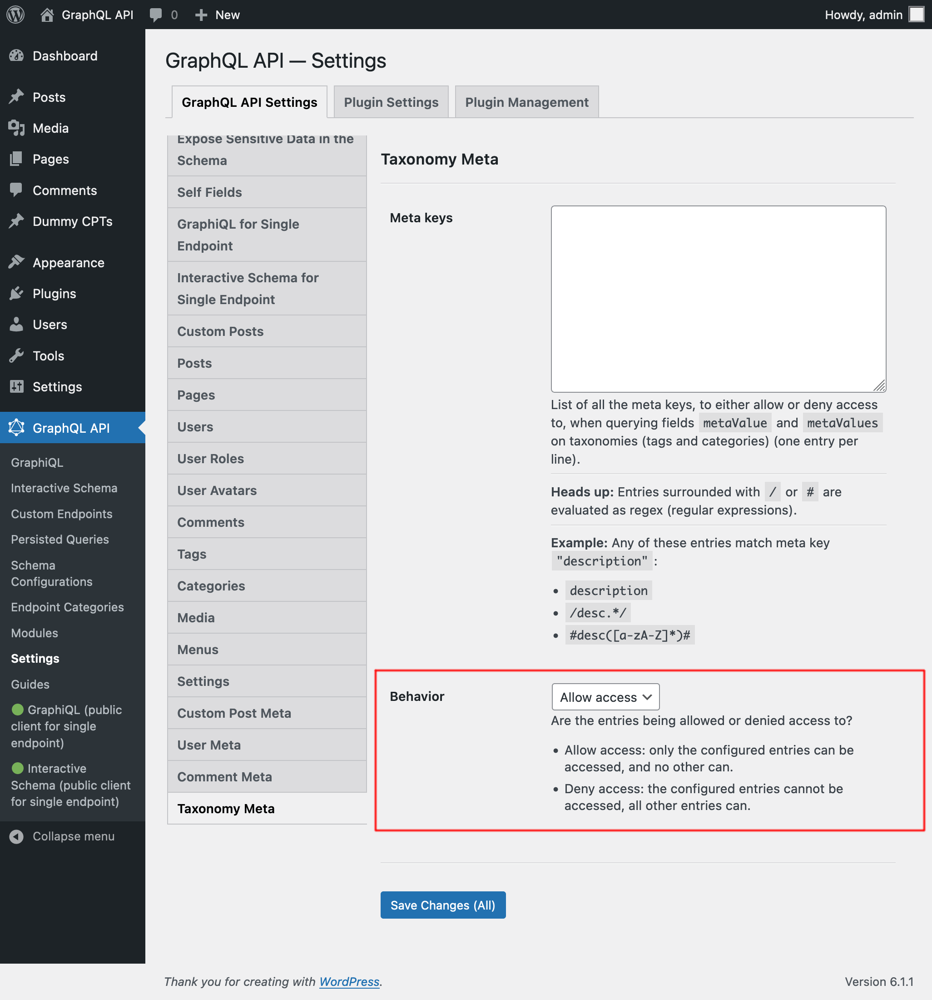

# Schema Taxonomy Meta

Retrieve meta values for taxonomies (i.e. tags and categories), by querying fields `metaValue` and `metaValues`.

For security reasons, which meta keys can be queried must be explicitly configured. By default, the list is empty.

## How to use

Query fields `metaValue` and `metaValues` on a tag or category, passing the required meta key as field argument `key`.

For instance, this query retrieves the category's `description` meta value (as long as allowed by configuration):

```graphql
{
  posts {
    id
    categories {
      id
      description: metaValue(key: "description")
    }
  }
}
```

## Configuring the allowed meta keys

In the "Schema Taxonomy Meta" tab from the Settings, we must configure the list of meta keys that can be queried via the meta fields.

Each entry can either be:

- A regex (regular expression), if it's surrounded by `/`, or
- The full option name, otherwise

For instance, both entries `description` and `/desc*/` match meta key `"description"`.

<a href="../../images/schema-configuration-taxonomy-meta-entries.png" target="_blank"></a>

There are 2 behaviors, "Allow access" and "Deny access":

👉🏽 <strong>Allow access:</strong> only the configured entries can be accessed, and no other can<br/>
👉🏽 <strong>Deny access:</strong> the configured entries cannot be accessed, all other entries can

<a href="../../images/schema-configuration-taxonomy-meta-behavior.png" target="_blank"></a>

## Performance considerations

Fetching multiple meta keys for the same object requires a single database call.

However, every call to the database involves only 1 object.

When the query involves a large number of results, resolving the query could become slow.
