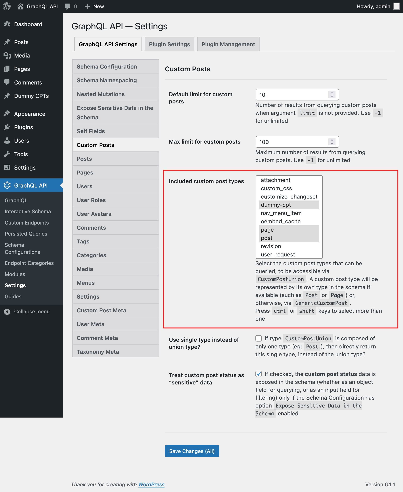
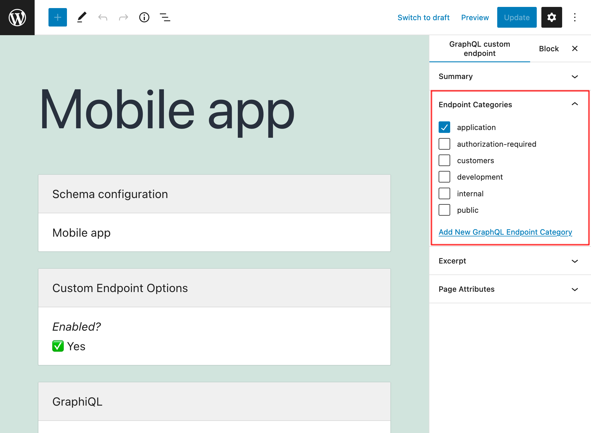
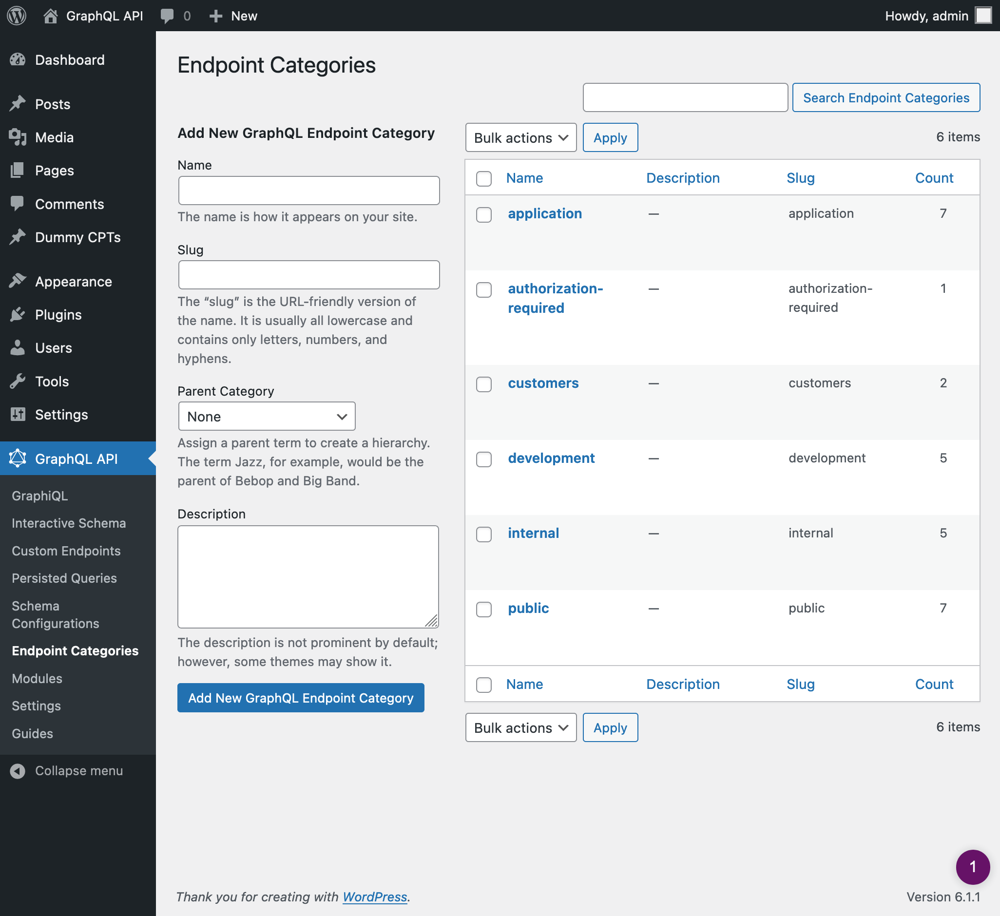
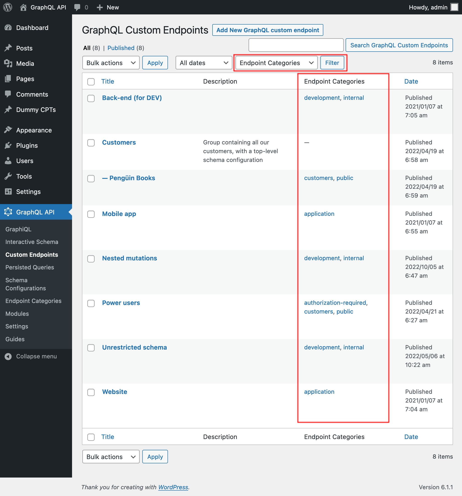
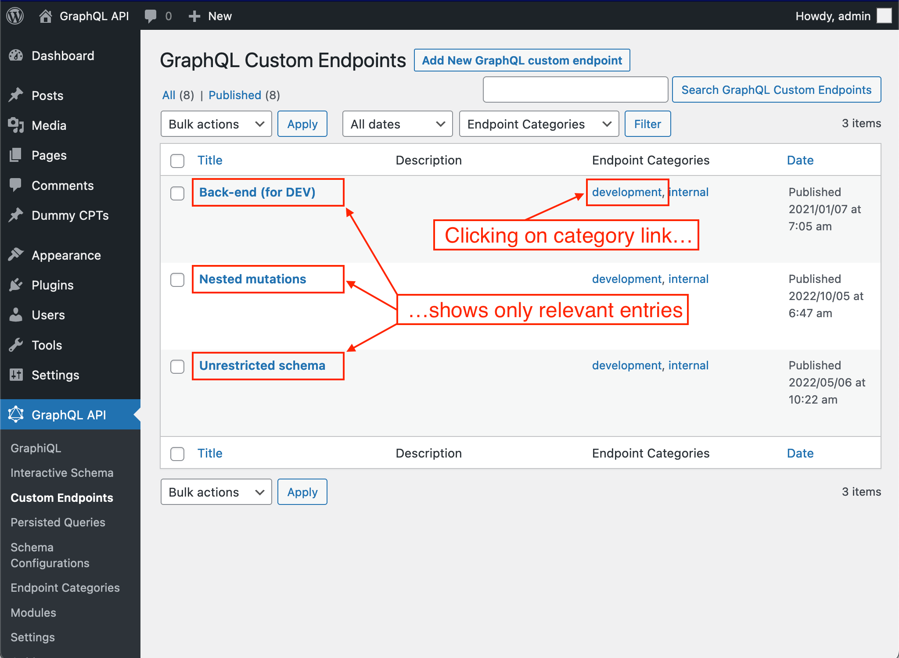
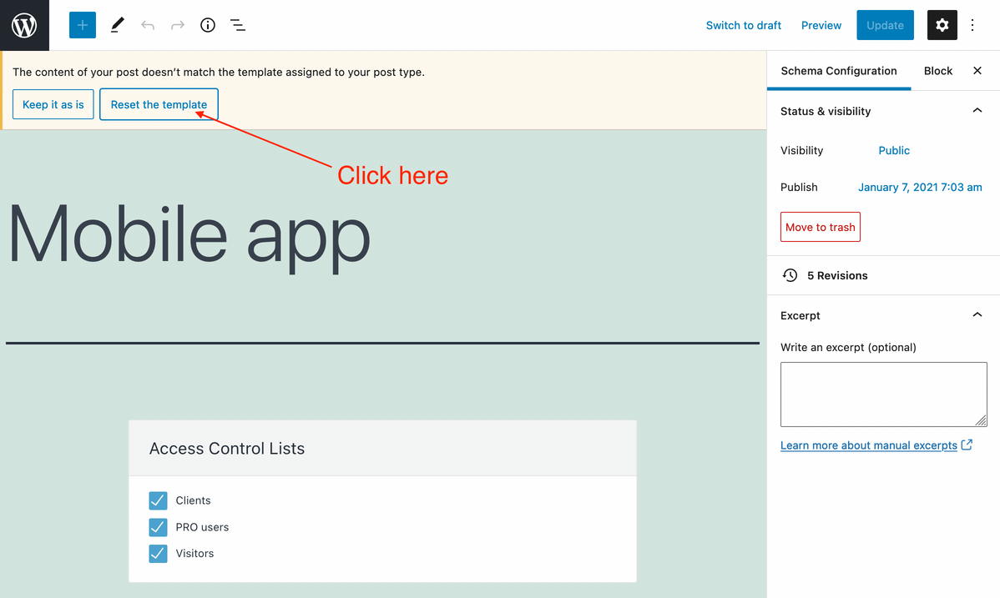

# Release Notes: 0.9

This is the biggest release in the history of this plugin 🚀

These are all the changes added for version 0.9 of the GraphQL API for WordPress.

## Further completed the GraphQL Schema

The GraphQL schema mapping the WordPress data model has been significantly completed! 💪


Let's see what new elements have been added.

### In addition to `id`, fetch single entities by `slug`, `path` and other properties

Fields to fetch a single entity, such as `Root.post` or `Root.user`, used to receive argument `id` to select the entity. Now they have been expanded: `id` has been replaced with argument `by`, which is a oneof input object (explained later on) to query the entity by different properties.

The following fields have been upgraded, accepting the following properties in their `by` input:

- `Root.customPost`:
  - `id`
  - `slug`
- `Root.mediaItem`:
  - `id`
  - `slug`
- `Root.menu`:
  - `id`
  - `slug`
  - `location`
- `Root.page`:
  - `id`
  - `slug`
  - `path`
- `Root.postCategory`:
  - `id`
  - `slug`
- `Root.postTag`:
  - `id`
  - `slug`
- `Root.post`:
  - `id`
  - `slug`
- `Root.user`:
  - `id`
  - `username`
  - `email` (considered as “sensitive” data, so `Expose Sensitive Data in the Schema` must be enabled; see later on)

### Filter elements via the new `filter` field argument

In all fields retrieving a list of elements, such as `Root.posts` or `Root.users`, a new argument `filter` now allows us to filter the results. The filtering values are customized for each field, via a corresponding InputObject (see later on).

For instance, field `Root.posts` has argument `filter` of input object type `RootPostsFilterInput`, with these input fields:

```graphql
type RootPostsFilterInput {
  authorIDs: [ID!]
  authorSlug: String
  categoryIDs: [ID!]
  dateQuery: [DateQueryInput!]
  excludeAuthorIDs: [ID!]
  excludeIDs: [ID!]
  ids: [ID!]
  search: String
  status: [CustomPostStatusEnum!]
  tagIDs: [ID!]
  tagSlugs: [String!]
}
```

### Pagination and sorting fields are accessed via `pagination` and `sort` field args

All fields retrieving a list of elements can be paginated and sorted using customized InputObjects, and these are always placed under field arguments `pagination` and `sort` (in addition to `filter` for filtering).

For instance, field `Root.posts` now has this schema:

```graphql
type Root {
  posts(
    filter: RootPostsFilterInput
    pagination: PostPaginationInput
    sort: CustomPostSortInput
  ): [Post]!
}
```

### `customPosts` fields now also retrieve data from CPTs which are not mapped to the GraphQL schema

`customPosts` allowed to fetch data for CPTs which already have a corresponding GraphQL type in the schema (such as `"post"` => `Post` and `"page"` => `Page`), as these types are incorporated directly into `CustomPostUnion`.

Now, `customPosts` can also retrieve data for any CPT that has not been modeled in the schema (such as `"attachment"`, `"revision"` or `"nav_menu_item"`, or any CPT installed by any plugin). This data will be accessed via the `GenericCustomPost` type.

The custom post types that can be queried must be explicitly configured in the Settings page, under section "Included custom post types":



### Filter custom post fields by tag, category, author and others

On fields to retrieve custom posts, such as:

- `Root.posts`
- `Root.customPosts`
- `Root.myPosts`
- `User.posts`
- `PostCategory.posts`
- `PostTag.posts`

...added input fields for filtering the results:

- `tagIDs: [ID]`
- `tagSlugs: [String]`
- `categoryIDs: [ID]`
- `authorIDs: [ID]`
- `authorSlug: String`
- `excludeAuthorIDs: [ID]`
- `hasPassword: Bool` (considered as “sensitive” data)
- `password: String` (considered as “sensitive” data)

For instance, this query retrieves posts containing either tag `"graphql"`, `"wordpress"` or `"plugin"`:

```graphql
{
  posts(
    filter: {
      tagSlugs: ["graphql", "wordpress", "plugin"]
    }
  ) {
    id
    title
  }
}
```

### Exclude results via field arg `excludeIDs`

Added the field argument `excludeIDs` on all fields retrieving posts and custom posts, media items, users, comments, tags, categories and menus.

```graphql
{
  posts(
    filter: {
      excludeIDs: [1, 2, 3]
    }
  ) {
    id
    title
  }
}
```

### Filter by `metaQuery`

Custom posts, comments, users and taxonomies can now be filtered by meta, using the `metaQuery` input.

This input offers an enhancement over [how the `meta_query` args are provided](https://developer.wordpress.org/reference/classes/wp_meta_query/) (to functions `get_posts`, `get_users`, etc), in that type validations are strictly enforced in the GraphQL schema, and only the combinations that make sense are exposed. This is accomplished by using the newly-added oneof input object (explained later on) for input field `compareBy`, which offers 4 possible comparisons:

- `key`
- `numericValue`
- `stringValue`
- `arrayValue`

Depending on the chosen option, different data must be provided. For instance, filtering by `numericValue` we can use operator `GREATER_THAN`, by `arrayValue` we can use operator `IN`, and by `key` we can use operator `EXISTS` (and there's no need to provide a `value`).

We can pass several items under `metaQuery`, and decide if to do an `AND` or `OR` of their conditions by passing input `relation` on the first item in the list.

Concerning security, meta entries are by default not exposed. To make them accessible, their meta key [must be added to the corresponding allowlist](https://graphql-api.com/guides/config/querying-by-meta-values/), or an error will be returned.

Let's see some examples. This query filters posts where meta key `_thumbnail_id` exists:

```graphql
{
  posts(filter: {
    metaQuery: {
      key: "_thumbnail_id",
      compareBy:{
        key: {
          operator: EXISTS
        }
      }
    }
  }) {
    id
    title
    metaValue(key: "_thumbnail_id")
  }
}
```

This query filters users where meta `nickname` has a certain value:

```graphql
{
  users(filter: {
    metaQuery: {
      key: "nickname",
      compareBy:{
        stringValue: {
          value: "leo"
          operator: EQUALS
        }
      }
    }
  }) {
    id
    name
    metaValue(key: "nickname")
  }
}
```

This query filters comments where meta `upvotes` (which is an array of integers) has either values `4` or `5`:

```graphql
{
  comments(filter: {
    metaQuery: [
      {
        relation: OR
        key: "upvotes",
        compareBy: {
          arrayValue: {
            value: 4
            operator: IN
          }
        }
      },
      {
        key: "upvotes",
        compareBy: {
          arrayValue: {
            value: 5
            operator: IN
          }
        }
      }
  ]}) {
    id
    upvotes: metaValues(key: "upvotes")
  }
}
```

### Field `urlAbsolutePath`

Field `urlAbsolutePath` has been added to several types:

- `Post.urlAbsolutePath: URLAbsolutePath!`
- `Page.urlAbsolutePath: URLAbsolutePath!`
- `PostCategory.urlAbsolutePath: URLAbsolutePath!`
- `PostTag.urlAbsolutePath: URLAbsolutePath!`
- `User.urlAbsolutePath: URLAbsolutePath!`

For instance, if field `User.url` returns `"https://mysite.com/author/admin/"`, then field `User.urlAbsolutePath` returns `"/author/admin/"`.

```graphql
{
  users {
    id
    urlAbsolutePath
  }
}
```

### `content` fields are now of type `HTML`, and a new `rawContent` field of type `String` was added

The `content` fields are now of type `HTML`:

- `Post.content: HTML!`
- `Page.content: HTML!`
- `Comment.content: HTML!`

And a new `rawContent` of type `String` was introduced:

- `Post.rawContent: String!`
- `Page.rawContent: String!`
- `Comment.rawContent: String!`

### Converted from string to Enum type whenever possible

Since adding support for custom enum types (see later on), wherever possible (in fields, field/directive arguments and input types) enums are now used. This includes:

- Custom post type and status
- Comment type and status
- "Order by" property, for all entities
- Menu locations

### Custom posts

Added fields to retrieve the logged-in user's custom posts:

- `Root.myCustomPost: CustomPostUnion`
- `Root.myCustomPosts: [CustomPostUnion]!`
- `Root.myCustomPostCount: Int!`

Added fields to all custom post entities (`Post`, `Page`, etc):

- `modifiedDate: DateTime`
- `modifiedDateStr: String`

### Posts

Added fields to the `Post` type:

- `postFormat: String!`
- `isSticky: Bool!`

### Pages

Added fields to `Page` to fetch the parent and children, and the menu order:

- `parent: Page`
- `children: [Page]!`
- `childCount: Int!`
- `menuOrder: Int!`

Filter field `pages` via new inputs:

- `parentIDs: [ID]`
- `parentID: ID`

```graphql
{
  pages(
    filter: {
      parentID: 0
    }
    pagination: {
      limit: 30
    }
  ) {
    ...PageProps
    children(
      filter: {
        search: "html"
      }
    ) {
      ...PageProps
      children(
        pagination: {
          limit: 3
        }
      ) {
        ...PageProps
      }
    }
  }
}

fragment PageProps on Page {
  id
  title
  date
  urlAbsolutePath
}
```

### Comments

Added fields to retrieve comments and their number:

- `Root.comment: Comment`
- `Root.comments: [Comment]!`
- `Root.commentCount: Int!`
- `Root.myComment: Comment`
- `Root.myComments: [Comment]!`
- `Root.myCommentCount: Int!`
- `Commentable.commentCount: Int!` (`Commentable` is an interface, implemented by types `Post`, `Page` and `GenericCustomPost`)
- `Comment.responseCount: Int!`

Added input fields to filter comments:

- `authorIDs: [ID!]`
- `customPostID: ID!`
- `customPostIDs: [ID!]`
- `excludeCustomPostIDs: [ID]`
- `customPostAuthorIDs: [ID!]`
- `excludeCustomPostAuthorIDs: [ID]`
- `customPostTypes: [String!]`
- `dateQuery: [DateQueryInput]`
- `excludeAuthorIDs: [ID]`
- `excludeIDs: [ID!]`
- `ids: [ID!]`
- `parentID: ID!`
- `parentIDs: [ID!]`
- `excludeParentIDs: [ID]`
- `excludeIDs: [ID!]`
- `search: String`
- `types: [String!]`

### Comment Mutations

Non logged-in users can now also create comments (previously, the mutation returned an error if the user was not logged-in):

```graphql
mutation {
  addCommentToCustomPost(input: {
    authorEmail: "leo@test.com"
    authorName: "Leo"
    authorURL: "https://leoloso.com"
    comment: "Hola sarola!"
    customPostID: 1
  }) {
    id
    date
    content
  }
}
```

### Users

Query properties for users:

- `User.nicename: String!`
- `User.nickname: String!`
- `User.locale: String!`
- `User.registeredDate: String!`

### User roles

Added functional fields to better operate with user roles:

- `User.roleNames: [String]!`
- `User.hasRole: Bool!`
- `User.hasAnyRole: Bool!`
- `User.hasCapability: Bool!`
- `User.hasAnyCapability: Bool!`

Added inputs `roles` and `excludeRoles` to filter by user roles.

### Categories

Fetch the children of a category:

- `PostCategory.children: [PostCategory]!`
- `PostCategory.childNames: [String]!`
- `PostCategory.childCount: Int`

```graphql
{
  postCategories(
    pagination: {
      limit: -1
    }
  ) {
    ...CatProps
    children {
      ...CatProps
      children {
        ...CatProps
      }
    }
  }
}

fragment CatProps on PostCategory {
  id
  name
  parent {
    id
    name
  }
}
```

### Taxonomies (Tags and Categories)

Added filter input `hideEmpty` to fields `postTags` and `postCategories` to fetch entries with/out any post.

Added types `GenericTag` and `GenericCategory` to query any non-mapped custom taxonomy (tags and categories), and fields:

- `Root.categories(taxonomy: String!): [GenericCategory!]`
- `Root.tags(taxonomy: String!): [GenericTag!]`
- `GenericCustomPost.categories(taxonomy: String!): [GenericCategory!]`
- `GenericCustomPost.tags(taxonomy: String!): [GenericTag!]`

For instance, this query retrieves all tags of taxonomy `"custom-tag"` and all categories of taxonomy `"custom-category"`

```graphql
{
  # Custom tag taxonomies
  tags(taxonomy: "custom-tag") {
    __typename
    
    # Common tag interface
    ... on IsTag {
      id
      count
      name
      slug
      url
    }

    # "Generic" tags
    ... on GenericTag {
      taxonomy
      customPostCount
      customPosts {
        __typename
        id
      }
    }
  }

  # Custom category taxonomies
  categories(taxonomy: "custom-category") {
    __typename

    # Common category interface
    ... on IsCategory {
      id
      count
      name
      slug
      url
    }

    # "Generic" categories
    ... on GenericCategory {
      taxonomy
      customPostCount
      customPosts {
        __typename
        id
      }
    }
  }
```

We can also query the tags and categories added to some custom post (for CPT `"custom-cpt"` in this example):

```graphql
  # Custom tags/categories added to a CPT
  customPosts(filter: { customPostTypes: "custom-cpt" }) {
    __typename
    
    ... on IsCustomPost {
      id
      title
      customPostType
    }

    ... on GenericCustomPost {
      tags(taxonomy: "custom-tag") {
        __typename
        id
        name
        taxonomy
      }

      categories(taxonomy: "custom-category") {
        __typename
        id
        name
        taxonomy
      }
    }
  }
}
```

### Filter Custom Posts by Associated Taxonomy (Tags and Categories)

A custom post type can have custom taxonomies (tags and categories) associated to them. For instance, a CPT `"product"` may have associated the category taxonomy `"product-cat"` and the tag taxonomy `"product-tag"`.

The `filter` input to fetch custom posts has been added properties to filter entries by their associated taxonomies:

- `categoryTaxonomy`
- `tagTaxonomy`

In the query below, we fetch custom posts filtering by category, tag, and both of them:

```graphql
{
  customPostsByCat: customPosts(
    filter: {
      categoryIDs: [26, 28],
      categoryTaxonomy: "product-category"
    }
  ) {
    id
    title
    ... on GenericCustomPost {
      categories(taxonomy: "product-category") {
        id
      }
    }
  }

  customPostsByTag: customPosts(
    filter: {
      tagSlugs: ["inventory", "classic"],
      tagTaxonomy: "product-tag"
    }
  ) {
    id
    title
    ... on GenericCustomPost {
      tags(taxonomy: "product-tag") {
        slug
      }
    }
  }

  customPostsByTagAndCat: customPosts(
    filter: {
      tagSlugs: ["inventory", "classic"],
      tagTaxonomy: "product-tag"
      categoryIDs: [26, 28],
      categoryTaxonomy: "product-category"
    }
  ) {
    id
    title
    ... on GenericCustomPost {
      categories(taxonomy: "product-category") {
        id
      }
      tags(taxonomy: "product-tag") {
        id
      }
    }
  }
}
```

### Menus

Menus have been upgraded, adding the following fields:

- `Root.menus: [Menu]!`: list and filter the menus on the site
- `Root.menuCount: Int!`: count the list of menus
- `Menu.name: String`: menu's name
- `Menu.slug: String`: menu's slug
- `Menu.count: Int`: number of items in the menu
- `Menu.locations: [String]!`: locations assigned to the menu
- `Menu.items: [MenuItem]!`: items for a menu
- `MenuItem.children: [MenuItem]!`: children items for a menu item

```graphql
{
  menus {
    id
    name
    slug
    count
    locations
    items {
      ...MenuItemProps
      children {
        ...MenuItemProps
        children {
          ...MenuItemProps
        }
      }
    }
  }
}

fragment MenuItemProps on MenuItem {
  classes
  description
  id
  objectID
  parentID
  target
  title
  url
}
```

### User avatar

Added type `UserAvatar`, and fields:

- `User.avatar: [UserAvatar]`: the user's avatar
- `UserAvatar.src: String!`: the avatar's URL
- `UserAvatar.size: Int!`: the avatar's size

```graphql
{
  users {
    id
    avatar(size: 150) {
      size
      src
    }
  }
}
```

### Media

Added field arguments to `Root.mediaItems: [Media]!` for filtering results.

Added media fields:

- `Root.imageSizeNames: [String]!` to retrieve the list of the available intermediate image size names
- `Root.mediaItemCount: Int!` to count the number of media items

Added the following fields for media items:

- `Media.srcSet: String`
- `Media.url: String!`
- `Media.localURLPath: String`
- `Media.slug: String!`
- `Media.title: String`
- `Media.caption: String`
- `Media.altText: String`
- `Media.description: String`
- `Media.date: DateTime`
- `Media.dateStr: String`
- `Media.modifiedDate: DateTime`
- `Media.modifiedDateStr: String`
- `Media.mimeType: String`
- `Media.sizes: String`

```graphql
{
  imageSizeNames
  mediaItems(
    pagination: {
      limit: 3
    }
    sort: {
      by: TITLE
      order: DESC
    }
    filter: {
      dateQuery: {
        after: "2012-01-02"
      }
    }
  ) {
    id
    srcSet
    src(size:"medium")
    sizes(size:"medium")
    height
    width
    slug
    url
    urlAbsolutePath
    title
    caption
    altText
    description
    date
    modifiedDate
    mimeType
  }
}
```

### Settings

Field `Root.option` was used to fetch options, from the `wp_options` table. However this was not enough, since it only allowed us to fetch single values, but not arrays or objects, which can [also be handled as options in WordPress](https://developer.wordpress.org/reference/functions/get_option/#return).

This has been fixed now, with the introduction of 2 new fields:

- `Root.optionValues: [AnyBuiltInScalar]`
- `Root.optionObjectValue: JSONObject`

For consistency, field `Root.option` has been renamed:

- `Root.optionValue: AnyBuiltInScalar`

Now, we can execute the following query:

```graphql
{
  # This is a single value
  siteURL: optionValue(name: "siteurl")

  # This is an array
  stickyPosts: optionValues(name: "sticky_posts")

  # This is an object
  themeMods: optionObjectValue(name: "theme_mods_twentytwentyone")
}
```

...which will produce this response:

```json
{
  "data": {
    "siteURL": "https://graphql-api.com",
    "stickyPosts": [
      1241,
      1788,
      1785
    ],
    "themeMods": {
      "custom_css_post_id": -1,
      "nav_menu_locations": {
        "primary": 178,
        "footer": 0
      }
    }
  }
}
```

#### Settings configuration

Additional entries were added to the default allowlist for Settings:

- `"siteurl"`
- `"WPLANG"`
- `"posts_per_page"`
- `"comments_per_page"`
- `"date_format"`
- `"time_format"`
- `"blog_charset"`

### Mutations now return "Payload" types

Mutations in the schema now return some "Payload" object, which provides any error(s) resulting from the mutation, or the modified object if successful (these 2 properties are most likely exclusive: either `errors` or `object` will have a value, and the other one will be `null`).

Errors are provided via some "ErrorPayloadUnion" type, containing all possible errors for that mutation. Every possible error is some "ErrorPayload" type that implements the interface `IsErrorPayload`.

For instance, the operation `updatePost` returns a `RootUpdatePostMutationPayload`, which contains the following fields:

- `status`: whether the operation was successful or not, with either value `SUCCESS` or `FAILURE`
- `post` and `postID`: the updated post object and its ID, if the update was successful
- `errors`: a list of `RootUpdateCustomPostMutationErrorPayloadUnion`, if the update failed.

The union type `RootUpdateCustomPostMutationErrorPayloadUnion` contains the list of all possible errors that can happen when modifying a custom post:

- `CustomPostDoesNotExistErrorPayload`
- `GenericErrorPayload`
- `LoggedInUserHasNoEditingCustomPostCapabilityErrorPayload`
- `LoggedInUserHasNoPermissionToEditCustomPostErrorPayload`
- `LoggedInUserHasNoPublishingCustomPostCapabilityErrorPayload`
- `UserIsNotLoggedInErrorPayload`

Error type `GenericErrorPayload` is contained by all "ErrorPayloadUnion" types. It is used whenever the specific reason for the error cannot be pointed out, such as when `wp_update_post` simply produces `WP_Error`. This type provides two additional fields: `code` and `data`.

Then, to execute the `updatePost` mutation, we can execute:

```graphql
mutation UpdatePost(
  $postId: ID!
  $title: String!
) {
  updatePost(
    input: {
      id: $postId,
      title: $title,
    }
  ) {
    status
    errors {
      __typename
      ...on IsErrorPayload {
        message
      }
      ...on GenericErrorPayload {
        code
      }
    }
    post {
      id
      title
    }
  }
}
```

If the operation was successful, we may receive:

```json
{
  "data": {
    "updatePost": {
      "status": "SUCCESS",
      "errors": null,
      "post": {
        "id": 1724,
        "title": "This incredible title"
      }
    }
  }
}
```

If the user is not logged in, we will receive:

```json
{
  "data": {
    "updatePost": {
      "status": "FAILURE",
      "errors": [
        {
          "__typename": "UserIsNotLoggedInErrorPayload",
          "message": "You must be logged in to create or update custom posts"
        }
      ],
      "post": null
    }
  }
}
```

If the user doesn't have the permission to edit posts, we will receive:

```json
{
  "data": {
    "updatePost": {
      "status": "FAILURE",
      "errors": [
        {
          "__typename": "LoggedInUserHasNoEditingCustomPostCapabilityErrorPayload",
          "message": "Your user doesn't have permission for editing custom posts."
        }
      ],
      "post": null
    }
  }
}
```

The affected mutations are:

- `Comment.reply: CommentReplyMutationPayload!`
- `Commentable.addComment: CustomPostAddCommentMutationPayload!`
- `WithFeaturedImage.removeFeaturedImage: CustomPostRemoveFeaturedImageMutationPayload!` (`WithFeaturedImage` is an interface, implemented by types `Post`, `Page` and `GenericCustomPost`)
- `WithFeaturedImage.setFeaturedImage: CustomPostSetFeaturedImageMutationPayload!`
- `Post.setCategories: PostSetCategoriesMutationPayload!`
- `Post.setTags: PostSetTagsMutationPayload!`
- `Post.update: PostUpdateMutationPayload!`
- `Root.addCommentToCustomPost: RootAddCommentToCustomPostMutationPayload!`
- `Root.createPost: RootCreatePostMutationPayload!`
- `Root.loginUser: RootLoginUserMutationPayload!`
- `Root.logoutUser: RootLogoutUserMutationPayload!`
- `Root.replyComment: RootReplyCommentMutationPayload!`
- `Root.removeFeaturedImageFromCustomPost: RootRemoveFeaturedImageFromCustomPostMutationPayload!`
- `Root.setCategoriesOnPost: RootSetCategoriesOnPostMutationPayload!`
- `Root.setFeaturedImageOnCustomPost: RootSetFeaturedImageOnCustomPostMutationPayload!`
- `Root.setTagsOnPost: RootSetTagsOnPostMutationPayload!`
- `Root.updatePost: RootUpdatePostMutationPayload!`

### `Commentable` and `WithFeaturedImage` interfaces are only added to CPTs that support the feature

The `Commentable` interface has the following fields:

- `areCommentsOpen`
- `hasComments`
- `commentCount`
- `comments`

This interface was added to all types for all custom post types (`Post`, `Page` and `GenericCustomPost`). Now, it is only added to the types for those CPTs that do support comments.

Similarly, interface `WithFeaturedImage` is now only added to the types for those CPTs that do support a featured image.

For instance, the type `Post` implements both `Commentable` and `WithFeaturedImage` (because `post_type_supports('post', 'comments') === true` and because `post_type_supports('post', 'thumbnail') === true`).

## Custom scalars

Support for custom [scalar types](https://graphql.org/learn/schema/#scalar-types) has been added to the GraphQL server! 🎉

Custom scalars allow you to better represent your data, whether for getting an input via a field argument, or printing a customized output in the response.

(Here is the [source code for an example implementation](https://github.com/leoloso/PoP/blob/a882ddf1300ee915b96683fbdf56f09be2ea0447/layers/Schema/packages/schema-commons/src/TypeResolvers/ScalarType/EmailScalarTypeResolver.php).)

### Implementation of standard custom scalar types

Several standard custom scalar types have been implemented, so they are readily-available to be used in your GraphQL schema:

- `Date`
- `DateTime`
- `Email`
- `HTML`
- `URL`
- `URLAbsolutePath`

You can browse their source code [here](https://github.com/leoloso/PoP/tree/b2d60e9a7ee886c7bd4cadbcae17f259b0c86f6c/layers/Schema/packages/schema-commons/src/TypeResolvers/ScalarType).

### Implementation of `Numeric` scalar

An input in the GraphQL schema may need to receive any numeric value, not caring if it is `Int` or `Float`.

To support these, the new `Numeric` scalar has been introduced. This type acts as a wildcard type, allowing both `Int` or `Float` values, coercing them accordingly.

### Support for the new "Specified By URL" meta property

The custom scalars can expose the [`specifiedBy` property](https://spec.graphql.org/draft/#sec-Scalars.Custom-Scalars), providing an URL which defines the behavior of the scalar.

We can query the value via the `specifiedByURL` field, via introspection:

```graphql
{
  __schema {
    emailScalarType: type(name: "Email") {
      specifiedByURL
    }
  }
}
```

## Custom enums

Similar to custom scalars, custom [enum types](https://graphql.org/learn/schema/#enumeration-types) are now supported! 🚀

Enums are a special kind of scalar that is restricted to a particular set of allowed values. This allows you to:

- Validate that any arguments of this type are one of the allowed values
- Communicate through the type system that a field will always be one of a finite set of values

(Here is the [source code for an example implementation](https://github.com/leoloso/PoP/blob/c320cb1a4e5db48c5045cb37b66506b4a4a9a695/layers/Schema/packages/comments/src/TypeResolvers/EnumType/CommentStatusEnumTypeResolver.php).)

### Implementation of several enum types

Several enum types have been implemented, and used whenever appropriate in the GraphQL schema, including:

- `CommentOrderByEnum`
- `CommentStatusEnum`
- `CommentTypeEnum`
- `CustomPostOrderByEnum`
- `CustomPostStatusEnum`
- `MediaItemOrderByEnum`
- `MenuOrderByEnum`
- `TaxonomyOrderByEnum`
- `UserOrderByEnum`

## "Enum String" types

As explained above for enum types, there are certain pieces of information that can only have a value from a predefined set. However, enum types have the limitation that its values can't include the `"-"` char, and there are ocassions when this can't be avoided.

For instance, it would make sense to have a `CustomPostEnum` enum type, listing all the custom post types that can be queried (i.e. those registered in the site, and which have been allowed to be queried). However, custom post types can include the `"-"` char in their names, as in the `"some-custom-cpt"` example below:

```graphql
{
  customPosts(
    filter: {
      customPostTypes: ["post", "product", "some-custom-cpt"]
    }
  ) {
    # ...
  }
}
```

Because of this limitation, the GraphQL API cannot provide this type as an `Enum` type. Instead, it implements it as `CustomPostEnumString`, i.e. as a custom "Enum String" type, which is a `String` type that can only receive a value from a pre-defined set, similar to an enum.

We can retrieve the list of accepted values for each `EnumString` type via introspection:

```graphql
query EnumStringTypePossibleValues {
  __schema {
    types {
      name
      extensions {
        # This will print the enum-like "possible values" for EnumString type resolvers, or `null` otherwise
        possibleValues
      }
    }
  }
}
```

(Here is the [source code for an example implementation](https://github.com/leoloso/PoP/blob/d60ce3e2f299cc7cb17d43b4a464862878e60bd5/layers/CMSSchema/packages/customposts/src/TypeResolvers/EnumType/CustomPostEnumStringScalarTypeResolver.php).)

### Implementation of several "Enum String" types

Several "enum string" types have been implemented, and used whenever appropriate in the GraphQL schema, including:

- `CustomPostEnumString`
- `TagTaxonomyEnumString`
- `CategoryTaxonomyEnumString`
- `MenuLocationEnumString`

## Input Objects

In addition, the GraphQL server now also supports [input types](https://graphql.org/learn/schema/#input-types), and you can add your own input objects to the GraphQL schema! 💪

Input objects allow you to pass complex objects as inputs to fields, which is particularly useful for mutations.

(Here is the [source code for an example implementation](https://github.com/leoloso/PoP/blob/accfd9954aa6b26b9d38c39580764b1a38e0f539/layers/Schema/packages/posts/src/TypeResolvers/InputObjectType/RootPostsFilterInputObjectTypeResolver.php).)

### Implementation of several input object types

In all query and mutation fields in the GraphQL schema, data was provided via multiple field arguments. Since `v0.9`, data is instead passed via InputObjects. Whenever appropriate, the following convention is used:

For query fields, organize input objects under:

- `filter`
- `sort`
- `pagination`

For instance:

```graphql
query {
  posts(
    filter:{
      search: "Hello"
    }
    sort: {
      by: TITLE
      order: DESC
    }
    pagination: {
      limit: 3,
      offset: 3
    }
  ) {
    id
    title
    content
  }
}
```

For mutation fields, organize input objects under:

- `input`

For instance:

```graphql
mutation {
  createPost(input: {
    title: "Adding some new post",
    content: "passing the data via an input object"
  }) {
    id
    title
    content
  }
}
```

## Oneof Input Objects

This feature is not in the GraphQL spec yet, but it's expected to be eventually added: [graphql/graphql-spec#825](https://github.com/graphql/graphql-spec/pull/825). Since it is extremely valuable, it has already been implemented for the GraphQL API for WordPress.

The "oneof" input object is a particular type of input object, where exactly one of the input fields must be provided as input, or otherwise it returns a validation error. This behavior introduces polymorphism for inputs.

For instance, the field `Root.post` now receives a field argument `by`, which is a oneof input object allowing is to retrieve the post via different properties, such as by `id`:

```graphql
{
  post(
    by: {
      id: 1
    }
  ) {
    id
    title
  }
}
```

...or by `slug`:

```graphql
{
  post(
    by: {
      slug: "hello-world"
    }
  ) {
    id
    title
  }
}
```

The benefit is that a single field can then be used to tackle different use cases, so we can avoid creating a different field for each use case (such as `postByID`, `postBySlug`, etc), thus making the GraphQL schema leaner and more elegant.

### Implementation of several Oneof Input Objects

As mentioned earlier on, all fields to fetch a single entity now receive argument `by`, which is a oneof input filter:

- `Root.customPost(by:)`
- `Root.mediaItem(by:)`
- `Root.menu(by:)`
- `Root.page(by:)`
- `Root.postCategory(by:)`
- `Root.postTag(by:)`
- `Root.post(by:)`
- `Root.user(by:)`

## Operation Directives

GraphQL operations (i.e. `query` and `mutation` operations) can now also receive directives.

In the example below, directives `@skip` and `@include` can be declared in the operation, to have the query or mutation be processed or not based on some state:

```graphql
query CheckIfPostExistsAndExportAsDynamicVariable
{
  # Initialize the dynamic variable to `false`
  postExists: _echo(value: false) @export(as: "postExists")

  post(by: { id: $id }) {
    # Found the Post => Set dynamic variable to `true`
    postExists: _echo(value: true) @export(as: "postExists")
  }
}

# Execute this mutation only if dynamic variable $postExists is `false`
mutation CreatePostIfItDoesntYetExist @skip(if: $postExists)
{
  # Do something...
}

# Execute this mutation only if dynamic variable $postExists is `true`
mutation UpdatePostIfItAlreadyExists @include(if: $postExists)
{
  # Do something...
}
```

_(This query example is demonstrative, but you can't run it yet: it depends on several features -**Multiple Query Execution**, **Dynamic Variables** and **Function Fields**- which are not available in the current version of the plugin.)_

## Restrict Field Directives to Specific Types

Field Directives can be restricted to be applied on fields of some specific type only.

GraphQL enables to apply directives to fields, to modify their value. For instance, let's assume we have a field directive `@strUpperCase` transforming the string in the field to upper case:

```graphql
{
  posts {
    title @strUpperCase
  }
}
```

...producing:

```json
{
  "data": {
    "posts": [
      {
        "title": "HELLO WORLD!"
      }
    ]
  }
}
```

The functionality for `@strUpperCase` makes sense when applied on a `String` (as in the field `Post.title` above), but not on other types, such as `Int`, `Bool`, `Float` or any custom scalar type.

The **Restrict Field Directives to Specific Types** feature solves this problem, by having a field directive define what types it supports.

Field directive `@strUpperCase` would define to support the following types only:

- `String`
- `ID`
- `AnyBuiltInScalar`

When the type is `String`, the validation succeeds automatically. When the type is `ID` or `AnyBuiltInScalar`, an extra validation `is_string` is performed on the value before it is accepted. For any other type, the validation fails, and an error message is returned.

The query below would then not work, as field `Post.commentCount` has type `Int`, which cannot be converted to upper case:

```graphql
{
  posts {
    commentCount @strUpperCase
  }
}
```

...producing this response:

```json
{
  "errors": [
    {
      "message": "Directive 'strUpperCase' is not supported at this directive location, or for this node in the GraphQL query",
      "locations": [
        {
          "line": 3,
          "column": 19
        }
      ],
      "extensions": {
        "path": [
          "@strUpperCase",
          "commentCount @strUpperCase",
          "posts { ... }",
          "query { ... }"
        ],
        "type": "Post",
        "field": "commentCount @strUpperCase",
        "code": "gql@5.7.2",
        "specifiedBy": "https://spec.graphql.org/draft/#sec-Directives-Are-In-Valid-Locations"
      }
    }
  ],
  "data": {
    "posts": [
      {
        "commentCount": null
      }
    ]
  }
}
```

## Link to the online documentation of the GraphQL errors

When executing a GraphQL query and an error is returned, if the error has been documented in the GraphQL spec, then the response will now include a link to its online documentation.

This information is retrieved under the error's `extensions` entry, containing the code of the corresponding validation section in the spec under entry `code`, and its URL under entry `specifiedBy`.

For instance, executing the following query:

```graphql
{
  posts(
    pagination: {limit: $limit}
  ) {
    id
    title
  }
}
```

Will produce this response:

```json
{
  "errors": [
    {
      "message": "Variable 'limit' has not been defined in the operation",
      "locations": [
        {
          "line": 3,
          "column": 25
        }
      ],
      "extensions": {
        "code": "gql@5.8.3",
        "specifiedBy": "https://spec.graphql.org/draft/#sec-All-Variable-Uses-Defined"
      }
    }
  ]
}
```

## Namespacing is applied to new types

The newly introduced types (scalars, enums and input objects), as well as the existing types (object, interfaces and unions) [have their names namespaced](https://graphql-api.com/guides/schema/namespacing-the-schema/).

That means that, if your plugin includes a custom scalar type `Price`, and another plugin does the same, these names will be namespaced (becoming `YourPlugin_Price` and `TheOtherPlugin_Price`), thus avoiding conflicts in the schema.

## Print the full path to the GraphQL query node producing errors

The response now contains the full path to the nodes in the GraphQL query that return an error (under the subentry `extensions.path`), making it easier to find out the source of the problem.

For instance, in the following query, the directive `@nonExisting` does not exist:

```graphql
query {
  myField @nonExisting
}
```

The response is the following:

```json
{
  "errors": [
    {
      "message": "There is no directive with name 'nonExisting'",
      "locations": [
        {
          "line": 2,
          "column": 7
        }
      ],
      "extensions": {
        "type": "QueryRoot",
        "field": "myField @nonExisting",
        "path": [
          "@nonExisting",
          "myField @nonExisting",
          "query { ... }"
        ],
        "code": "PoP\\ComponentModel\\e20"
      }
    }
  ],
  "data": {
    "id": "root"
  }
}
```

## Enable unsafe default settings

The GraphQL API for WordPress provides safe default settings:

- The single endpoint is disabled
- The “sensitive” data elements in the GraphQL schema (such as `User.roles`, or filtering posts by `status`) are not exposed
- Only a handful of the settings options and meta keys (for posts, users, etc) can be queried
- The number of entities that can be queried at once is limited (for posts, users, etc)

These safe default settings are needed to make "live" sites secure, to prevent malicious attacks. However, they are not needed when building "static" sites, where the WordPress site is not vulnerable to attacks (as when it's a development site on a laptop, sitting behind a secure firewall, or not exposed to the Internet in general).

Starting from `v0.9`, we can enable unsafe defaults by adding in `wp-config.php`:

```php
define( 'GRAPHQL_API_ENABLE_UNSAFE_DEFAULTS', true );
```

Alternatively, we can define this same key/value as an environment variable.

When enabling unsafe defaults, the default plugin settings are transformed like this:

- The single endpoint is enabled
- The “sensitive” data elements are exposed in the GraphQL schema
- All settings options and meta keys can be queried
- The number of entities that can be queried at once is unlimited

## Schema Configuration for the Single Endpoint

Starting from `v0.9`, the GraphQL single endpoint can be assigned a Schema Configuration (similar to the custom endpoints).

This means we can now configure the single endpoint:

- Nested mutations
- Schema namespacing
- Expose “sensitive” data

To configure the single endpoint, go to tab "Schema Configuration" on the Settings page, and select the desired Schema Configuration entry from the dropdown for "Schema Configuration for the Single Endpoint", and click on "Save Changes":


## Display `"causes"` for errors in response (#893)

As has been [requested for the GraphQL spec on #893](https://github.com/graphql/graphql-spec/issues/893), when resolving a field fails due to multiple underlying reasons, it makes sense to show them all together under the subentry `"causes"` in the GraphQL response.

This feature is now supported.

## Sort fields and connections together, alphabetically

When retrieving the GraphQL schema via introspection, all connections were shown first, and only then all fields.

Now, they are sorted all together, making it easier to browse the fields in the GraphiQL Docs Explorer.

## The entities from the WordPress data model are not namespaced anymore

The WordPress data model is considered canonical, then its GraphQL schema types (such as `Post` and `User`) and interfaces (such as `Commentable` and `WithMeta`) do not need be namespaced. If any plugin were to provide the same name for any of these entities, the plugin's namespacing will already differentiate among them.

For instance, type `Post` was namespaced as `PoPSchema_Posts_Post`. From `v0.9`, `Post` will always be `Post`, in both the normal and namespaced schemas.

Namespacing applies to those types added by extensions. In this image, types `Event` and `Location` have been namespaced using the `EM_` prefix:


## Split Settings into "Default value for Schema Configuration" and "Value for the Admin"

The settings for several modules has been split into 2 separate items:

1. **Default value for Schema Configuration**: value to apply when the corresponding option in the Schema Configuration is set to `"Default"`
2. **Value for the Admin**: value to apply in the wp-admin, including the GraphiQL and Interactive Schema clients.

This decoupling allows us to try out some functionality (such as nested mutations) in the wp-admin's GraphiQL and Interactive Schema clients first, and only later enable it for the exposed endpoints.

The updated modules are:

- Schema Namespacing
- Nested Mutations
- Expose Sensitive Data in the Schema


## Validate constraints for field and directive arguments

Resolvers for fields and directives can now validate constraints on the argument values.

For instance, if field `Root.posts` has a maximum limit of 100 items, and we execute the following query:

```graphql
{
  posts(
    pagination: {
      limit: 150
    }
  ) {
    id
  }
}
```

... then we get an error:

```json
{
  "errors": [
    {
      "message": "The value for input field 'limit' in input object 'PostPaginationInput' cannot be above '100', but '150' was provided",
      "extensions": {
        "type": "QueryRoot",
        "field": "posts(pagination:{limit:150})"
      }
    }
  ],
  "data": {
    "posts": null
  }
}
```

## Added options "default limit" and "max limit" for Posts and Pages

The Settings for Posts and Pages used the "default limit" and "max limit" values assigned in the tab for Custom Posts.

Now, they have their own:


## Return an error if access is not allowed for the option name or meta key

When executing field `Root.option`, if [access to the option name is not allowed in the Settings](https://graphql-api.com/guides/config/defining-settings-allowed-entries/), the query now returns an error.

For instance, executing this query:

```graphql
{
  optionValue(name:"nonExistentOption")
}
```

Returns:

```json
{
  "errors": [
    {
      "message": "There is no option with name 'nonExistentOption'",
      "extensions": {
        "type": "Root",
        "id": "root",
        "field": "optionValue(name:\"nonExistentOption\")"
      }
    }
  ],
  "data": {
    "option": null
  }
}
```

The same behavior happens for the meta fields, when querying for a meta key whose [access is not allowed in the Settings](https://graphql-api.com/guides/config/querying-by-meta-values/):

- `Post.metaValue`
- `Post.metaValues`
- `Page.metaValue`
- `Page.metaValues`
- `User.metaValue`
- `User.metaValues`
- `Comment.metaValue`
- `Comment.metaValues`
- `PostCategory.metaValue`
- `PostCategory.metaValues`
- `PostTag.metaValue`
- `PostTag.metaValues`

For instance, executing this query:

```graphql
{
  post(by: { id: 1 }) {
    id
    metaValue(key: "nothingHere")
  }
}
```

Returns:

```json
{
  "errors": [
    {
      "message": "There is no meta with key 'nothingHere'",
      "extensions": {
        "type": "Post",
        "field": "metaValue(key:\"nothingHere\")"
      }
    }
  ],
  "data": {
    "post": {
      "id": 1,
      "metaValue": null
    }
  }
}
```

## Completed all remaining query validations defined by the GraphQL spec

The plugin now implements all the validations required by the GraphQL spec.

The following ones where added:

- There are no cyclical fragment references ([spec](https://spec.graphql.org/draft/#sec-Fragment-spreads-must-not-form-cycles))
- There are no duplicate fragment names ([spec](https://spec.graphql.org/draft/#sec-Fragment-Name-Uniqueness))
- Fragment spread type existence ([spec](https://spec.graphql.org/draft/#sec-Fragment-Spread-Type-Existence))
- Fragment spread can be applied on unions, in addition to objects/interfaces ([spec](https://spec.graphql.org/October2021/#sec-Fragments-On-Composite-Types))
- Variables are input types ([spec](https://spec.graphql.org/draft/#sec-Variables-Are-Input-Types))
- Queried fields are unambiguous ([spec](https://spec.graphql.org/draft/#sec-Field-Selection-Merging))

## Organize Custom Endpoints and Persisted Queries by Category

When creating a Custom Endpoint or Persisted Query, we can add a "GraphQL endpoint category" to it, to organize all of our endpoints:



For instance, we can create categories to manage endpoints by client, application, or any other required piece of information:



On the list of Custom Endpoints and Persisted Queries, we can visualize their categories and, clicking on any category link, or using the filter at the top, will only display all entries for that category:





## Support block string characthers

Added support for the GraphQL spec-defined [block strings](https://spec.graphql.org/draft/#BlockStringCharacter), which are are strings that use `"""` as delimiter instead of `"`, allowing us to input multi-line strings.

This query can now be executed:

```graphql
{
  posts(
    filter:{
      search: """
        hello
        world
      """}
  ) {
    id
    title
    content
  }
}
```

## Query schema extensions via introspection

Custom metadata attached to schema elements can now be queried via field `extensions`. This is a feature [requested for the GraphQL spec](https://github.com/graphql/graphql-spec/issues/300#issuecomment-504734306), but not yet approved. This GraphQL server already implements it, though, since it is very useful.

All introspection elements of the schema have been upgraded with the new field, each of them returning an object of a corresponding "`Extensions`" type, which exposes the custom properties for that element.

```graphql
# Using "_" instead of "__" in introspection type name to avoid errors in graphql-js
type _SchemaExtensions {
  # Is the schema being namespaced?
  isNamespaced: Boolean!
}

extend type __Schema {
  extensions: _SchemaExtensions!
}

type _NamedTypeExtensions {
  # The type name
  elementName: String!

  # The "namespaced" type name
  namespacedName: String!

  # Enum-like "possible values" for EnumString type resolvers, `null` otherwise
  possibleValues: [String!]
}

extend type __Type {
  # Non-null for named types, null for wrapping types (Non-Null and List)
  extensions: _NamedTypeExtensions
}

type _DirectiveExtensions {
  # If no objects are returned in the field (eg: because they failed validation), does the directive still need to be executed?
  needsDataToExecute: Boolean!
}

extend type __Directive {
  extensions: _DirectiveExtensions!
}

type _FieldExtensions {
  isGlobal: Boolean!

  # Useful for nested mutations
  isMutation: Boolean!

  # `true` => Only exposed when "Expose “sensitive” data elements" is enabled
  isSensitiveDataElement: Boolean!
}

extend type __Field {
  extensions: _FieldExtensions!
}

type _InputValueExtensions {
  isSensitiveDataElement: Boolean!
}

extend type __InputValue {
  extensions: _InputValueExtensions!
}

type _EnumValueExtensions {
  isSensitiveDataElement: Boolean!
}

extend type __EnumValue {
  extensions: _EnumValueExtensions!
}
```

### Implemented extension `isSensitiveDataElement`

Several `extensions` fields expose property `isSensitiveDataElement`, to identify which are the “sensitive” data elements from the schema (i.e. elements which can only be accessed when "Expose Sensitive Data in the Schema" is enabled in the Schema Configuration, such as `User.roles`, or filtering posts by `status`).

To retrieve this data, execute this query:

```graphql
query ViewSensitiveDataElements {
  __schema {
    types {
      name
      fields {
        name
        extensions {
          isSensitiveDataElement
        }
        args {
          name
          extensions {
            isSensitiveDataElement
          }
        }
      }
      inputFields {
        name
        extensions {
          isSensitiveDataElement
        }
      }
      enumValues {
        name
        extensions {
          isSensitiveDataElement
        }
      }
    }
  }
}
```

And then search for entries with `"isSensitiveDataElement": true` in the results.

## Performance improvement: Avoid regenerating the container when the schema is modified

The explanation below is a bit technical, but the TL;DR is: the plugin is now faster when saving CPTs (such as the Schema Configuration).

When a Schema Configuration is modified, the schema must be regenerated. This was done by purging the whole cache folder, which contains both the service container and the schema configuration files. However, since regenerating the service container takes a few seconds, we'd rather not purge that folder when there is no need to.

From `v0.9`, the service container and the schema both have independent timestamps tracking their state, and they can be purged independently. Hence, modifying the schema will only purge the corresponding cached files, and there will be an improvement in performance when editing any of the CPTs provided in the plugin.

## Clicking on "Save Changes" on the Settings page will always regenerate the schema

If we are testing an extension and the schema is cached, it must be purged. To do so, we can modify some value in the Settings page and save, which would regenerate the schema. But this required some value to be modified.

From `v0.9` it is not needed to modify any value on the Settings. Just clicking on the "Save Changes" button will always regenerate the schema.

## Prettyprint GraphQL queries in the module docs

The GraphQL queries in the module documentation are now prettyprinted:


## Upgraded GraphiQL

The plugin upgraded [GraphiQL](https://github.com/graphql/graphiql/tree/main/packages/graphiql) to version `v1.5.7`

## Finished decoupling the GraphQL server code from WordPress

The underlying GraphQL server powering the plugin can now be installed and executed as a standalone PHP component, i.e. independently of WordPress 🙏🎉👏💪🚀.

This opens the doors to using the GraphQL API with other frameworks (eg: Laravel), and on any PHP environment, whether WordPress is available or not (such as when executing a Continous Integration task).

This plugin itself benefits from this feature: the unit tests in the repo are being [executed in GitHub Actions](https://github.com/leoloso/PoP/actions/workflows/unit_tests.yml) (yet there's no instance of WordPress running). As an example, [this PHPUnit test](https://github.com/leoloso/PoP/blob/b6cc58227a06bc2e58b5d31da0d3fdaeec7eacad/layers/GraphQLAPIForWP/phpunit-packages/graphql-api-for-wp/tests/Unit/Faker/WPFakerFixtureQueryExecutionGraphQLServerTest.php) asserts that [this GraphQL query](https://github.com/leoloso/PoP/blob/2558abee7bc08469cda1792543c228a137ec2e69/layers/GraphQLAPIForWP/phpunit-packages/graphql-api-for-wp/tests/Unit/Faker/fixture/success/query.gql) produces [this response](https://github.com/leoloso/PoP/blob/2558abee7bc08469cda1792543c228a137ec2e69/layers/GraphQLAPIForWP/phpunit-packages/graphql-api-for-wp/tests/Unit/Faker/fixture/success/query.json).

## Browse documentation when editing a Schema Configuration, Custom Endpoint and Persisted Query

All the blocks shown when editing a Schema Configuration, Custom Endpoint and Persisted Query now have an "info" button which, when clicked, displays documentation on a modal window.


## Fixed issues

- Fixed newlines removed from GraphQL query after refreshing browser ([#972](https://github.com/leoloso/PoP/pull/972))

## Improvements in Development and Testing

The [development code and process](https://github.com/leoloso/PoP) underwent numerous improvements:

- Created several hundred new unit and integration tests
- Upgraded all code to PHPStan's level 8
- Bumped the min PHP version to 8.1 for development (transpiled to PHP 7.1 when generating the plugin)

## Breaking changes

### Replaced argument `id` with `by` in fields fetching a single entity

Fields to fetch a single entity, such as `Root.post` or `Root.user`, used to receive argument `id` to select the entity. Now they have been expanded: `id` has been replaced with argument `by`, which is a oneof input object to query the entity by different properties.

The following fields have been upgraded:

- `Root.customPost`
- `Root.mediaItem`
- `Root.menu`
- `Root.page`
- `Root.postCategory`
- `Root.postTag`
- `Root.post`
- `Root.user`

Then, querying an entity by ID must be updated. This GraphQL query:

```graphql
{
  post(id: 1) {
    title
  }
}
```

...must be transformed like this:

```graphql
{
  post(by: {
    id: 1
  }) {
    title
  }
}
```

### Must update GraphQL queries to use the new `filter`, `pagination` and `sort` field arguments

In `v0.9`, field arguments for fetching elements have been organized into input objects, under args `filter`, `pagination` and `sort`. Hence, all GraphQL queries must be updated.

For instance, this query from `v0.8`:

```graphql
{
  posts(
    searchfor: "Hello",
    limit: 3,
    offset: 3,
    order: "title|DESC"
  ) {
    id
    title
  }
}
```

...is now done like this:

```graphql
{
  posts(
    filter:{
      search: "Hello"
    }
    pagination: {
      limit: 3,
      offset: 3
    }
    sort: {
      by: TITLE
      order: DESC
    }
  ) {
    id
    title
  }
}
```

Most input fields have the same name as the field argument they replace, such as:

- `Root.posts(ids:)` => `Root.posts(filter:ids)`

There are a few exceptions, though, such as:

- `Root.posts(searchfor:)` => `Root.posts(filter:search)`
- `Root.users(nombre:)` => `Root.users(filter:searchBy.name)`

Please visualize the Explorer Docs in GraphiQL, and the Interactive Schema, to understand how the GraphQL schema has been upgraded.

### Renamed module "Expose Sensitive Data in the Schema"

Renamed module "Schema for the Admin" to "Expose Sensitive Data in the Schema". If this module had been disabled, it must be disabled again.

In addition, its block for the Schema Configuration also got renamed, so you must click on "Reset the template" on all Schema Configurations to show the block again:



### Renamed scalar type `AnyScalar` to `AnyBuiltInScalar`

Because custom scalar `AnyScalar` only represents the 5 built-in GraphQL scalar types (`String`, `Int`, `Boolean`, `Float`, and `ID`), it was renamed to `AnyBuiltInScalar` to better convey this information.

### Renamed interface type `Elemental` to `Node`

The `Elemental` interface contains field `id: ID!`. It has been renamed to `Node` to follow the convention by most GraphQL implementations (for instance, by [GitHub's GraphQL API](https://docs.github.com/en/graphql/reference/interfaces#node)).

### Renamed field `Root.option` to `Root.optionValue`

For consistency, since adding fields `optionValues` and `optionObjectValue`.

### Removed the `genericCustomPosts` fields, unifying their logic into `customPosts`

In the past, there were two fields to select custom posts:

- `customPosts`: to retrieve data for CPTs already mapped to the schema, such as `Post` and `Page`
- `genericCustomPosts`: to retrieve data for CPTs which are not mapped to the schema

Now, these two fields have been combined into `customPosts`, and `genericCustomPosts` has been removed.

`customPosts` will now return a `CustomPostUnion` which is formed by:

- Every one of the CPT object types mapped to the schema, such as `Post` and `Page`
- Type `GenericCustomPost` for all other CPTs

And `GenericCustomPost` can only retrieve data for CPTs allowed by configuration (as explained earlier on).

### Changed type for `date` fields to the new `DateTime`

Date fields in `v0.8` were of type `String`, and had field argument `format`:

- `Post.date(format: String): String!`
- `Media.date(format: String): String!`
- `Comment.date(format: String): String!`
- `Post.modifiedDate(format: String): String!`
- `Media.modifiedDate(format: String): String!`
- `User.registeredDate(format: String): String!`

These fields have been renamed as `...Str`:

- `Post.dateStr(format: String): String!`
- `Media.dateStr(format: String): String!`
- `Comment.dateStr(format: String): String!`
- `Post.modifiedDateStr(format: String): String!`
- `Media.modifiedDateStr(format: String): String!`
- `User.registeredDateStr(format: String): String!`

And in their place, they have been converted to type `DateTime`, and have had the argument `format` removed (since specifing how to print the date value does not apply anymore):

- `Post.date: DateTime!`
- `Media.date: DateTime!`
- `Comment.date: DateTime!`
- `Post.modifiedDate: DateTime!`
- `Media.modifiedDate: DateTime!`
- `User.registeredDate: DateTime!`

### Must update `content(format:PLAIN_TEXT)` to `rawContent`

Since `content` fields are now of type `HTML`, to obtain it as a `String` the query must be updated to using `rawContent` instead.

### Must update the inputs for mutations

Mutation fields now use input objects instead of field arguments, hence they must be updated.

For instance, mutation `createPost` now receives data via an input object under field argument `input`:

```graphql
mutation {
  createPost(input: {
    title: "Saronga donga",
    content: "cento per cento italiano"
    status: publish,
    tags: ["sette","giorni","su","sette"],
    categoryIDs: [1,58,55],
    featuredImageID: 771
  }) {
    id
    title
    content
    tags {
      id
      name
    }
    categories {
      id
      name
    }
    featuredImage {
      id
      src
    }
  }
}
```

As another example, mutation `loginUser` was used like this:

```graphql
mutation {
  loginUser(
    usernameOrEmail: "admin",
    password: "pachonga"
  ) {
    id
    name
  }
}
```

Now, `loginUser` relies on the oneof input object, and logging-in the user must be done like this:

```graphql
mutation {
  loginUser(
    by: {
      credentials: {
        usernameOrEmail: "admin",
        password: "pachonga"
      },
    }
  ) {
    id
    name
  }
}
```

### Merged the “sensitive” data and non-sensitive-data fields

Removed all the "unrestricted" fields (which were exposed via module `Expose Sensitive Data in the Schema`). Instead, a single field will now tackle all of its data, whether it is “sensitive” data or not.

To do this, fields will show or hide some element (such as a field argument or enum value) depending on the GraphQL schema being exposed as “sensitive” or not. (This is configured in block `Expose Sensitive Data in the Schema` from the Schema Configuration).

For instance, field `Root.posts` has argument `filter`. When the GraphQL schema is configured to expose “sensitive” data, this input object exposes an additional input field `status`, enabling to filter posts by status `"draft"`, `"pending"` or `"trash"` (i.e. allowing to fetch private posts).

The list of “sensitive” (or "unrestricted") fields which were removed, and what fields now handle their, is this one:

Root:

- `unrestrictedPost` => `post`
- `unrestrictedPosts` => `posts`
- `unrestrictedPostCount` => `postCount`
- `unrestrictedCustomPost` => `customPost`
- `unrestrictedCustomPosts` => `customPosts`
- `unrestrictedCustomPostCount` => `customPostCount`
- `unrestrictedPage` => `page`
- `unrestrictedPages` => `pages`
- `unrestrictedPageCount` => `pageCount`

User:

- `unrestrictedPosts` => `posts`
- `unrestrictedPostCount` => `postCount`
- `unrestrictedCustomPosts` => `customPosts`
- `unrestrictedCustomPostCount` => `customPostCount`

PostCategory:

- `unrestrictedPosts` => `posts`
- `unrestrictedPostCount` => `postCount`

PostTag:

- `unrestrictedPosts` => `posts`
- `unrestrictedPostCount` => `postCount`

### `User.email` is treated as “sensitive” field

From now on, field `User.email` is treated as “sensitive” data. As such, it is exposed only if property `Expose Sensitive Data in the Schema` is enabled.

This behavior can be overriden in the Settings page:


### Mutations now return a "Payload" type

The GraphQL queries must be adapted accordingly. For instance:

```graphql
mutation UpdatePost(
  $postId: ID!
  $title: String!
) {
  updatePost(
    input: {
      id: $postId,
      title: $title,
    }
  ) {
    status
    errors {
      __typename
      ...on IsErrorPayload {
        message
      }
      ...on GenericErrorPayload {
        code
      }
    }
    post {
      id
      title
    }
  }
}
```

### Removed modules

Since `v0.9`, the following modules are not included anymore in the GraphQL API for WordPress plugin:

- Access Control
- Cache Control
- Public/Private Schema Mode
- Low-Level Persisted Query Editing

### Module "GraphiQL Explorer" has been hidden

The GraphiQL Explorer module is still present in the plugin, but now it's hidden, so it can't be disabled or configured anymore.

This is in preparation for the [switch to v2.0 of GraphiQL](https://github.com/leoloso/PoP/issues/1902), which already provides a plugin to support the Explorer. When this issue is completed, the standard GraphiQL client will already include the Explorer, and so a dedicated module will make no sense anymore and will then be removed.

### Settings for several modules must be set again

Those modules which had their Settings value split into 2 ("Default value for Schema Configuration" and "Value for the Admin") must be set again:

- Schema Namespacing
- Nested Mutations
- Expose Sensitive Data in the Schema

In addition, the `Default Schema Configuration` option for module "Schema Configuration" has been renamed, and it must also be set again.


### Must re-set options "default limit" and "max limit" for Posts and Pages

Posts and pages do not take their "default limit" and "max limit" values from the Custom Posts anymore. Now we must set their own values, under sections "Schema Posts" and "Schema Pages" in the Settings page.
