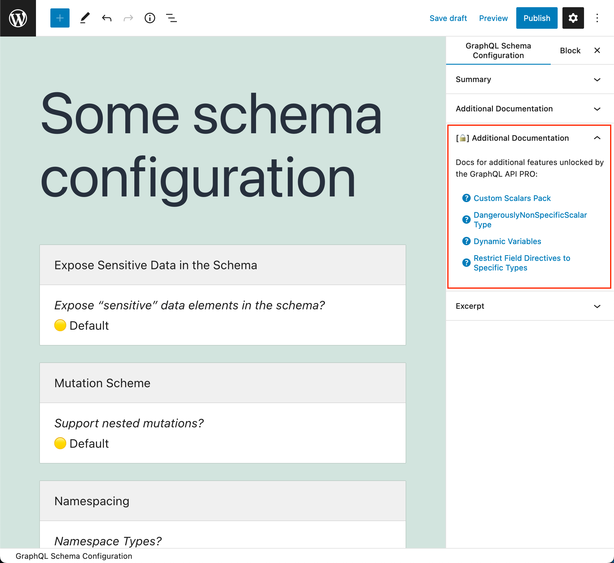

# Release Notes: 1.0

## Browse "Additional Documentation" when editing a Schema Configuration ([#2052](https://github.com/leoloso/PoP/pull/2052)/[#2053](https://github.com/leoloso/PoP/pull/2053))

Documentation for additional features in the GraphQL API can now be browsed when editing a Schema Configuration CPT, on the editor's sidebar:

In addition, documentation for the GraphQL API PRO are also available:

When clicking on any of the links, a modal window is displayed with the corresponding documentation:

## Fixed

- Made field `Comment.type` of type `CommentTypeEnum` (previously was `String`) ([#2043](https://github.com/leoloso/PoP/pull/2043))
- Avoid error from loading non-existing translation files ([2362e2c](https://github.com/leoloso/PoP/commit/2362e2cc46ab6269afabb7d072ea3345fc65aaab))
