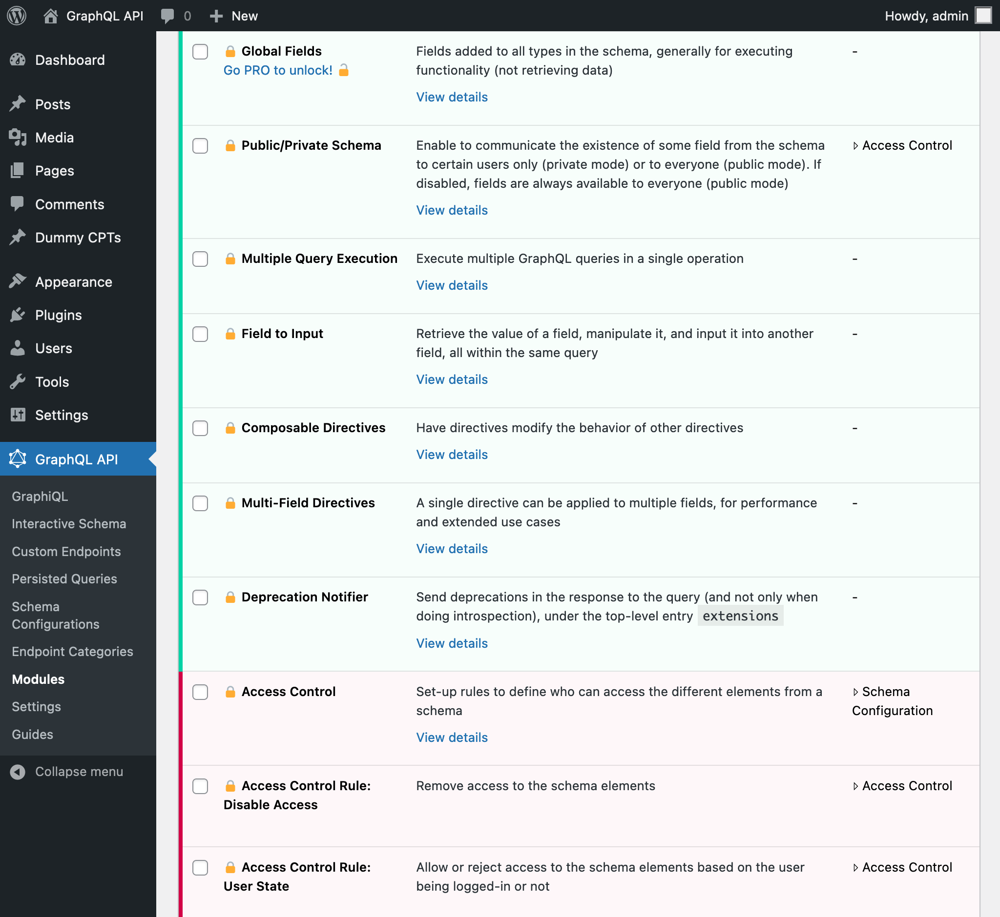

# Release Notes: 1.0

## Browse "Additional Documentation" when editing a Schema Configuration

Documentation for additional features in the GraphQL API can now be browsed when editing a Schema Configuration CPT, on the editor's sidebar:

When clicking on any of the links, a modal window is displayed with the corresponding documentation:

## Added documentation for PRO modules and their corresponding Schema Configuration functionalities

PRO modules are installed by the GraphQL API PRO plugin, which has been released alongside the GraphQL API for WordPress v1.0.

Documentation for the corresponding PRO features can be visualized in the plugin, by:

- Clicking on the corresponding module's "View details" link, on the Modules page
- Clicking on the corresponding block's "View details" link, when editing a Schema Configuration

## Fixed

- Made field `Comment.type` of type `CommentTypeEnum` (previously was `String`)
- Avoid error from loading non-existing translation files
