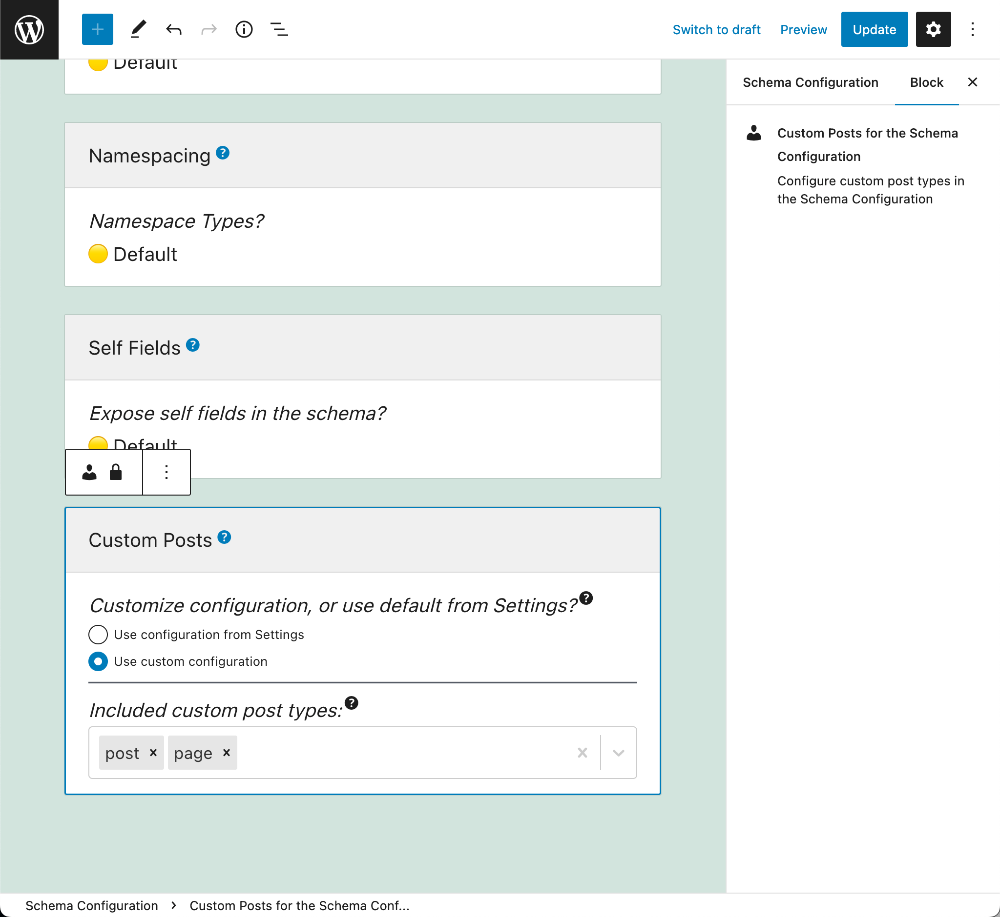

# Release Notes: 1.0

<!-- ## Improved query-resolution performance (by caching method results in PHP)

Method `asFieldOutputQueryString` (from any `Field` class in PHP) is now cached, improving the performance of the query resolution. -->

## Docs for modules "Tags" and "Categories"

Added documentation for modules "Tags" and "Categories", displayed when clicking on "View details" on the corresponding entries on the Modules page.

## Configure several modules via the Schema Configuration

The Schema Configuration now allows to configure several additional modules:

- Custom Posts

As a result, endpoints can have a unique configuration that makes sense only for them, including:

- What CPTs can be accessed
- What meta entries can be queried
- What environment values can be used
- What URLs can be connected to
- Several others

For instance, we can now define the Custom Post Types that can be queried for some specific endpoint, by editing block "Custom Posts" in the corresponding Schema Configuration:

_Please notice: Because of the new blocks added, we will need to click on the "Reset the template" button when editing a Schema Configuration entry created on a previous version of the plugin._
